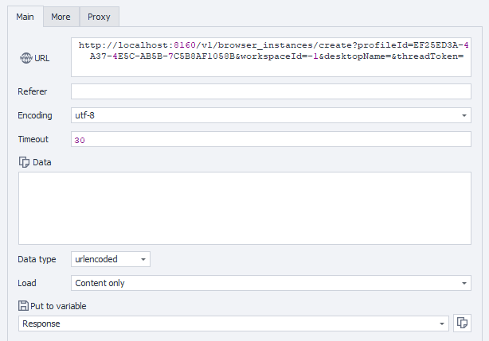

---
sidebar_position: 2
sidebar_label: Создание экземпляра браузера
title: Создание экземпляра браузера
description: Создание нового экземпляра браузера из существующего профиля — подробное руководство по ZennoBrowser Public API. Детальные инструкции, примеры использования и руководство по настройке
---
import DisclaimerNotice from '@site/src/components/DisclaimerNotice';

<DisclaimerNotice />

**Описание:** Этот метод создает новый экземпляр браузера, используя указанный профиль с дополнительными параметрами рабочего пространства и рабочего стола.

#### **Параметры запроса:**

| Parameter | Type | Format | Default | Description |
| :-----: | :-----: | :-----: | :-----: | :----- |
| profileId | string | uuid | (required) | Уникальный идентификатор профиля, с которым будет связан экземпляр браузера. |
| workspaceId | integer | int64 | \-1 | Идентификатор рабочего пространства. `-1` означает рабочее пространство по умолчанию. |
| desktopName | string |  | (empty) | Имя среды рабочего стола (необязательно). |
| threadToken | string |  | (empty) | Токен потока для экземпляра браузера. Чтобы создать новый поток выполнения (необязательно), передайте пустую строку (значение по умолчанию). |
| environmentTags | string |  | (empty) | Теги для конфигурации окружения экземпляра браузера. |
| commandLineArguments | string |  | (empty) | Пользовательские дополнительные аргументы командной строки, которые будут переданы браузеру при запуске. |

#### **Пример запроса:**

**POST**  
**CURL:**

```bash
curl 'http://localhost:8160/v1/browser_instances/create?profileId=123e4567-e89b-12d3-a456-426614174000&workspaceId=-1&desktopName=Desktop%201&threadToken=thread-token-1&environmentTags=&commandLineArguments=--disable-gpu' \
  --request POST \
  --header 'Api-Token: YOUR_SECRET_TOKEN'
```

**C#:**

```csharp
using System.Net.Http.Headers;
var client = new HttpClient();
var request = new HttpRequestMessage
{
    Method = HttpMethod.Post,
    RequestUri = new Uri("http://localhost:8160/v1/browser_instances/create?profileId=123e4567-e89b-12d3-a456-426614174000&workspaceId=-1&desktopName=Desktop%201&threadToken=thread-token-1&environmentTags=&commandLineArguments=--disable-gpu"),
    Headers =
    {
        { "Api-Token", "YOUR_SECRET_TOKEN" },
    },
};
using (var response = await client.SendAsync(request))
{
    response.EnsureSuccessStatusCode();
    var body = await response.Content.ReadAsStringAsync();
    Console.WriteLine(body);
}
```

**Cube:**  
```
http://localhost:8160/v1/browser_instances/create?profileId=PROFILE_ID&workspaceId=-1&desktopName=Desktop 1&threadToken=thread-token-1&environmentTags=&commandLineArguments=--disable-gpu
```



**Дополнительно:**  
User-Agent: `{-Profile.UserAgent-}`  
Api-Token: токен из **UserArea2**.


#### **Ответ API:**

| Код ответа | Результат |
| :---: | :---: |
| `200 OK` | Успешно |
| `401 Unauthorized` | Не авторизован |
| `403 Forbidden` | Доступ запрещен |
| `500 Internal Server Error` | Внутренняя ошибка сервера |

**Успешный ответ (200 OK):**

```json
{
  "profileId": "123e4567-e89b-12d3-a456-426614174000",
  "processId": 1,
  "connectionString": null
}
```

**Ответ с ошибкой (500):**

```json
{
  "message": null
}
```

---
