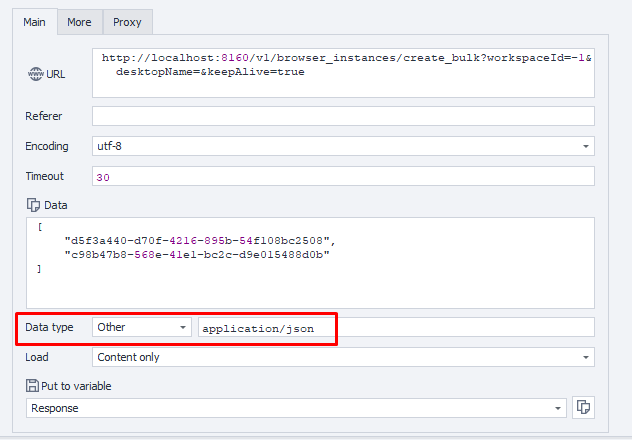

---
sidebar_position: 3
sidebar_label: Создание экземпляров (пакетно)
title: Создание нескольких экземпляров браузера
description: Одновременное создание нескольких экземпляров браузера — подробное руководство по ZennoBrowser Public API. Инструкции по использованию, примеры и руководство по настройке
---
import DisclaimerNotice from '@site/src/components/DisclaimerNotice';

<DisclaimerNotice />

## **Описание** 

Этот метод используется для пакетного создания экземпляров браузера для указанных профилей. Пожалуйста, убедитесь, что переданные ID профилей действительны и указанный ID рабочего пространства существует.

## **Параметры запроса**

| Parameter | Type | Format | Default | Description |
| :-----: | :-----: | :-----: | :-----: | :----- |
| workspaceId | integer | int64 | \-1 | Идентификатор рабочего пространства. `-1` означает рабочее пространство по умолчанию |
| desktopName | string |  | (empty) | Имя рабочего стола (необязательно) |
| keepAlive | логическое значение |  | true | Показывает, должны ли экземпляры браузера оставаться активными после создания. Установите `true`, чтобы экземпляры оставались активными; в противном случае — `false`. Значение по умолчанию — `true` (`true` или `false`) |
| body | JSON-Array  |  |  | Массив UUID профилей, для которых нужно создать экземпляры браузера. Пример: `["uuid1", "uuid2"]` |

:::note
Список ID профилей, для которых нужно создать экземпляры браузера, должен быть передан в теле запроса в виде массива в следующем формате:

```json
[
  "884d8f8d-9a4e-4b1e-9dd3-a028d3ae419b",
  "d24eba34-12d6-4412-ab20-80fae618c264"
]
```
:::

## **Пример запроса**

**POST**  
**CURL:**

```bash
curl 'http://localhost:8160/v1/browser_instances/create_bulk?workspaceId=-1&desktopName=&keepAlive=true' \
  --request POST \
  --header 'Content-Type: application/json' \
  --header 'Api-Token: YOUR_SECRET_TOKEN' \
  --data '[
    "uuid1",
    "uuid2"
  ]'
```

**C#:**

```csharp
using System.Net.Http.Headers;
var client = new HttpClient();
var request = new HttpRequestMessage
{
    Method = HttpMethod.Post,
    RequestUri = new Uri("http://localhost:8160/v1/browser_instances/create_bulk?workspaceId=-1&desktopName=&keepAlive=true"),
    Headers =
    {
        { "Api-Token", "YOUR_SECRET_TOKEN" },
    },
    Content = new StringContent("[\n  " +
                                "\"uuid1\"," +
                                "\"uuid2\"," +
                                "\n]")
    {
        Headers =
        {
            ContentType = new MediaTypeHeaderValue("application/json")
        }
    }
};
using (var response = await client.SendAsync(request))
{
    response.EnsureSuccessStatusCode();
    var body = await response.Content.ReadAsStringAsync();
    Console.WriteLine(body);
}
```

**`Cube:`**  
```
http://localhost:8160/v1/browser_instances/create_bulk?workspaceId=-1&desktopName=&keepAlive=true
```
**Data:**   
`["uuid1", "uuid2"]`



### **Дополнительно**  

User-Agent: `{-Profile.UserAgent-}`  
Api-Token: токен из **UserArea2**


## **Ответ API**

| Response code | Result |
| :---: | :---: |
| `200 OK` | Успешно |
| `500 Error` | Внутренняя ошибка сервера |

**Успешный ответ (200 OK):**

Возвращает массив созданных экземпляров браузера:

```json
[
  {
    "profileId": "123e4567-e89b-12d3-a456-426614174000",
    "processId": 1,
    "connectionString": null
  }
]
```

**Ответ об ошибке (500):**

```json
{
  "message": null
}
```

---