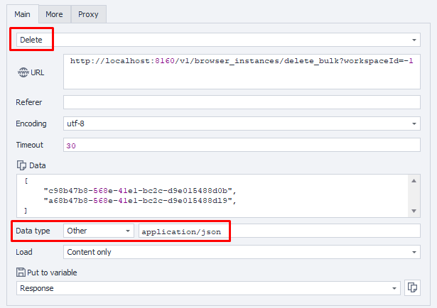

---
sidebar_position: 5
sidebar_label: Массовая остановка экземпляров браузера
title: Массовая остановка экземпляров браузера
description: Остановка нескольких экземпляров браузера за один раз — подробное руководство по ZennoBrowser Public API. Подробные инструкции, примеры использования и руководство по настройке
---
import DisclaimerNotice from '@site/src/components/DisclaimerNotice';

<DisclaimerNotice />

### **Остановка экземпляров браузера (массово)**

**Описание:** Этот метод останавливает несколько существующих экземпляров браузера, связанных с указанными профилями.  
Эта операция безвозвратно закрывает все указанные экземпляры браузера и освобождает их ресурсы.

#### **Параметры запроса:**

| Параметр | Тип | Формат | По умолчанию | Описание |
| :-----: | :-----: | :-----: | :-----: | :----- |
| workspaceId | integer | int64 | \-1 | Идентификатор рабочего пространства. `-1` означает рабочее пространство по умолчанию. |
| body | JSON-Array |  |  | Массив UUID профилей тех экземпляров браузера, которые нужно удалить. Например: `["uuid1", "uuid2"]` |

:::note
Список идентификаторов профилей экземпляров браузера для удаления должен быть передан в теле запроса в виде массива в следующем формате:

```json
[
  "884d8f8d-9a4e-4b1e-9dd3-a028d3ae419b",
  "d24eba34-12d6-4412-ab20-80fae618c264"
]
```
:::

#### **Пример запроса:**

**DELETE**  
**CURL:**

```bash
curl 'http://localhost:8160/v1/browser_instances/delete_bulk?workspaceId=-1' \
  --request DELETE \
  --header 'Content-Type: application/json' \
  --header 'Api-Token: YOUR_SECRET_TOKEN' \
  --data '[
    "uuid1",
    "uuid2"
  ]'
```

**C#:**

```csharp
using System.Net.Http.Headers;
var client = new HttpClient();
var request = new HttpRequestMessage
{
    Method = HttpMethod.Delete,
    RequestUri = new Uri("http://localhost:8160/v1/browser_instances/delete_bulk?workspaceId=-1"),
    Headers =
    {
        { "Api-Token", "YOUR_SECRET_TOKEN" },
    },
    Content = new StringContent("[\n  " +
                                "\"uuid1\"," +
                                "\"uuid2\"," +
                                "\n]")
    {
        Headers =
        {
            ContentType = new MediaTypeHeaderValue("application/json")
        }
    }
};
using (var response = await client.SendAsync(request))
{
    response.EnsureSuccessStatusCode();
    var body = await response.Content.ReadAsStringAsync();
    Console.WriteLine(body);
}
```

**Cube:**  
```
http://localhost:8160/v1/browser_instances/delete_bulk?workspaceId=-1
```
**Data:**   
`["uuid1", "uuid2"]`  



**Дополнительно:**  
User-Agent: `{-Profile.UserAgent-}`  
Api-Token: токен из **UserArea2**.  


#### **Ответ API:**

| Код ответа | Результат |
| :---: | :---: |
| `200 OK` | Успех |
| `500 Error` | Внутренняя ошибка сервера |

**Успешный ответ (200 OK):**

При успешном удалении контент в ответе не возвращается.

**Ответ с ошибкой (500):**

```json
{
  "message": null
}
```

---