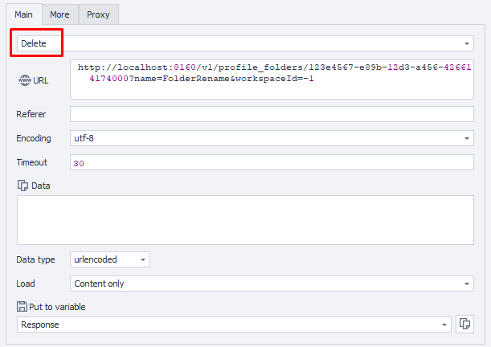

---
sidebar_position: 4
sidebar_label: Удаление папки профиля
title: Удаление папки профиля
description: Удаление папки профиля из рабочего пространства — подробное руководство по ZennoBrowser Public API. Детальные инструкции, примеры использования и руководство по настройке
---
import DisclaimerNotice from '@site/src/components/DisclaimerNotice';

<DisclaimerNotice />

## **Описание** 

Этот метод используется для удаления папки профиля. Значение profileFolderId должно соответствовать существующей папке в указанном рабочем пространстве.

## **Параметры запроса**

| Parameter | Type | Format | Default | Description |
| :-----: | :-----: | :-----: | :-----: | :----- |
| profileFolderId | string | uuid |  | Уникальный идентификатор папки профиля, которую требуется удалить |
| workspaceId | integer | int64 | \-1 | Идентификатор рабочего пространства, к которому относится папка профиля. По умолчанию \-1, если не указано |

:::note
ID папки профиля, которую нужно удалить, следует указать в фигурных скобках `{ }` в пути URL.
:::

## **Пример запроса**

**DELETE**  
**CURL:**

```bash
curl 'http://localhost:8160/v1/profile_folders/{profileFolderId}?workspaceId=-1' \
  --request DELETE \
  --header 'Api-Token: YOUR_SECRET_TOKEN'
```

**C#:**

```csharp
using System.Net.Http.Headers;
var client = new HttpClient();
var request = new HttpRequestMessage
{
    Method = HttpMethod.Delete,
    RequestUri = new Uri("http://localhost:8160/v1/profile_folders/%7BprofileFolderId%7D"),
    Headers =
    {
        { "Api-Token", "YOUR_SECRET_TOKEN" },
    },
};
using (var response = await client.SendAsync(request))
{
    response.EnsureSuccessStatusCode();
    var body = await response.Content.ReadAsStringAsync();
    Console.WriteLine(body);
}
```

**Cube:**  
```
http://localhost:8160/v1/profile_folders/{profileFolderId}?workspaceId=-1
```



### **Дополнительно** 

User-Agent: `{-Profile.UserAgent-}`  
Api-Token: токен из **UserArea2** 


## **Ответ API**

| Response code | Result |
| :---: | :---: |
| `200 OK` | Успешно |
| `500 Error` | Внутренняя ошибка сервера |

**Успешный ответ (200 OK):**

При успешном удалении содержимое в ответе не возвращается.

**Ответ об ошибке (500):**

```json
{
  "message": null
}
```

---