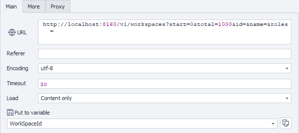

---
sidebar_position: 2
sidebar_label: Получение доступных рабочих пространств
title: Получение доступных рабочих пространств
description: Получение списка рабочих пространств, доступных текущему пользователю — подробное руководство по публичному API ZennoBrowser. Детальные инструкции, примеры использования и руководство по настройке
---
import DisclaimerNotice from '@site/src/components/DisclaimerNotice';

<DisclaimerNotice />

**Описание:** Операция получает список рабочих пространств, доступных текущему пользователю. Эта информация необходима для выполнения большинства последующих запросов.

#### **Параметры запроса:**

| Parameter | Type | Format | Default | Description |
| :-----: | :-----: | :-----: | :-----: | :-----: |
| start | integer | int32 | 0 | Начальный индекс для пагинации |
| total | integer | int32 | 1000 | Максимальное количество возвращаемых результатов |
| id | integer | int64 | (empty) | Необязательный фильтр по ID рабочего пространства |
| name | string |  | (empty) | Необязательный фильтр по имени рабочего пространства |
| roles | string |  | (empty) | Необязательный фильтр по ролям |

#### 

#### **Пример запроса:**

**GET**  
**CURL:**

```bash
curl 'http://localhost:8160/v1/workspaces?start=0&total=1000&id=&name=&roles=' \
  --header 'Api-Token: YOUR_SECRET_TOKEN'
```

**C#:**

```csharp
using System.Net.Http.Headers;
var client = new HttpClient();
var request = new HttpRequestMessage
{
    Method = HttpMethod.Get,
    RequestUri = new Uri( "http://localhost:8160/v1/workspaces?start=0&total=1000&id=&name=&roles="),
    Headers =
    {
        { "Api-Token", "YOUR_SECRET_TOKEN" },
    },
};
using (var response = await client.SendAsync(request))
{
    response.EnsureSuccessStatusCode();
    var body = await response.Content.ReadAsStringAsync();
    Console.WriteLine(body);
}
```

**Cube:**  
```
http://localhost:8160/v1/workspaces?start=0&total=1000&id=&name=&roles=
```


**Дополнительно:**  
User-Agent: `{-Profile.UserAgent-}`  
Api-Token: токен из **UserArea2**.


#### **Ответ API:**

| Код ответа | Результат |
| :---: | :---: |
| `200 OK` | Успешно |
| `401 Unauthorized` | Не авторизован |
| `403 Forbidden` | Доступ запрещен |
| `500 Internal Server Error` | Внутренняя ошибка сервера |

**Успешный ответ (200 OK):**

```json
{
  "totalCount": 1,
  "items": [
    {
      "workspaceId": 1,
      "name": null,
      "role": "Owner"
    }
  ]
}
```

**Ответ с ошибкой (500):**

```json
{
  "message": null
}
```
