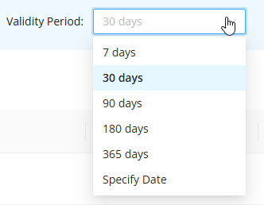
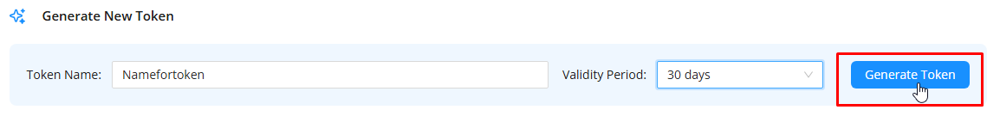

---
sidebar_position: 1
sidebar_label: Начало работы
title: Начало работы с ZennoBrowser API
description: Узнайте, как получить API-токен и выполнить первые запросы к ZennoBrowser Public API — подробное руководство по ZennoBrowser Public API. Подробные инструкции, примеры использования и руководство по настройке
---
import DisclaimerNotice from '@site/src/components/DisclaimerNotice';

# Начало работы с ZennoBrowser API

<DisclaimerNotice />

## Начало работы с ZennoBrowser API

Для выполнения всех запросов необходим API-токен. Его можно получить следующим образом:

1. Войдите в UserArea2 с активной подпиской на ZennoBrowser;
2. Откройте раздел «ZennoBrowser» в верхней части главной страницы;


3. Нажмите ссылку «API Control»;


4. Укажите имя токена (минимум 3 символа);


5. Выберите период, в течение которого токен будет действителен (7 дней, 30 дней, 60 дней и т.п.);



6. Нажмите «Generate token»;



7. Скопируйте сгенерированный токен. После закрытия окна скопировать токен снова будет невозможно, поэтому обязательно сохраните его.


8. Используйте сгенерированный токен для выполнения запросов.

**Примечание:**

1. После удаления токена он будет продолжать работать ещё в течение 1,5–2 часов;  
2. После истечения срока действия токена он перестанет работать;  
3. Если вы потеряли ранее созданный токен, вы можете создать новый.


---

## «Кодирование параметров (URL Encoding)»

### **Важно: Передача спецсимволов в значениях**

Если вы формируете запрос вручную (через `HttpClient`, `fetch` или `curl`), обязательно выполняйте **URL-encoding для значений** параметров.

В частности это касается параметра `screen=HD+`. Если не закодировать `+`, сервер интерпретирует его как пробел, и вы получите ошибку.

**Пример для `screen=HD+`:**

* **Неверно:** `.../create?screen=HD+`  
* **Верно:** `.../create?screen=HD%2B`

### **Таблица часто используемых символов**

Для корректной работы API следующие символы в **значениях параметров** должны быть заменены. 

Кодируйте эти символы, только если они являются частью передаваемых данных (значений).

| Символ | Описание | Код (Encoded) |
| :---- | :---- | :---- |
| \+ | Плюс (как в HD+) | %2B |
|  | Пробел | %20 |
| & | Амперсанд (разделитель параметров) | %26 |
| \= | Равно | %3D |
| ? | Знак вопроса | %3F |
| / | Слэш | %2F |
| : | Двоеточие | %3A |

### **Примеры реализации**

**C\# (HttpClient):** Вместо прямой склейки строк можно используйте метод `Uri.EscapeDataString()` для значения параметра, где могут быть спецсимволы.
``` csharp
string screen = "HD+";
string url = $"http://localhost:8160/v1/profiles/create?name=ApiProfile&workspaceId=-1&screen={Uri.EscapeDataString(screen)}";
// Результат: ...?screen=HD%2B
```
**Python (Requests):** Библиотека `requests` делает это автоматически, если передавать параметры словарем.
``` Python
params = {'screen': 'HD+'}
response = requests.get('http://localhost:8160/v1/profiles/create', params=params)
# Библиотека сама преобразует это в HD%2B
```