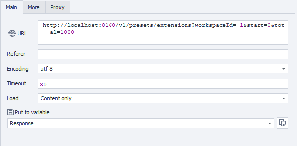

import DisclaimerNotice from '@site/src/components/DisclaimerNotice';

<DisclaimerNotice />

**Описание:** Этот метод получает список расширений, доступных текущему пользователю.

#### **Параметры запроса:**

| Параметр | Тип | Формат | Значение по умолчанию | Описание |
| :-----: | :-----: | :-----: | :-----: | :----- |
| workspaceId | integer | int64 | -1 | Идентификатор рабочего пространства. Значение `-1` означает рабочее пространство по умолчанию. |
| start | integer | int32 | (empty) | Starting index for pagination |
| total | integer | int32 | (empty) | Maximum number of results to return |
| id | string |  | (empty) | Необязательный фильтр по идентификатору расширения. |
| name | string |  | (empty) | Необязательный фильтр по названию расширения. |
| presetId | string |  | (empty) | Необязательный фильтр по идентификатору пресета расширения. |

#### **Пример запроса:**

**GET**  
**CURL:**

```bash
curl 'http://localhost:8160/v1/presets/extensions?workspaceId=-1&start=0&total=1000&id=&name=ApiEntity&presetId=123e4567-e89b-12d3-a456-426614174000' \
  --header 'Api-Token: YOUR_SECRET_TOKEN'
```

**C#:**

```csharp
using System.Text;
var client = new HttpClient();
var request = new HttpRequestMessage
{
    Method = HttpMethod.Get,
    RequestUri = new Uri("http://localhost:8160/v1/presets/extensions?workspaceId=-1&start=0&total=1000&id=&name=ApiEntity&presetId=123e4567-e89b-12d3-a456-426614174000"),
    Headers =
    {
        { "Api-Token", "YOUR_SECRET_TOKEN" },
    },
};
using (var response = await client.SendAsync(request))
{
    response.EnsureSuccessStatusCode();
    var body = await response.Content.ReadAsStringAsync();
    Console.WriteLine(body);
}
```

**Cube:**
```
http://localhost:8160/v1/presets/extensions?workspaceId=-1&start=0&total=1000&id=&name=ApiEntity&presetId=123e4567-e89b-12d3-a456-426614174000
```



**Дополнительно:**  
User-Agent: `{-Profile.UserAgent-}`  
Api-Token: токен из **UserArea2**.


#### **Ответ API:**

| Код ответа | Результат |
| :---: | :---: |
| `200 OK` | Успешно |
| `401 Unauthorized` | Не авторизован |
| `403 Forbidden` | Доступ запрещен |
| `500 Internal Server Error` | Внутренняя ошибка сервера |

**Успешный ответ (200 OK):**

```json
{
  "items": [
    {
      "id": "123e4567-e89b-12d3-a456-426614174000",
      "presetId": "123e4567-e89b-12d3-a456-426614174000",
      "name": "Sample Name",
      "extensionWebId": "string",
      "extensionWebUrl": "https://example.com",
      "icon": "string",
      "status": "Ok",
      "source": "string",
      "version": {
        "versionNumber": "1.0.0",
        "status": "Ok"
      }
    }
  ],
  "totalCount": 1
}
```

**Ответ с ошибкой (500):**

```json
{
  "message": null
}
```

---
