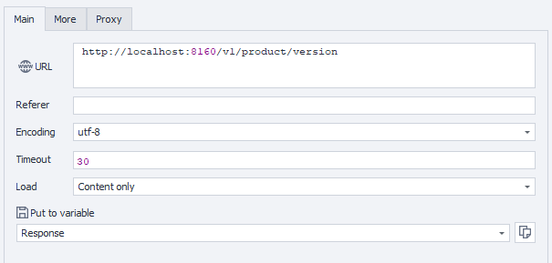

import DisclaimerNotice from '@site/src/components/DisclaimerNotice';

<DisclaimerNotice />

**Описание:** Этот метод возвращает текущую версию продукта.

#### **Параметры запроса:**

Для этого метода параметры запроса не требуются.

#### **Пример запроса:**

**GET**  
**CURL:**

```bash
curl 'http://localhost:8160/v1/product/version' \
  --header 'Api-Token: YOUR_SECRET_TOKEN'
```

**C#:**

```csharp
using System.Text;
var client = new HttpClient();
var request = new HttpRequestMessage
{
    Method = HttpMethod.Get,
    RequestUri = new Uri("http://localhost:8160/v1/product/version"),
    Headers =
    {
        { "Api-Token", "YOUR_SECRET_TOKEN" },
    },
};
using (var response = await client.SendAsync(request))
{
    response.EnsureSuccessStatusCode();
    var body = await response.Content.ReadAsStringAsync();
    Console.WriteLine(body);
}
```

**Cube:**
```
http://localhost:8160/v1/product/version
```



**Дополнительно:**  
User-Agent: `{-Profile.UserAgent-}`  
Api-Token: токен из **UserArea2**.


#### **Ответ API:**

| Код ответа | Результат |
| :---: | :---: |
| `200 OK` | Успешно |
| `401 Unauthorized` | Не авторизован |
| `403 Forbidden` | Доступ запрещен |
| `500 Internal Server Error` | Внутренняя ошибка сервера |

**Успешный ответ (200 OK):**

```text
1.0.0
```

**Ответ с ошибкой (500):**

```json
{
  "message": null
}
```

---
