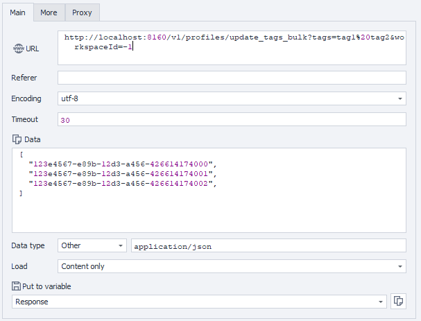

import DisclaimerNotice from '@site/src/components/DisclaimerNotice';

<DisclaimerNotice />

**Описание:** Этот метод массово обновляет теги для одного или нескольких профилей браузера.

#### **Параметры запроса:**

| Параметр | Тип | Формат | Значение по умолчанию | Описание |
| :-----: | :-----: | :-----: | :-----: | :----- |
| tags | string |  | (empty) | Теги профиля, разделенные пробелами. Например, `1 2 3 4`. |
| workspaceId | integer | int64 | -1 | Идентификатор рабочего пространства. Значение `-1` означает рабочее пространство по умолчанию. |

#### **Тело запроса:**

| Поле | Тип | Формат | Обязательность | Описание |
| :-----: | :-----: | :-----: | :-----: | :----- |
| body | array[string] | uuid | (optional) | Массив идентификаторов профилей, которые необходимо обновить. |

#### **Пример запроса:**

**POST**  
**CURL:**

```bash
curl 'http://localhost:8160/v1/profiles/update_tags_bulk?tags=tag1%20tag2&workspaceId=-1' \
  --request POST \
  --header 'Api-Token: YOUR_SECRET_TOKEN' \
  --header 'Content-Type: application/json' \
  --data '[
  "123e4567-e89b-12d3-a456-426614174000"
]'
```

**C#:**

```csharp
using System.Text;
var client = new HttpClient();
var request = new HttpRequestMessage
{
    Method = HttpMethod.Post,
    RequestUri = new Uri("http://localhost:8160/v1/profiles/update_tags_bulk?tags=tag1%20tag2&workspaceId=-1"),
    Headers =
    {
        { "Api-Token", "YOUR_SECRET_TOKEN" },
    },
};
request.Content = new StringContent("[\n  \"123e4567-e89b-12d3-a456-426614174000\"\n]", Encoding.UTF8, "application/json");
using (var response = await client.SendAsync(request))
{
    response.EnsureSuccessStatusCode();
    var body = await response.Content.ReadAsStringAsync();
    Console.WriteLine(body);
}
```

**Cube:**
```
http://localhost:8160/v1/profiles/update_tags_bulk?tags=tag1%20tag2&workspaceId=-1
```

**Body (JSON):**
```json
[
  "123e4567-e89b-12d3-a456-426614174000"
]
```



**Дополнительно:**  
User-Agent: `{-Profile.UserAgent-}`  
Api-Token: токен из **UserArea2**.


#### **Ответ API:**

| Код ответа | Результат |
| :---: | :---: |
| `200 OK` | Успешно |
| `401 Unauthorized` | Не авторизован |
| `403 Forbidden` | Доступ запрещен |
| `500 Internal Server Error` | Внутренняя ошибка сервера |

**Успешный ответ (200 OK):**

Тело ответа отсутствует.

**Ответ с ошибкой (500):**

```json
{
  "message": null
}
```

---
