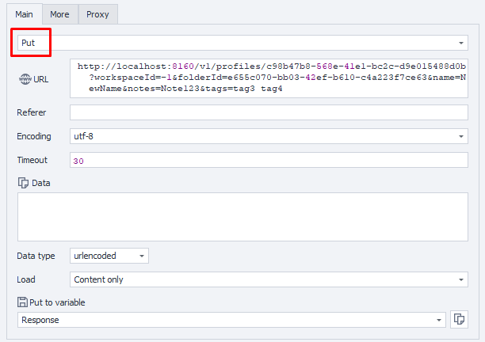

---
sidebar_position: 4
sidebar_label: Обновление профиля браузера
title: Обновление профиля браузера
description: Обновление настроек и параметров отпечатка существующего профиля браузера — подробное руководство по ZennoBrowser Public API. Детальные инструкции, примеры использования и руководство по настройке
---
import DisclaimerNotice from '@site/src/components/DisclaimerNotice';

<DisclaimerNotice />

**Описание:** Этот метод обновляет существующий профиль браузера.

#### **Параметры запроса:**

| Параметр | Тип | Формат | Значение по умолчанию | Описание |
| :-----: | :-----: | :-----: | :-----: | :----- |
| profileId | string | uuid | (required) | Уникальный идентификатор редактируемого профиля (**обязательный**). |
| workspaceId | integer | int64 | \-1 | Идентификатор рабочего пространства. \-1 означает рабочее пространство по умолчанию. |
| folderId | string | uuid | (empty) | Новая папка, в которую будет перемещён профиль (необязательно). |
| name | string |  | (empty) | Новое имя профиля. |
| notes | string |  | (empty) | Новые заметки к профилю (необязательно). |
| tags | string |  | (empty) | Новые теги профиля, разделённые пробелами (необязательно). |
| screen | string |  | (empty) | Настройки конфигурации экрана. Допустимые значения: “auto” — использовать значение из отпечатка, “ignore” — использовать системное значение, либо “width x height” для задания пользовательского разрешения экрана (`auto`, `ignore` или ручной ввод разрешения, например SVGA, WSVGA, HD+ и т. д. Полный список разрешений, которые можно настроить вручную, приведен ниже)<br/>"SVGA" \= 800×600; "0.69M3" \= 960×720;<br/>"0.59M9" \= 1024×576; "WSVGA" \= 1024×600;<br/>"0.66MA" \= 1024×640; "XGA" \= 1024×768;<br/>"1152×648" \= 1152×648; "XGA+" \= 1152×864;<br/>"HD" \= 1280×720; "WXGA" \= 1280×768;<br/>"WXGA+" \= 1280×800; "SXGA-" \= 1280×960;<br/>"SXGA" \= 1280×1024; "1360×768" \= 1360×768;<br/>"WXGA HD" \= 1366×768; "SXGA+" \= 1400×1050;<br/>"WSXGA" \= 1440×900; "1.56M3" \= 1440×1080;<br/>"1536×864" \= 1536×864; "HD+" \= 1600×900;<br/>"UXGA" \= 1600×1200; "WSXGA+" \= 1680×1050;<br/>"1832×1392" \= 1832×1392; "FHD" \= 1920×1080;<br/>"WUXGA" \= 1920×1200; "2.76M3" \= 1920×1440;<br/>"QWXGA" \= 2048×1152; "QXGA" \= 2048×1536;<br/>"3.32MA" \= 2304×1440; "WQHD" \= 2560×1440;<br/>"WQXGA" \= 2560×1600; "QSXGA" \= 2560×2048;<br/>"5.18MA" \= 2880×1800; "4K UHD-1" \= 3840×2160;<br/>"9.44M9" \= 4096×2304; "5K" \= 5120×2880;<br/>"8K UHD-2" \= 7680×4320; |
| cpu | string |  | (empty) | Настройки конфигурации CPU. Допустимые значения: “auto” — использовать значение из отпечатка, “ignore” — использовать системное значение, либо целое число для задания пользовательского количества ядер процессора (`auto`, `ignore` или количество ядер ("2/4", "4/8", "6/12",  "8/16",  "10/20", "12/24", "14/28", "16/32", "32/64", "64/128")) |
| memory | string |  | (empty) | Настройки конфигурации памяти. Допустимые значения: “auto” — использовать значение из отпечатка, “ignore” — использовать системное значение или целое число для указания собственного размера памяти (auto, ignore или размер памяти ("2", "4", "8", "16", "32", "64", "128"")) |
| language | string |  | (empty) | Настройки языка браузера. Допустимые значения: “auto” — использовать значение из отпечатка, “ignore” — использовать системное значение, либо значение языковой локали (`auto`, `ignorate` или локаль: Russian \- ru English (United States) \- en-US German \- de French \- fr Spanish \- es English (United Kingdom) \- en-GB |
| geoLocation | string |  | (empty) | Настройки географического положения. Допустимые значения: “auto” — использовать значение из отпечатка, “ignore” — использовать системное значение. Также можно указать от одного до семи чисел с плавающей запятой, которые представляют следующие геокоординаты: широта (Latitude), долгота (Longitude), высота (Altitude), точность (Accuracy), точность по высоте (AltitudeAccuracy), курс (Heading), скорость (Speed), радиус (Radius). Некоторые координаты можно пропускать. Например, следующая последовательность значений корректна: 10, , 40, , 60, 70 \- означает Latitude \= 10, Longitude \= случайное значение, Altitude \= 40, Accuracy \= случайное значение, AltitudeAccuracy \= 60, Heading \= 70, Speed \= случайное значение, Radius \= случайное значение (`auto`, `ignore` или координаты (широта, долгота и т. д.)) |
| timeZone | string |  | (empty) | Настройки часового пояса. Допустимые значения: “auto” — использовать значение из отпечатка, “ignore” — использовать системное значение, либо пользовательское значение часового пояса (`auto`, `ignore` или конкретное значение (например, `Europe/Moscow`)) |
| webGl | string |  | (empty) | Настройки конфигурации WebGL. Допустимые значения: “auto” — использовать значение из отпечатка, “ignore” — использовать системное значение (`auto` или `ignore)` |
| webGpu | string |  | (empty) | Настройки конфигурации WebGPU. Допустимые значения: “on” — включить или “off” — отключить эту функцию (`on` или `off)` |
| webRtc | string |  | (empty) | Настройки конфигурации WebRTC. Допустимые значения: “Emulate” — использовать значение из отпечатка, “Real” — использовать системное значение или “Hide” — отключить эту функцию (`Emulate`, `Real` или `Hide)` |
| domRect | string |  | (empty) | Настройки конфигурации DOM Rectangle. Допустимые значения: “Ignore” — отключить эту функцию или “Noise” — использовать зашумление dom rect (`Ignore` или `Noise)` |
| audio | string |  | (empty) | Настройки конфигурации аудио. Допустимые значения: “on” — включить или “off” — отключить эту функцию (`on` или `off)` |
| fonts | string |  | (empty) | Настройки конфигурации шрифтов. Допустимые значения: “on” — включить или “off” — отключить эту функцию `(on` или `off)` |
| battery | string |  | (empty) | Настройки конфигурации батареи. Допустимые значения: “on” — включить или “off” — отключить эту функцию (`on` или `off)` |
| plugins | string |  | (empty) | Настройки конфигурации плагинов браузера. Допустимые значения: “on” — включить или “off” — отключить эту функцию (`on` или `off)` |
| speechVoices | string |  | (empty) | Настройки голосов синтеза речи. Допустимые значения: “on” — включить или “off” — отключить эту функцию (`on` или `off)` |
| canvas | string |  | (empty) | Настройки Canvas. Допустимые значения: `Ignore` — отключить эту функцию или `Noise` — использовать зашумление. |
| mediaDevices | string |  | (empty) | Настройки медиоустройств. Допустимые значения: `auto` — использовать значение из отпечатка, `ignore` — использовать реальные значения или пользовательские значения. Можно указать от одного до трех целых чисел, соответствующих значениям `AudioInput`, `AudioOutput` и `VideoInput`. |
| commandLineArguments | string |  | (empty) | Пользовательские дополнительные аргументы командной строки, которые будут переданы браузеру при запуске. |
| proxyServerId | string |  | (empty) | Настройка идентификатора прокси-сервера. Используйте `null`, чтобы оставить значение без изменений, пустую строку — чтобы очистить прокси, или корректный GUID — чтобы установить новый прокси-сервер. |
| presetId | string |  | (empty) | Идентификатор пресета для применения. Используйте `null`, чтобы оставить значение без изменений, пустую строку — чтобы снять пресет, или GUID — чтобы установить новый пресет. |

:::note
ID профиля для обновления должен быть указан в фигурных скобках `{ }` в пути URL.
:::

#### **Пример запроса:**

**PUT**  
**CURL:**

```bash
curl 'http://localhost:8160/v1/profiles/123e4567-e89b-12d3-a456-426614174000?workspaceId=-1&folderId=123e4567-e89b-12d3-a456-426614174000&name=ApiEntity&notes=Created%20from%20API&tags=tag1%20tag2&screen=1920%20x%201080&cpu=8%2F16&memory=8&language=en-US&geoLocation=55.7558%2C37.6176&timeZone=Europe%2FMoscow&webGl=auto&webGpu=on&webRtc=Emulate&domRect=Noise&audio=on&fonts=on&battery=on&plugins=on&speechVoices=on&canvas=Noise&mediaDevices=1%2C1%2C1&commandLineArguments=--disable-gpu&proxyServerId=123e4567-e89b-12d3-a456-426614174000&presetId=123e4567-e89b-12d3-a456-426614174000' \
  --request PUT \
  --header 'Api-Token: YOUR_SECRET_TOKEN'
```

**C#:**

```csharp
using System.Net.Http.Headers;
var client = new HttpClient();
var request = new HttpRequestMessage
{
    Method = HttpMethod.Put,
    RequestUri = new Uri("http://localhost:8160/v1/profiles/123e4567-e89b-12d3-a456-426614174000?workspaceId=-1&folderId=123e4567-e89b-12d3-a456-426614174000&name=ApiEntity&notes=Created%20from%20API&tags=tag1%20tag2&screen=1920%20x%201080&cpu=8%2F16&memory=8&language=en-US&geoLocation=55.7558%2C37.6176&timeZone=Europe%2FMoscow&webGl=auto&webGpu=on&webRtc=Emulate&domRect=Noise&audio=on&fonts=on&battery=on&plugins=on&speechVoices=on&canvas=Noise&mediaDevices=1%2C1%2C1&commandLineArguments=--disable-gpu&proxyServerId=123e4567-e89b-12d3-a456-426614174000&presetId=123e4567-e89b-12d3-a456-426614174000"),
    Headers =
    {
        { "Api-Token", "YOUR_SECRET_TOKEN" },
    },
};
using (var response = await client.SendAsync(request))
{
    response.EnsureSuccessStatusCode();
    var body = await response.Content.ReadAsStringAsync();
    Console.WriteLine(body);
}
```

**Cube:**  
```
http://localhost:8160/v1/profiles/{profileId}?workspaceId=-1&folderId=123e4567-e89b-12d3-a456-426614174000&name=ApiEntity&notes=Created from API&tags=tag1 tag2&screen=1920 x 1080&cpu=8/16&memory=8&language=en-US&geoLocation=55.7558,37.6176&timeZone=Europe/Moscow&webGl=auto&webGpu=on&webRtc=Emulate&domRect=Noise&audio=on&fonts=on&battery=on&plugins=on&speechVoices=on&canvas=Noise&mediaDevices=1,1,1&commandLineArguments=--disable-gpu&proxyServerId=123e4567-e89b-12d3-a456-426614174000&presetId=123e4567-e89b-12d3-a456-426614174000
```



**Дополнительно:**  
User-Agent: `{-Profile.UserAgent-}`  
Api-Token: токен из **UserArea2**.


#### **Ответ API:**

| Код ответа | Результат |
| :---: | :---: |
| `200 OK` | Успешно |
| `401 Unauthorized` | Не авторизован |
| `403 Forbidden` | Доступ запрещен |
| `500 Internal Server Error` | Внутренняя ошибка сервера |

**Успешный ответ (200 OK):**

При успешном обновлении тело ответа отсутствует.

**Ответ с ошибкой (500):**

```json
{
  "message": null
}
```

---
