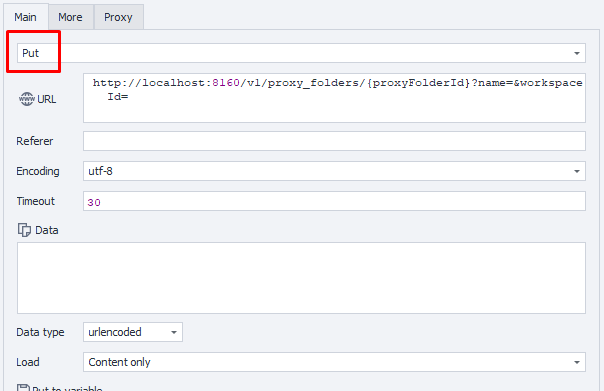

---
sidebar_position: 3
sidebar_label: Редактирование папки прокси
title: Редактирование папки прокси
description: Обновление свойств существующей папки прокси — подробное руководство по ZennoBrowser Public API. Детальные инструкции, примеры использования и руководство по настройке
---
import DisclaimerNotice from '@site/src/components/DisclaimerNotice';

<DisclaimerNotice />

### **Редактирование папки прокси**

**Описание:** Этот метод изменяет имя указанной папки прокси. Это единственное свойство, доступное для редактирования.

#### **Параметры запроса:**

| Parameter | Type | Format | Default | Description |
| :-----: | :-----: | :-----: | :-----: | :----- |
| proxyFolderId | string | uuid | (empty) | Идентификатор папки (обязательный параметр) |
| name | string |  | (empty) | Новое имя папки |
| workspaceId | integer | int64 | \-1 | Идентификатор рабочего пространства. \-1 означает рабочее пространство по умолчанию. |

**Примечание:**

ID редактируемого списка прокси должен быть указан в фигурных скобках {} в пути URL.

#### **Пример запроса:**

**PUT**  
**CURL:**

```bash
curl 'http://localhost:8160/v1/proxy_folders/{proxyFolderId}?name=&workspaceId=' \
  --request PUT \
  --header 'Api-Token: YOUR_SECRET_TOKEN'
```

**C#:**

```csharp
using System.Net.Http.Headers;
var client = new HttpClient();
var request = new HttpRequestMessage
{
    Method = HttpMethod.Put,
    RequestUri = new Uri("http://localhost:8160/v1/proxy_folders/{proxyFolderId}?name=&workspaceId="),
    Headers =
    {
        { "Api-Token", "YOUR_SECRET_TOKEN" },
    },
};
using (var response = await client.SendAsync(request))
{
    response.EnsureSuccessStatusCode();
    var body = await response.Content.ReadAsStringAsync();
    Console.WriteLine(body);
}
```

**Cube:**   
```
http://localhost:8160/v1/proxy_folders/{proxyFolderId}?name=&workspaceId=
```  

   

**Дополнительно:**  
User-Agent: `{-Profile.UserAgent-}`  
Api-Token: токен из **UserArea2**.


#### **Ответ API:**

| Код ответа | Результат |
| :---: | :---: |
| `200 OK` | Успешно |
| `401 Unauthorized` | Не авторизован |
| `403 Forbidden` | Доступ запрещен |
| `500 Internal Server Error` | Внутренняя ошибка сервера |

**Успешный ответ (200 OK):**

При успешном обновлении тело ответа не возвращается.

**Ответ с ошибкой (500):**

```json
{
  "message": null
}
```

---