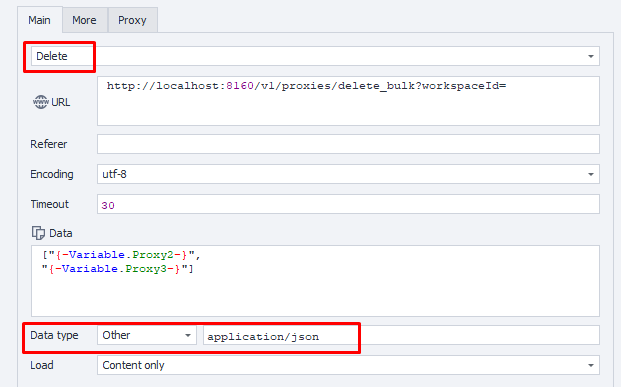

---
sidebar_position: 5
sidebar_label: Удаление прокси (пакетно)
title: Удаление прокси (пакетно)
description: Массовое удаление нескольких прокси‑серверов — подробное руководство по ZennoBrowser Public API. Детальные инструкции, примеры использования и руководство по настройке
---
import DisclaimerNotice from '@site/src/components/DisclaimerNotice';

<DisclaimerNotice />

## **Описание** 

Этот метод отправляет пакетный запрос на удаление в API для удаления указанных прокси.

## **Параметры запроса**

| Параметр | Тип | Формат | По умолчанию | Описание |
| :-----: | :-----: | :-----: | :-----: | :----- |
| workspaceId | integer | int64 | \-1 | Идентификатор рабочего пространства. \-1 означает рабочее пространство по умолчанию |
| body | JSON array | GUID\[\] |  | Массив UUID, содержащий прокси, которые нужно удалить |

:::note
Список прокси для удаления должен быть передан в теле запроса в виде массива в следующем формате:

```json
[
  "884d8f8d-9a4e-4b1e-9dd3-a028d3ae419b",
  "d24eba34-12d6-4412-ab20-80fae618c264"
]
```
:::

## **Пример запроса**

**DELETE**  
**CURL:**

```bash
curl 'http://localhost:8160/v1/proxies/delete_bulk?workspaceId=' \
  --request DELETE \
  --header 'Content-Type: application/json' \
  --header 'Api-Token: YOUR_SECRET_TOKEN' \
  --data '[
  ""
]'
```

**C#:**

```csharp
using System.Net.Http.Headers;
var client = new HttpClient();
var request = new HttpRequestMessage
{
    Method = HttpMethod.Delete,
    RequestUri = new Uri("http://localhost:8160/v1/proxies/delete_bulk?workspaceId="),
    Headers =
    {
        { "Api-Token", "YOUR_SECRET_TOKEN" },
    },
    Content = new StringContent("[\n  \"\"\n]")
    {
        Headers =
        {
            ContentType = new MediaTypeHeaderValue("application/json")
        }
    }
};
using (var response = await client.SendAsync(request))
{
    response.EnsureSuccessStatusCode();
    var body = await response.Content.ReadAsStringAsync();
    Console.WriteLine(body);
}
```

**Cube:**   
```
http://localhost:8160/v1/proxies/delete_bulk?workspaceId=
```



### **Дополнительно**

User-Agent: `{-Profile.UserAgent-}`  
Api-Token: Токен из **UserArea2**


## **Ответ API**

| Код ответа | Результат |
| :---: | :---: |
| `200 OK` | Успешно |
| `500 Error` | Внутренняя ошибка сервера |

**Успешный ответ (200 OK):**

При успешном удалении содержимое не возвращается.

**Ошибка (500):**

```json
{
  "message": null
}
```

---