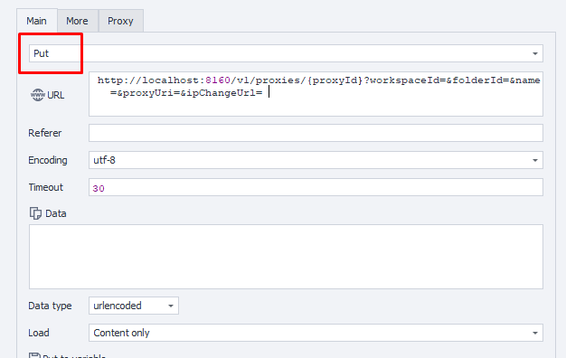

---
sidebar_position: 3
sidebar_label: Редактирование существующего прокси
title: Редактирование существующего прокси
description: Обновление конфигурации и параметров существующего прокси-сервера — подробное руководство по ZennoBrowser Public API. Детальные инструкции, примеры использования и руководство по настройке
---
import DisclaimerNotice from '@site/src/components/DisclaimerNotice';

<DisclaimerNotice />

**Описание:** Этот метод изменяет конфигурацию существующего прокси-сервера на основе указанных параметров. 

#### **Параметры запроса:**

| Parameter | Type | Format | Default | Description |
| :-----: | :-----: | :-----: | :-----: | :----- |
| proxyId | string | uuid | (empty) |  Уникальный идентификатор прокси (обязателен) |
| workspaceId | integer | int64 | \-1 | Идентификатор рабочего пространства. \-1 означает рабочее пространство по умолчанию. |
| folderId | string | uuid | (empty) | Новая папка для прокси. Оставьте пустым, чтобы не менять текущее значение. |
| name | string |  | (empty) | Новое имя прокси. Установите в null, чтобы сохранить текущее имя. |
| proxyUrl | string |  | (empty) | Новый URL для прокси. |
| ipChangeUrl | string |  | (empty) | Новый URL для ротации IP. |

:::note
ID прокси, который нужно отредактировать, необходимо указать в фигурных скобках `{ }` в пути URL.
:::

#### **Пример запроса:**

**PUT**  
**CURL:**

```bash
curl 'http://localhost:8160/v1/proxies/{proxyId}?workspaceId=&folderId=&name=&proxyUri=&ipChangeUrl=' \
  --request PUT \
  --header 'Api-Token: YOUR_SECRET_TOKEN'
```

**C#:**

```csharp
using System.Net.Http.Headers;
var client = new HttpClient();
var request = new HttpRequestMessage
{
    Method = HttpMethod.Put,
    RequestUri = new Uri("http://localhost:8160/v1/proxies/{proxyId}?workspaceId=&folderId=&name=&proxyUri=&ipChangeUrl="),
    Headers =
    {
        { "Api-Token", "YOUR_SECRET_TOKEN" },
    },
};
using (var response = await client.SendAsync(request))
{
    response.EnsureSuccessStatusCode();
    var body = await response.Content.ReadAsStringAsync();
    Console.WriteLine(body);
}
```

**Cube:** 
```
http://localhost:8160/v1/proxies/{proxyId}?workspaceId=&folderId=&name=&proxyUri=&ipChangeUrl=
``` 



**Дополнительно:**  
User-Agent: `{-Profile.UserAgent-}`  
Api-Token: токен из **UserArea2**.


#### **Ответ API:**

| Код ответа | Результат |
| :---: | :---: |
| `200 OK` | Успех |
| `401 Unauthorized` | Не авторизован |
| `403 Forbidden` | Доступ запрещен |
| `500 Internal Server Error` | Внутренняя ошибка сервера |

**Успешный ответ (200 OK):**

При успешном обновлении контент не возвращается.

**Ответ с ошибкой (500):**

```json
{
  "message": null
}
```

---