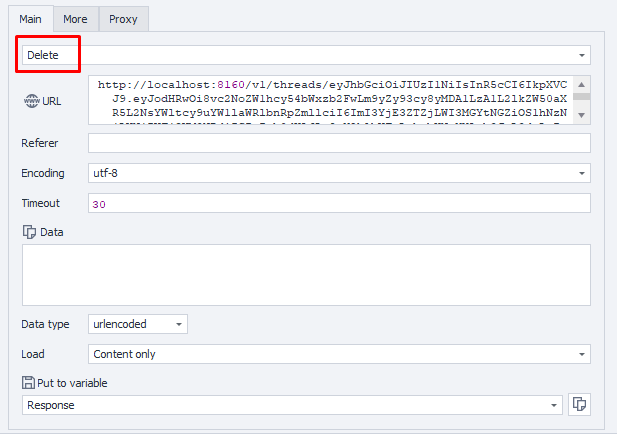

---
sidebar_position: 6
sidebar_label: Остановка потока выполнения
title: Остановка потока выполнения
description: Остановка одного потока выполнения — подробное руководство по ZennoBrowser Public API. Детальные инструкции, примеры использования и руководство по настройке
---
import DisclaimerNotice from '@site/src/components/DisclaimerNotice';

<DisclaimerNotice />

## **Описание** 

Этот метод можно использовать для остановки существующего потока выполнения.

## **Параметры запроса**

| Parameter | Type | Format | Default | Description |
| :-----: | :-----: | :-----: | :-----: | :----- |
| threadToken | string |  | (required) | Токен целевого потока (обязательный параметр) |
| workspaceId | integer | int64 | \-1 | Идентификатор рабочего пространства. -1 означает рабочее пространство по умолчанию |

:::note
Токен потока, который нужно удалить, должен быть указан в фигурных скобках `{ }` в пути URL.
:::

## **Пример запроса**

**DELETE**  
**CURL:**

```bash
curl 'http://localhost:8160/v1/threads/{threadToken}?workspaceId=-1' \
  --request DELETE \
  --header 'Api-Token: YOUR_SECRET_TOKEN'
```

**C#:**

```csharp
using System.Net.Http.Headers;
var client = new HttpClient();
var request = new HttpRequestMessage
{
    Method = HttpMethod.Delete,
    RequestUri = new Uri("http://localhost:8160/v1/threads/{threadToken}?workspaceId=-1"),
    Headers =
    {
        { "Api-Token", "YOUR_SECRET_TOKEN" },
    },
};
using (var response = await client.SendAsync(request))
{
    response.EnsureSuccessStatusCode();
    var body = await response.Content.ReadAsStringAsync();
    Console.WriteLine(body);
}
```

**Cube:**  
```
http://localhost:8160/v1/threads/{threadToken}?workspaceId=-1
```



### **Дополнительно**

User-Agent: `{-Profile.UserAgent-}`  
Api-Token: Токен из **UserArea2**


## **Ответ API**

| Response code | Result |
| :---: | :---: |
| `200 OK` | Успешно |
| `500 Error` | Внутренняя ошибка сервера |

**Успешный ответ (200 OK):**

В случае успешного удаления содержимое в ответе не возвращается.

**Ответ с ошибкой (500):**

```json
{
  "message": null
}
```

---