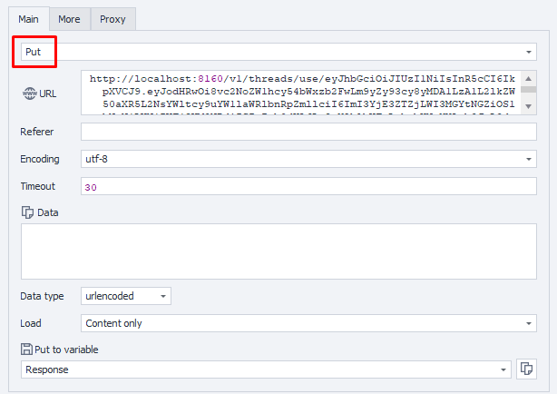

---
sidebar_position: 4
sidebar_label: Обновление потока выполнения
title: Обновление потока выполнения
description: Обновление конфигурации одного потока выполнения — подробное руководство по ZennoBrowser Public API. Подробные инструкции, примеры использования и руководство по настройке
---
import DisclaimerNotice from '@site/src/components/DisclaimerNotice';

<DisclaimerNotice />

**Описание:** Этот метод используется для продолжения работы потока выполнения, связанного с токеном потока.

#### **Параметры запроса:**

| Parameter | Type | Format | Default | Description |
| :-----: | :-----: | :-----: | :-----: | :----- |
| threadToken | string |  | (required) | Уникальный идентификатор потока выполнения, который нужно продолжить. |
| workspaceId | integer | int64 | \-1 | Идентификатор рабочего пространства. `-1` означает рабочее пространство по умолчанию. |

:::note
ID потока, который нужно обновить, должен быть указан в фигурных скобках `{ }` в пути URL.
:::

#### **Пример запроса:**

**PUT**  
**CURL:**

```bash
curl 'http://localhost:8160/v1/threads/use/{threadToken}?workspaceId=-1' \
  --request PUT \
  --header 'Api-Token: YOUR_SECRET_TOKEN'
```

**C#:**

```csharp
using System.Net.Http.Headers;
var client = new HttpClient();
var request = new HttpRequestMessage
{
    Method = HttpMethod.Put,
    RequestUri = new Uri("http://localhost:8160/v1/threads/use/{threadToken}?workspaceId=-1"),
    Headers =
    {
        { "Api-Token", "YOUR_SECRET_TOKEN" },
    },
};
using (var response = await client.SendAsync(request))
{
    response.EnsureSuccessStatusCode();
    var body = await response.Content.ReadAsStringAsync();
    Console.WriteLine(body);
}
```

**Cube:**  
```
http://localhost:8160/v1/threads/use/{threadToken}?workspaceId=-1
```



**Дополнительно:**  
User-Agent: `{-Profile.UserAgent-}`  
Api-Token: токен из **UserArea2**.  


#### **Ответ API:**

| Response code | Result |
| :---: | :---: |
| `200 OK` | Успех |
| `500 Error` | Внутренняя ошибка сервера |

**Успешный ответ (200 OK):**

При успешном обновлении содержимое в ответе не возвращается.

**Ответ с ошибкой (500):**

```json
{
  "message": null
}
```

---