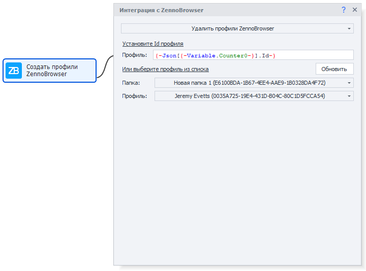

import DisclaimerNotice from '@site/src/components/DisclaimerNotice';

# Удаление профилей ZennoBrowser
<DisclaimerNotice />  

Действие "Удалить профили ZennoBrowser" предназначено для безвозвратного удаления выбранных профилей браузера из системы ZennoBrowser.

### **Способы указания профилей для удаления**

 1. **Ручной ввод ID:** укажите идентификатор профиля в поле "Установите ID профилей".

Поддерживается использование переменных для динамического указания ID.

 2. **Выбор из списка:**
 - Выберите папку профилей из выпадающего списка;
 - Выберите конкретный профиль для удаления из выбранной папки.

### **Обновление списка профилей**

Для получения актуального списка доступных профилей используйте кнопку "Обновить" в настройках действия.