:::info **Пожалуйста, ознакомьтесь с [*Правилами использования материалов на данном ресурсе*](../../Disclaimer).**
:::
_______________________________________________
## Как добавить в проект?  
***Нажимаем ПКМ → Добавить действие → Android → Действия с приложением***  

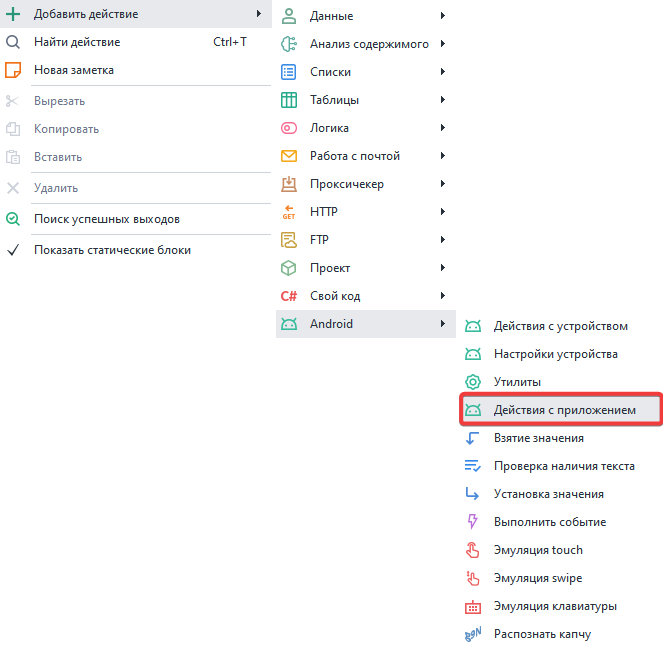  
_______________________________________________   
## Доступные действия.  
### Установка приложения.  
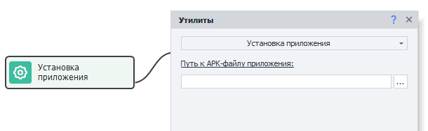  
Данное действие позволяет установить приложение из APK файла. Поддерживаемые форматы: ***.xapk, .apkm, .apks***
_______________________________________________  
### Удаление приложения.  
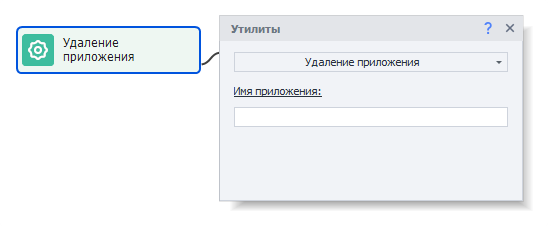  
Этот экшен удаляет установленное приложение по его имени, которое можно узнать с помощью инструмента [**Установленные приложения**](../../Tools/Installed_App).  
_______________________________________________ 
### Открыть приложение.  
Позволяет запустить ранее установленное приложение.  

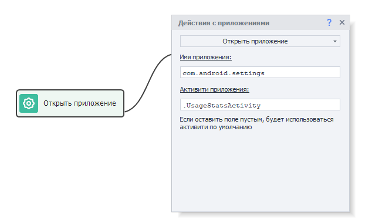  

- *Имя приложения*. Можно узнать с помощью инструмента [**Установленные приложения**](../../Tools/Installed_App).  
- *Активити приложения*. Позволяет сразу открыть нужное окно приложения. Это значение можно найти, изучив дамп приложения: `dumpsys package com.package_name | grep -i activity`. 
_______________________________________________   
### Открыть URL
Позволяет открыть веб-страницу в браузере. 

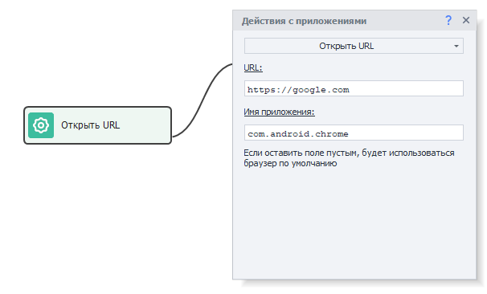

- *URL*. Тут указываем адрес страницы, которую хотим открыть.  
- *Имя приложения*. Сюда нужно поместить приложение, которое умеет открывать ссылки. Имя можно узнать с помощью инструмента [**Установленные приложения**](../../Tools/Installed_App). Если ничего не указать, то страница откроется в браузере по умолчанию.
_______________________________________________ 
### Закрыть приложение.  
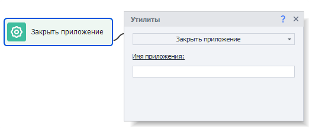  
Закрывает приложение (аналог команды `adb shell am force-stop com.package`). 
_______________________________________________ 
### Очистка приложения.  
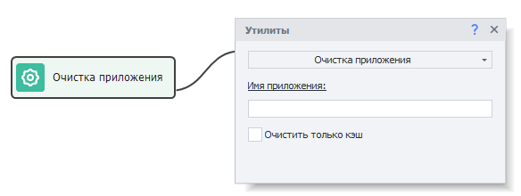   
Это действие нужно, чтобы стереть все данные пользователя.  
Поставив галочку на ***Очистить только кэш***, вы удалите только его, оставив все остальное. 
_______________________________________________ 
### Сохранить данные приложения.  
Данная функция позволяет сохранить все данные приложения (что-то вроде сохранения профиля в ZennoPoster).

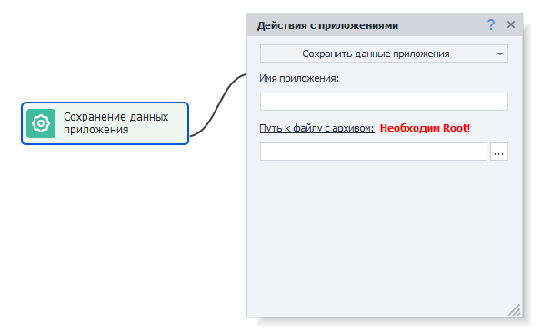  
 
#### Доступные параметры:    
- *Имя приложения*. Можно узнать с помощью инструмента [**Установленные приложения**](../../Tools/Installed_App).  
- *Путь к файлу с архивом*. Тут необходимо указать путь, куда будут сохранены заархивированные данные приложения (формат архива - ***tar.gz***).  
:::tip **Лучше так.**
Перед сохранением данных приложение лучше закрыть с помощью экшена Эмуляция клавиатуры с таким текстом внутри: `{AndroidKeys.HOME}`. Это эмуляция нажатия клавиши HOME.
:::  

#### Зачем закрывать приложение перед сохранением?  
Если в момент сохранения данных приложение будет открыто, то есть вероятность того, что часть из них будет в оперативной памяти, а не в файлах. Тогда эти данные не будут сохранены. Также не стоит для этих целей закрывать приложение с помощью экшена **Закрыть приложение**, так как он убивает процесс, что может привести к потере данных.  

### Восстановить данные приложения.  
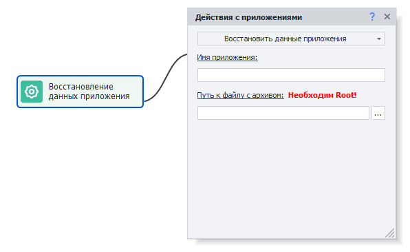  
С помощью данной функции вы можете загрузить данные приложения, которые были сохранены с помощью прошлого действия (***Сохранить данные приложения***).  
#### Доступные параметры:  
- *Имя приложения*. Можно узнать с помощью инструмента [**Установленные приложения**](../../Tools/Installed_App).  
- *Путь к файлу с архивом*. Тут необходимо указать путь к архиву с данным от приложения.  
:::warning **Внимание.**
При восстановлении данных приложение должно быть установлено в системе, но не запущено!
::: 
 
### Получить apk приложения.  
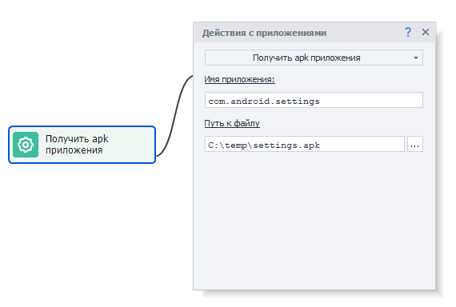  
Этот экшен позволяет получить установочный файл приложения в формате ***.apk*** или ***.apks***  
В дальнейшем приложение можно будет установить с помощью экшена **Установка apk**.  
_______________________________________________   
### Получить куки из приложения.  
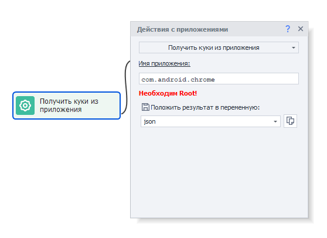   
Данное действие получает куки из приложений с Web содержимым, которые возвращаются в формате json.  
Затем эти данные можно прочесть с помощью экшена [**Обработка JSON и XML**](../../Data/JSON_XML).  
_______________________________________________ 
### Получить уведомления.  
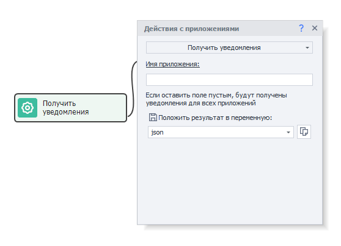   
Экшен получает уведомления от приложений из шторки (верхней системной панели) в формате json.  
Затем эти данные можно прочесть с помощью экшена [**Обработка JSON и XML**](../../Data/JSON_XML).  
_______________________________________________ 
### Очистить уведомления.  
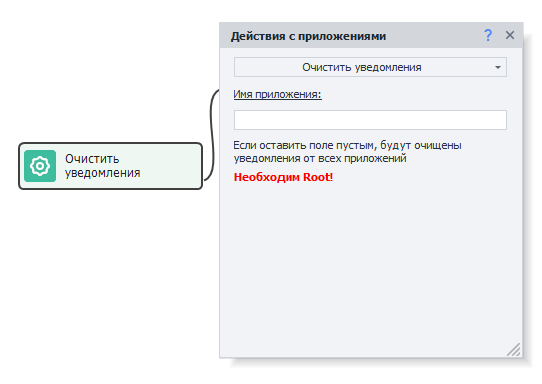  
Эта функция убирает все накопившиеся уведомления из верхней шторки.  
_______________________________________________   
### Имя активного приложения.  
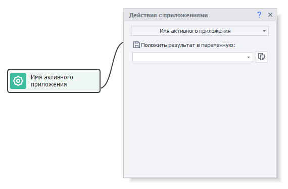  
С помощью этого действия мы можем получить название приложения, которое активно и находится на переднем плане устройства.  
_______________________________________________   
### Получить список приложений.  
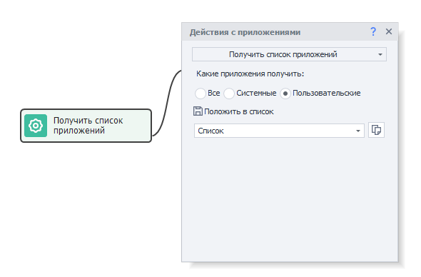  
Экшен позволяет получить названия всех установленных приложений и сохранить их в список.  
#### Фильтр получаемых приложений:  
- *Все*. Все приложения установленные на устройстве.  
- *Системные*. Предустановленные приложения, которые обычно нельзя удалить, а можно только скрыть.  
- *Пользовательские*. Приложения, которые были установлены вами в процессе работы.  
_______________________________________________ 
### Проверка, что приложение уже установлено.  
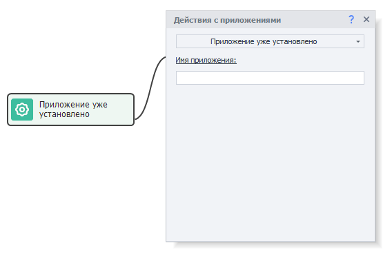  
Данная функция проверяет наличие приложения на устройстве. Его отсутствие будет трактоваться как ошибка, и выход пойдет по красной ветке.
_______________________________________________  
## Полезные ссылки.   
- [**Начало работы с браузером**](../../get-started/browser).  
- [**Отладка проектов**](../../pm/Debugging).   
- [**Работа с BlueStacks (ZDE)**](../../Enterprise/BlueStacks).
   