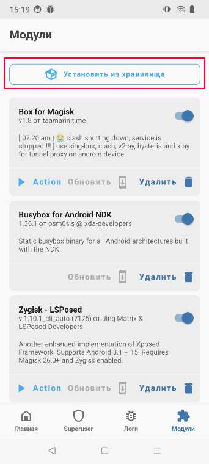
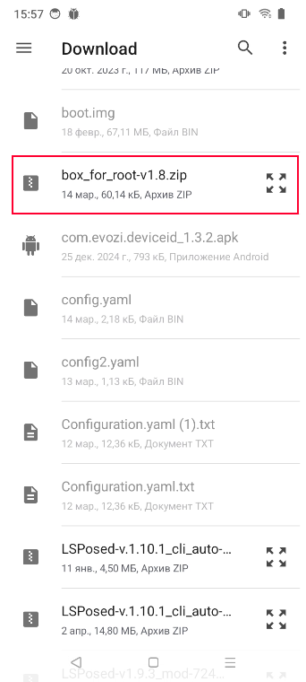

:::info **Пожалуйста, ознакомьтесь с [*Правилами использования материалов на данном ресурсе*](../../Disclaimer).**
:::
_______________________________________________ 
## Описание.  
Clash позволяет настроить прозрачный прокси на Android-устройствах с Root. Входит в состав модуля Box for Root для Magisk.  

Эта программа понадобится для [Установки прокси в режиме Clash](../../Settings/Proxy_Traffic_Ent).  
_______________________________________________
## Установка вручную.  
:::warning **Ставить модуль вручную необязательно.**
Box for Root автоматически устанавливается при первом использовании прокси в режиме Clash.
:::  

Для установки модуля вам понадобится смартфон с [**Magisk**](https://github.com/topjohnwu/Magisk).

Скачиваем последнюю версию модуля [Box for Root](https://github.com/taamarin/box_for_magisk/releases/latest) в папку телефона `sdcard/Download/` и устанавливаем с помощью стандартного меню.   

### **1. Открываем Magisk → раздел *Модули* → Установить из хранилища.**

### **2. Находим установщик среди скачанных файлов.**

### **3. Подтверждаем установку.**
  

### **4. В процессе установки в логе появится надпись `Do you want to download Kernel`**

**В этот момент необходимо зажать на телефоне кнопку *увеличения* громкости. Это запустит процесс скачивания дополнительных файлов, необходимых для функционирования модуля.**
:::warning **После установки необходимо перезагрузить устройство.**
:::
_______________________________________________ 