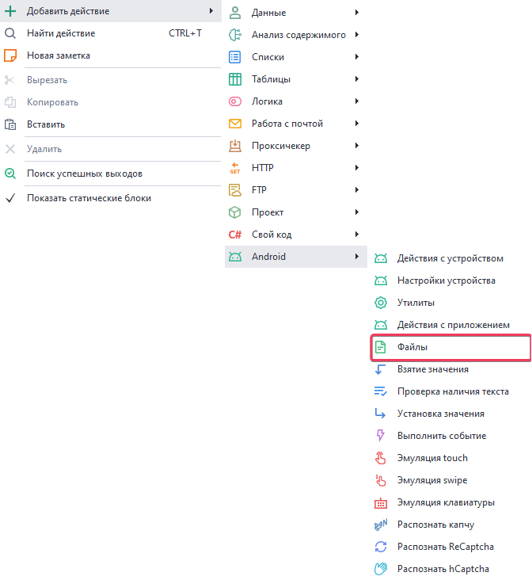
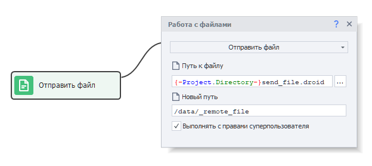
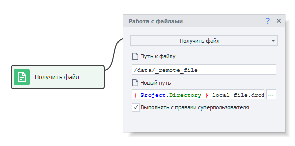

---
sidebar_position: 5
sidebar_label: Работа с файлами (Enterprise)
title: Работа с файлами (Enterprise) | Документация ZennoDroid | ZennoLab
description: Работа с файлами (Enterprise) - раздел официальной документации ZennoDroid от ZennoLab. Подробные инструкции, примеры использования и руководство по настройке
---  
import DisclaimerNotice from '@site/src/components/DisclaimerNotice';

# Работа с файлами (Enterprise)
<DisclaimerNotice />

Данный экшен позволяет отправлять файлы с компьютера на устройство и наоборот.  
_______________________________________________
## Как добавить в проект?  
***Нажимаем ПКМ → Добавить действие → Android → Файлы***  

  
_______________________________________________ 
### Отправка файла.  
Эту функция нужна, чтобы скопировать файл с компьютера на устройство.  

  

#### Доступные параметры:  
- *Путь к файлу*. Полный путь к файлу на компьютере.  
- *Новый путь*. Место, куда будет сохранен скопированный файл.  
Можно указать полный путь, задав сразу название для файла: `/sdcard/Pictures/pic.png` или же указать только папку: `/sdcard/Pictures/`. Во втором сценарии файл будет скопирован с имеющимся названием. Медиафайлы будут автоматически обновлены в галерее после отправки.  
:::info **Обратите внимание.**
Для отправки файлов в папки, для доступа к которым необходимы права суперпользователя (root), необходимо сначала отправить файл в папку `/data/local/tmp/` на устройстве. А затем уже с помощью экшена [**Консольная команда (ADB Shell)**](./Utilities_Ent#консольная-команда-adb-shell) скопировать файл в нужное место.  

Например:  `su -c cp /data/local/tmp/myfile /data/data/app/myfile`  
::: 

Выполнять с правами суперпользователя - необходимо установить данный параметр для отправки файлов в папки для доступа к которым необходимы права суперпользователя (при отправке файла выдается сообщение содержащее Permission denied). Если при выключенной настройке файл отправляется без ошибок, то включать данную настройку категорически не рекомендуется.   

### Получение файла.  
С помощью данного действия можно наоборот скопировать файл уже с устройства на компьютер.  

  

#### Доступные параметры:  
- *Путь к файлу*. Полный путь к файлу на смартфоне.  
- *Новый путь*. Место на компьютере, куда будет перемещён этот файл.  
Можно указать полный путь, задав сразу название для файла: `c:\Images\pic.png` или же указать только папку: `/sdcard/Pictures/`. Во втором сценарии файл будет скопирован с имеющимся названием. 

Выполнять с правами суперпользователя - необходимо установить данный параметр для получения файлов из папок для доступа к которым необходимы права суперпользователя (при получении файла выдается сообщение содержащее Permission denied или No such file or directory). Если при выключенной настройке получение файла работает без ошибок, то включать данную настройку категорически не рекомендуется.  
_______________________________________________
## Полезные ссылки.  
- [**Установка Root-прав**](../../Enterprise/Root)