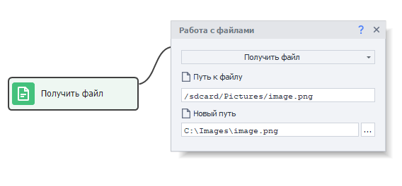

---
sidebar_position: 5
title: Работа с файлами (Enterprise)
description: Отправка файлов на реальное устройство с компьютера.
---  
:::info **Пожалуйста, ознакомьтесь с [*Правилами использования материалов на данном ресурсе*](../../Disclaimer).**
:::
_______________________________________________
Данный экшен позволяет отправлять файлы с компьютера на устройство и наоборот.  
_______________________________________________
## Как добавить в проект?  
***Нажимаем ПКМ → Добавить действие → Android → Файлы***  

  
_______________________________________________ 
### Отправка файла.  
Эту функция нужна, чтобы скопировать файл с компьютера на устройство.  

  

#### Доступные параметры:  
- *Путь к файлу*. Полный путь к файлу на компьютере.  
- *Новый путь*. Место, куда будет сохранен скопированный файл.  
Можно указать полный путь, задав сразу название для файла: `/sdcard/Pictures/pic.png` или же указать только папку: `/sdcard/Pictures/`. Во втором сценарии файл будет скопирован с имеющимся названием. Медиафайлы будут автоматически обновлены в галерее после отправки.  
:::info **Обратите внимание.**
Для отправки файлов в папки, для доступа к которым необходимы права суперпользователя (root), необходимо сначала отправить файл в папку `/data/local/tmp/` на устройстве. А затем уже с помощью экшена [**Консольная команда (ADB Shell)**](./Utilities_Ent#консольная-команда-adb-shell) скопировать файл в нужное место.  

Например:  `su -c cp /data/local/tmp/myfile /data/data/app/myfile`  
::: 

### Получение файла.  
С помощью данного действия можно наоборот скопировать файл уже с устройства на компьютер.  

  

#### Доступные параметры:  
- *Путь к файлу*. Полный путь к файлу на смартфоне.  
- *Новый путь*. Место на компьютере, куда будет перемещён этот файл.  
Можно указать полный путь, задав сразу название для файла: `c:\Images\pic.png` или же указать только папку: `/sdcard/Pictures/`. Во втором сценарии файл будет скопирован с имеющимся названием. 
_______________________________________________
## Полезные ссылки.  
- [**Установка Root-прав**](../../Enterprise/Root)