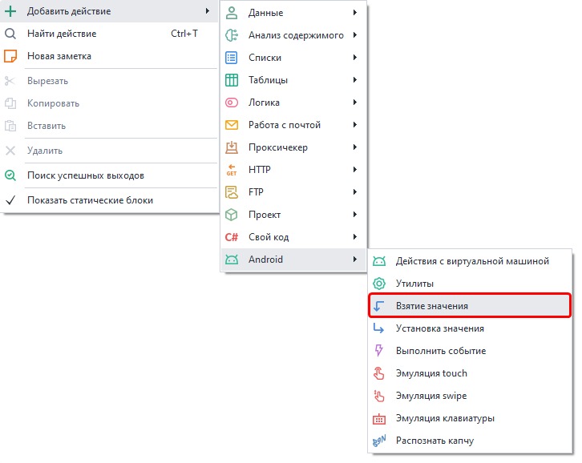
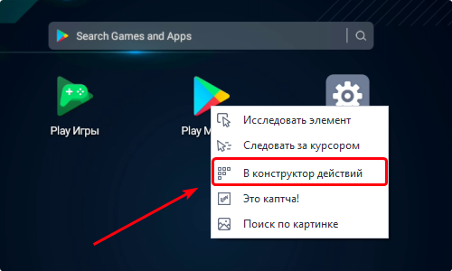
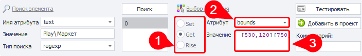
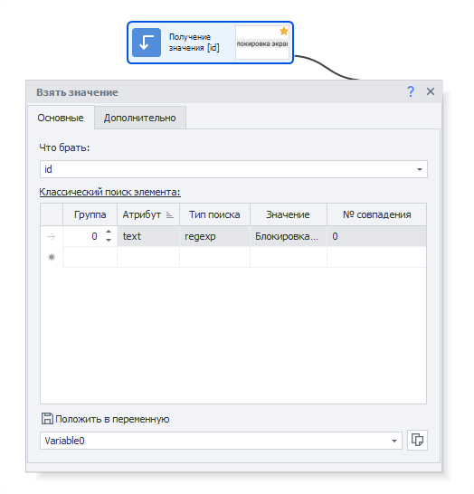
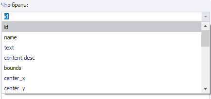
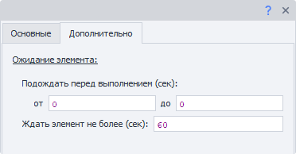
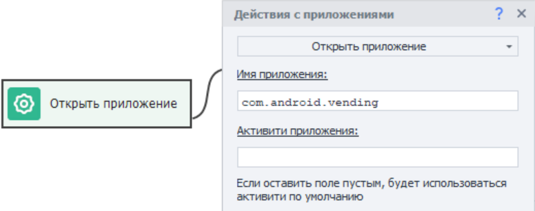
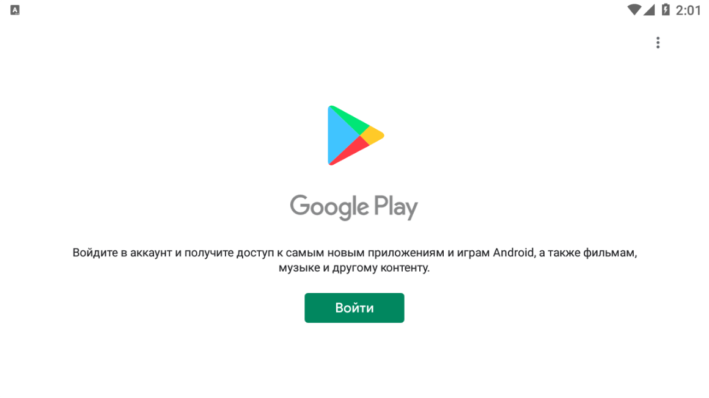
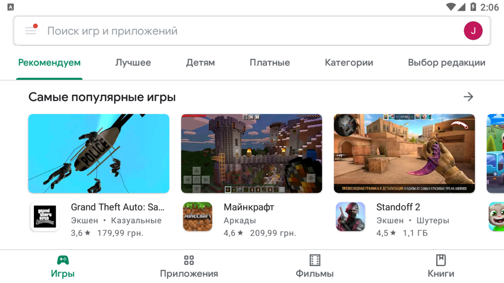
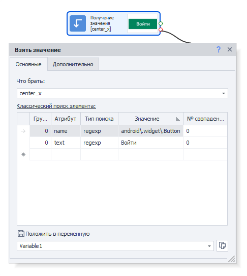

:::info **Пожалуйста, ознакомьтесь с [*Правилами использования материалов на данном ресурсе*](../../Disclaimer).**
:::
_______________________________________________  
## Описание.  
Данный экшен нужен для получения значения атрибутов у указанного элемента.  
Например:  
- *высота/ширина*;  
- *внутренний текст*;  
- *координаты центра*;  
- *id элемента*;  
- *и другие*.  

### Чем полезен?  
Позволяет проверять наличие элемента на странице. Используется для:  
- **Определения авторизации**.  
Например, когда пользователь авторизован в приложении, то появляется кнопка перехода в Личный кабинет или же символ выхода (Log out). Если что-то из этого есть, то всё в порядке, мы вошли в аккаунт.  
- **Поиск сообщений с ошибками**.  
Полезно при разгадывании капч. Ведь если капча была разгадана неверно, то часто появляется новый элемент с уведомлением о провале. В таком случае нам нужно попробовать разгадать капчу ещё раз.  

### Как добавить в проект?  
Через контекстное меню полотна:  
**Добавить действие → Android → Взятие значения**.  

  
_______________________________________________ 
## Выбрать элемент для взятия.  
В качестве элемента может выступать любой ярлык на главном экране, например, Play Market. Делаем по нему **ПКМ → В конструктор действий**.  

 

После этого внизу, под окном браузера, откроется [**Конструктор действий**](../../pm/Interface/ActionBuilder).  

  

Данные для поиска будут автоматически подобраны таким образом, что в результате останется только один элемент.  

#### Описание пунктов:  
**1**. В пункте *Действие* выбираем **Get** (получить).  
**2**. Координаты хранятся в атрибуте **bounds**.  
**3**. В первых скобках `[]` указаны координаты верхнего левого угла элемента, а во вторых — правого нижнего.  

#### Порядок действий:  
- Выбираем **bounds** из выпадающего списка параметра *Атрибут*.  
- В поле *Значение* после этого появятся координаты (например — `[530,120][750,253]`)  
- Перед добавлением экшена в проект проверим его работу, нажав кнопку **Тестировать**.  
- *Рекомендуем также написать комментарий к действию для большей информативности.*  
- Завершаем работу кликом **Добавить в проект**.  
_______________________________________________ 
## Настройка экшена.  
### Вкладка «Основные».
  

#### Что брать.  
При нажатии открывается список доступных атрибутов для считывания.  

#### Поиск элемента.  
Указываем необходимые параметры для поиска нужных элементов.  

### Вкладка «Дополнительно».  
  

#### Подождать перед выполнением.  
Указываем диапазон **ОТ** и **ДО** в секундах, из которого будет браться случайное значение для ожидания перед выполнением.  

#### Ждать элемент не более.  
Если по истечению указанного времени в секундах элемент не появится, то экшен завершит работу с ошибкой.  
_______________________________________________ 
## Пример использования.  
Разберём работу экшена на примере приложения Google Play. Представим, что нам нужно проверить авторизацию пользователя.  

Сначала запустим приложение одним из двух способов:  
- С помощью экшена [**Выполнить событие**](./RunEvent).  
- Через экшен [**Действия с приложением. Открыть приложение**](./App#открыть-приложение).  
  
| Воспользуемся вторым способом:    | 
| -------- | 
|   | 
| *Имя приложения можно узнать с помощью окна [**Установленные приложения**](../../Tools/Installed_App)* |  

Если пользователь не авторизован, то вы увидите окно с кнопкой **Войти**.   
| Без авторизации    | С авторизацией |
| -------- | ------- |
|   |     |

:::info **Язык приложения зависит от языка виртуальной машины.**
:::

Будем искать кнопку **Войти** сразу по двум критериям:  

  

В случае успешного обнаружения кнопки и получения значения для атрибута, мы делаем вывод, что пользователь не авторизовался.  

А если же экшен не нашёл кнопку, то пользователь вошёл в свой аккаунт.
_______________________________________________ 