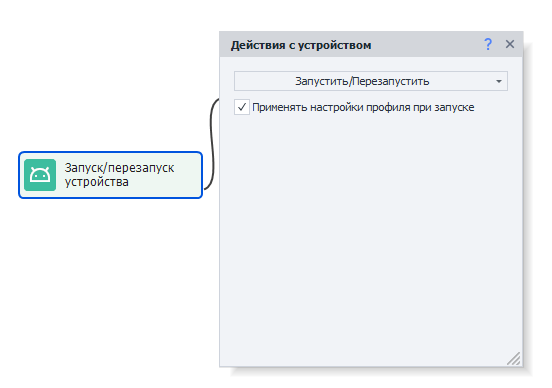

---
sidebar_position: 1
title: Действия с устройством (Enterprise)
description: Как взаимодействовать с устройством через ProjectMaker
---  
:::info **Пожалуйста, ознакомьтесь с [*Правилами использования материалов на данном ресурсе*](../../Disclaimer).**
:::
_______________________________________________
export const VideoSample = ({source}) => (
  <video controls playsInline muted preload="auto" className='docsVideo'>
    <source src={source} type="video/mp4" />
</video>
);   

## Как добавить действие в проект?  

Для вызова контекстного меню нажимаем правой кнопкой мыши по пустому месту.  
Затем **Добавить действие → Android → Действия с устройством**.  

  
_______________________________________________
## Как выбрать устройство?  

С помощью данного действия можно выбрать устройство, с которым будет вестись работа.  

 

### Доступные настройки:  
- ***Полное название или индекс***.  
Указываем тут серийный номер устройства или индекс (нумерация с нуля). Если здесь ничего не указать, то будет выбрано случайное устройство. 
- ***Regex***.  
В случае выбора этого варианта возьмётся случайное устройство из списка, который содержит серийные номера всех подключенных устройств, согласно заданному Regex выражению.    
- ***Положить индекс\имя в переменную***.  
Данный параметр позволяет сохранить название или индекс выбранного устройства в переменные. Обычно применяется при случайном выборе, чтобы знать, какое устройство используется.  
_______________________________________________
## Как запустить или перезапустить устройство?  
Данное действие запускает подключение к выбранному устройству и начинает взаимодействие с ним. Либо перезапускает уже существующее подключение к устройству.

 
  
:::danger **Перед запуском обязательно нужно *Выбрать* устройство, с которым будет работать программа.**
:::
_______________________________________________
## Как остановить устройство?  
Это действие останавливает запущенное устройство.   

   
_______________________________________________
## Как переименовать устройство?  
Позволяет изменить имя текущего устройства.  

 

:::info **Будьте внимательны.**
*Изменяется имя устройства, которое было выбрано с помощью функции **Выбрать** (описана в начале статьи).*
:::
_______________________________________________
## Как получить список устройств?  

Представленное действие позволяет сохранить все доступные устройства в список.  

 
#### Доступные настройки:  
- ***Что получить***.  
Можно выбрать что именно сохранить в список: индексы устройств или их серийные номера .  
- ***Положить в список***.  
Это список, в который будет сохранен результат работы.  
- ***Фильтр***.  
Также можно отфильтровать получаемый список по состоянию устройства:  
  - **Все.** Сюда входят все созданные устойства, не зависимо от их состояния.  
  - **Занятые.** Устройство занято в одном из выполняющихся потоков. Работает только при выполнении в ZennoDroid. (ProjectMaker не видит потоки выполняющиеся в ZennoDroid).  
  - **Не занятые.** Устройство не используется ни в одном из выполняющихся потоков. Данный фильтр также работает только при выполнении в ZennoDroid.  
  - **Запущенные.** Устройство подключено к компьютеру и с ним есть связь через ADB.  
  - **Не запущенные.** Устройство подключено, но с ним нет связи через ADB. Например, устройство не авторизовано или находится в состоянии *offline*.  
_______________________________________________  
## Полезные ссылки.   
- [**Автоматизация работы в приложениях**](../../get-started/apps).   
- [**Окно устройства**](../../pm/Interface/DeviceWindow).

