import DisclaimerNotice from '@site/src/components/DisclaimerNotice';

# Настройки устройства (Enterprise)
<DisclaimerNotice />

export const VideoSample = ({source}) => (
  <video controls playsInline muted preload="auto" className='docsVideo'>
    <source src={source} type="video/mp4" />
</video>
); 
 

## Как добавить действие в проект?  

Для вызова контекстного меню нажимаем правой кнопкой мыши по пустому месту.  
Затем **Добавить действие → Android → Настройки устройства**.  

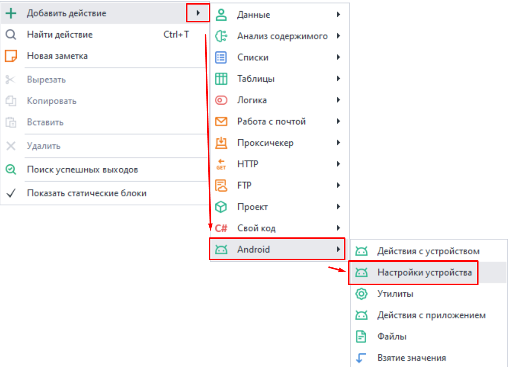  
_______________________________________________ 
## Как настроить идентификаторы устройства.  

С помощью данной функции можно изменить такие параметры как [IMEI](https://ru.wikipedia.org/wiki/IMEI), Android ID (идентификатор устройства), [IMSI](https://ru.wikipedia.org/wiki/IMSI), Sim Serial (серийный номер SIM карты).  

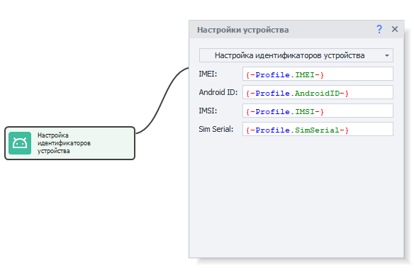  

Данные можно ввести вручную или взять из активного профиля.  

:::warning **Требуется установленный [*модуль «ZennoDroid» для LSPosed*](../../Enterprise/LSPosed#установка-модуля-zennodroid).**
:::
_______________________________________________ 
## Как добавить сотового оператора?  

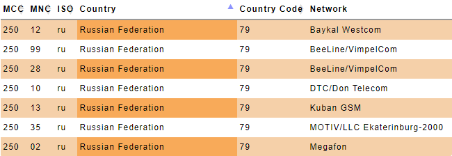  

Данные можно ввести вручную или взять из текущего профиля. Для ручного заполнения всю необходимую информацию можно найти [**на этом сайте**](https://www.mcc-mnc.com/)  

### Доступные настройки:  

 
- ***Страна***. Две буквы из колонки ISO.  
- ***Код оператора***. Совокупность значений из колонок MCC и MNC (например, 25002 для Мегафона).  
- ***Название оператора***. Колонка Network (Baykal Westcom, BeeLine/VimpelCom, MTS).  
- ***Номер телефона***. Без знака "+" в начале, 79*** и так далее.  

:::warning **Требуется установленный [*модуль «ZennoDroid» для LSPosed*](../../Enterprise/LSPosed#установка-модуля-zennodroid).**
:::
_______________________________________________ 
## Как указать модель устройства?  

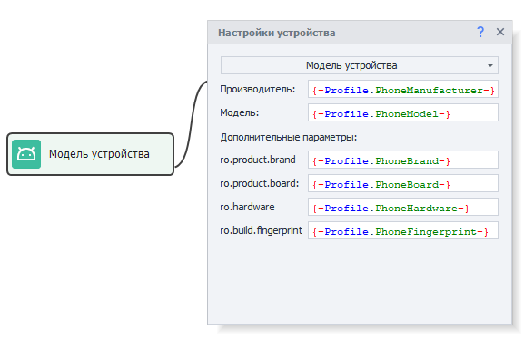 
### Доступные настройки:  
- ***Производитель***. Чье устройство эмулируем (Samsung, Huawei, Xiaomi, Google, Meizu и т.д.).  
- ***Модель***. Какую модель используем. Можно найти в build.prop (подскажем как ниже).  
- ***ro.product.brand***. Если в этом поле значение не указано, то дублируем его из Производитель.  
- ***ro.product.board***. Для современных телефонов неактуально, можно оставить пустым.  
- ***ro.hardware*** и ***ro.build.fingerprint***. Возьмем из build.prop.  

:::warning **Требуется установленный [*модуль «ZennoDroid» для LSPosed*](../../Enterprise/LSPosed#установка-модуля-zennodroid).**
:::

### Как найти данные в build.prop:  
Для этого необходимо сделать запрос в поисковую систему следующего вида:  
***build.prop phone_model*** *(например, build.prop Samsung s10)*.  
Переходим по одному из результатов и в тексте сообщения находим интересующие нас данные:  
`ro.product.brand=samsung`  
`ro.hardware.chipname=exynos9820`  
`ro.product.board = нет`  
`ro.product.model` или `ro.product.system.model`  
:::info **Как узнать параметры своего телефона?**
*Для этого нужно в терминале (например, [Terminal Emulator for Android](https://apkpure.com/terminal-emulator-for-android/jackpal.androidterm#google_vignette)) выполнить команду *getprop*.*
::: 
 
_______________________________________________
## Как настроить MAC адрес WiFi сети:  
Здесь можно установить новый MAC-адрес WiFi-адаптера на устройстве. Данные можно ввести вручную или взять из активного профиля.

 

Формат - через двоеточие: XX:XX:XX:XX:XX:XX, либо без него: XXXXXXXXXXXX (12 знаков)  

:::warning **Требуется установленный [*модуль «ZennoDroid» для LSPosed*](../../Enterprise/LSPosed#установка-модуля-zennodroid).**
::: 
_______________________________________________
## Выбор языка системы:  
Данная настройка меняет язык подключённого смартфона.   
Доступные значения: ***en, ko, de, ja, fr, ru, es, pt, hr, cn, sr, it, cs, th, in, pl, tr, uk, ar, vi, fil***  

:::warning **Перед изменением настроек убедитесь, что устройство выключено.**
:::
_______________________________________________
## Установка часового пояса:  
Позволяет выбрать часовой пояс устройства.  
Указывается в формате: ***Europe/Moscow*** или ***America/New_York*** и т.д.  
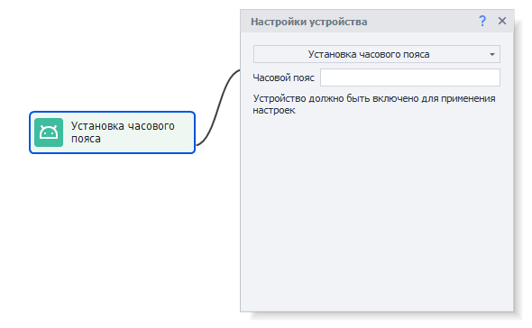  
Список всех доступных временных зон можно посмотреть [**Здесь**](https://en.wikipedia.org/wiki/List_of_tz_database_time_zones)  
_______________________________________________ 
## Как задать дату и время:  
Можно произвольно установить: **год, месяц, день, час, минуту и секунду**.  
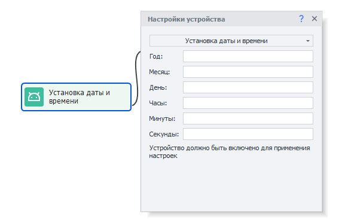    
Если оставить все поля пустыми, то произойдет автоматическая синхронизация с текущим временем.  
_______________________________________________ 
## **Доступ к WebView**
:::info **Добавлено в версии ZennoDroid 2.4.6.0.**
:::

Предоставляет возможность выполнять JavaScript в приложениях содержащих WebView.

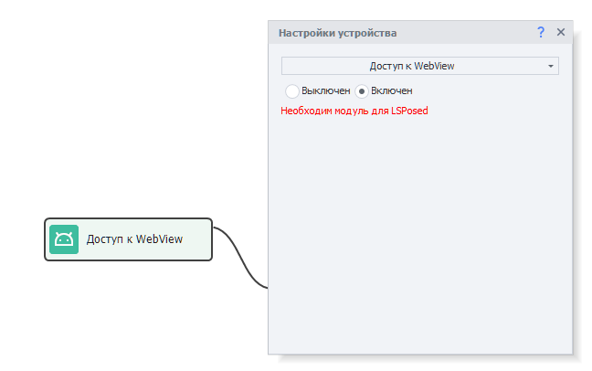

По умолчанию доступ к WebView в приложениях, не являющихся браузерами, всегда выключен. Данная настройка позволяет получить доступ к HTML-разметке не только браузеров, но и приложений использующих WebView. Для этого в дереве элементов должен присутствовать элемент `android.webkit.WebView`.

**Пример выполнения JavaScript:**
| Доступ к WebView выключен      |  |
| :-----------: | ----------- |
|  **Включен**   |       |


:::warning **Требуется установленный [*модуль «ZennoDroid» для LSPosed*](../../Enterprise/LSPosed#установка-модуля-zennodroid).**
:::
_______________________________________________ 
## **Сгенерировать устройство**
:::info **Добавлено в версии ZennoDroid 2.4.6.0.**
:::

Позволяет сформировать устройство по заданным фильтрам или из предварительно настроенных параметров в формате JSON.

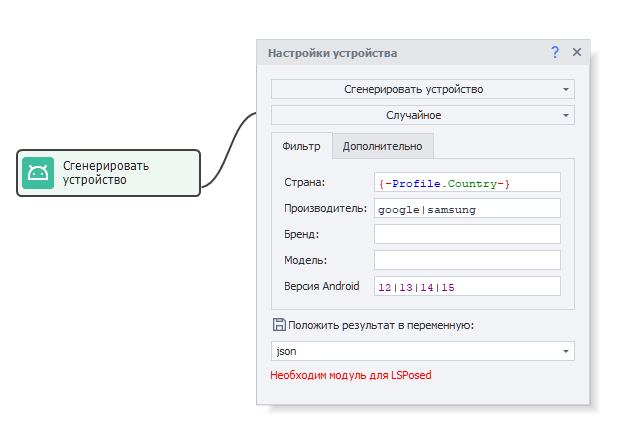

:::warning **Требуется установленный [*модуль «ZennoDroid» для LSPosed*](../../Enterprise/LSPosed#установка-модуля-zennodroid).**
:::
### **Случайное**
Генерация и применение случайного устройства по заданным фильтрам и настройкам.

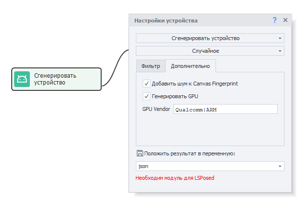

#### Вкладка «Фильтр»
- **Страна**. Используется для генерации мобильного оператора и сопутствующих настроек.  
Страна может быть указана в формате ISO:  
  - два символа, например, `ru`, `fr`, `us`  
  - или полностью: `Russia`, `France`, `United States of America`  
  - также поддерживается формат указанный в профиле в поле **Country** (Россия, France, USA)  
:::tip **Предпочтительно использовать двухбуквенный формат ISO**
Посмотреть коды и наименования стран можно  на сайте [http://www.mcc-mnc.com/](http://www.mcc-mnc.com/)
:::

- **Производитель устройства**. Можно указать несколько производителей: `google|samsung`.
- **Бренд устройства**. Используется если у производителя их несколько и нужен конкретный бренд.  
Например, у производителя Xiaomi есть бренды Poco и Redmi.  
- **Модель устройства**. Нужно для указания конкретного набора моделей.  
Например, `Pixel [7|8]` — только Google Pixel 7 или 8.
- **Версия Android**. Для выбора конкретных версий Android: `12|13|14|15`

#### Вкладка «Дополнительно»
- **Добавить шум к Canvas Fingerprint** — добавляет шум для *Canvas Fingerprint* (в приложениях и в браузерах).  
- **Генерировать GPU** — позволяет указать в приложениях **GPU Vendor** и **GPU Renderer**. В браузерах изменяет параметры WebGL: **Unmasked Vendor** и **Unmasked Renderer**.  
- **GPU Vendor** — позволяет задать фильтр *GPU Vendor* (`Qualcomm|ARM`).  
На некоторых телефонах при использовании вендора Qualcomm или ARM наблюдаются *проблемы с отображением на экране (**белый экран**)*. Можно установить фильтр, чтобы использовался только рабочий вендор. В случае проблем с обоими вендорами рекомендуется **отключить генерацию GPU**.  
- **Положить результат в переменную** — сгенерированное устройство будет сохранено в переменную в формате JSON. В дальнейшем можно повторно использовать сгенерированное устройство.

После установки фильтров рекомендуем проверить настройки, выполнив экшен. Если значения заданы некорректно или в базе устройств отсутствуют модели с необходимыми характеристиками, то появится предупреждение о невозможности сформировать устройство.

### **Использовать JSON**
Позволяет установить устройство из предварительно заданных параметров в формате JSON.

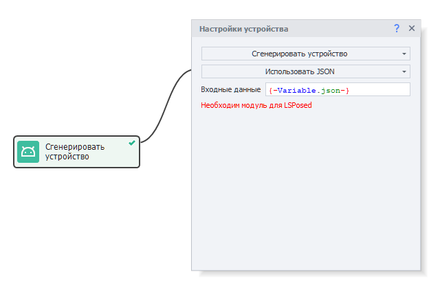

**Входные данные** — требуется строка в формате JSON, *можно указать переменную*.  
> Получить строку и ознакомиться с ее форматом можно при генерации случайного устройства.  
_______________________________________________  
## Как поставить прокси:  
Данная настройка позволяет установить прокси на все подключённые устройства.  

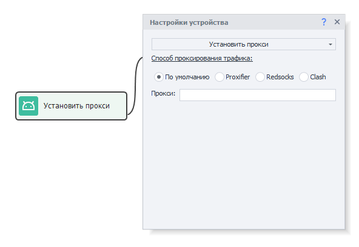  

Формат для прокси:  
- **С авторизацией**: `protocol://login:password@ip:port`.  
- **Без авторизации**: `protocol://ip:port`.  
Значения для **protocol**: ***http***, ***socks4*** или ***socks5***. Если не указать, то по умолчанию стоит ***http***.  

### [Proxifier](https://proxifier.com/).  
Это мощная и гибкая программа для перенаправления интернет-трафика через прокси-сервер. Она позволяет приложениям, которые не поддерживают работу через прокси, использовать его.  

#### Адреса DNS.  
Здесь можно настроить адреса DNS-сервера. Если их несколько, то разделять нужно запятой `,`  

#### Локальный IP.  
*Настройка локального IP-адреса устройства*.  

Если указать последнее число адреса равным нулю, например, `192.168.20.0`, то будет сгенерирован случайный адрес из указанной подсети `192.168.20.2-192.168.20.254`.

### Redsocks.  
Для проксирования трафика используется Redsocks2 — прозрачный редиректор TCP/UDP-соединений в прокси.  

#### Использовать интернет-подключение компьютера.  
При включении этой настройки весь трафик с телефона будет перенаправлен на компьютер.

#### Адреса DNS.  
Здесь можно настроить адреса DNS-сервера. Если их несколько, то разделять нужно запятой `,`  

По умолчанию DNS-запросы будут направляться через прокси-сервер. Поэтому если ваши запросы будут блокироваться (не подключается к интернету или возникает ошибка **`DNS_PROBE_FINISHED_NO_INTERNET`**), то необходимо отключить перенаправление.  

:::info **С# код для отключения перенаправления DNS-запросов.**  
```csharp
var settings = new DroidProxySettings.Redsocks();
settings.UseDnsTcp = false;
settings.UseDnsUdp = false;
instance.DroidInstance.Proxy.SetProxy("socks5://10.20.30.40:8080", settings);
```  
**Этот код необходимо выполнить перед установкой прокси.**
:::  

#### Локальный IP *(только при использовании интернет-подключения компьютера)*.  
*Настройка локального IP-адреса устройства*.  

Если указать последнее число адреса равным нулю, например, `192.168.20.0`, то будет сгенерирован случайный адрес из указанной подсети `192.168.20.2-192.168.20.254`.


### Clash.
Это продвинутый прокси-клиент с возможностью маршрутизации трафика по заданным правилам.  

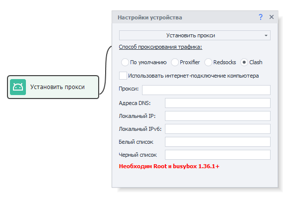 

:::warning **Необходим BusyBox версии не ниже 1.36.1.**
:::

#### Использовать интернет-подключение компьютера.  
При включении этой настройки весь трафик с телефона будет перенаправлен на компьютер.  

:::info **В данном режиме *не поддерживается* использование IPv6 прокси.**
:::

#### Адреса DNS.  
Здесь можно настроить адреса DNS-сервера. Если их несколько, то разделять нужно запятой `,`  

#### Локальный IP *(только при использовании интернет-подключения компьютера)*.  
*Настройка локального IP-адреса устройства*.  

Если указать последнее число адреса равным нулю, например, `192.168.20.0`, то будет сгенерирован случайный адрес из указанной подсети `192.168.20.2-192.168.20.254`.  

#### Локальный IPv6.  
Тут же выполняется настройка локального IPv6-адреса устройства.  

Пример адреса: `fdfe:dcba:9806::1/126` Если указать адрес вида `fdfe:dcba:0::1/126` то вместо **`0`** будет сгенерировано случайное число в шестнадцатеричном формате.  

#### Белый список.  
Список приложений, трафик которых будет идти через прокси (указываем каждое через запятую). Все остальные приложения будут использовать прямое подключение к интернету (без прокси).  

Идентификатор приложения можно узнать с помощью инструмента [Установленные приложения](../../Tools/Installed_App).  

#### Черный список.
Здесь наоборот задаётся список приложений, для которых будет недоступно прокси. Их трафик будет идти через прямое подключение к интернету. А все остальные приложения будут использовать прокси.  

Идентификатор приложения можно узнать с помощью инструмента [Установленные приложения](../../Tools/Installed_App).  

:::warning **Одновременно можно использовать либо белый, либо черный список.**
Если же заполнены оба поля, то будет использоваться только белый список.
:::  

#### Правила проксирования.  
Есть возможность задать собственные правила для проксирования. Их нужно разделять точкой с запятой `;` или переносом строки.  

| Примеры правил: | Описание|
| :-----------: | ----------- |
| `DOMAIN-REGEX,^abc,DIRECT`     | Не проксировать, если домен начинается с **abc**      |
| `DOMAIN-SUFFIX,ya.ru,REJECT`  | Блокировать трафик на домен **ya.ru**       |
| `DOMAIN-KEYWORD,google,PROXY`  | Проксировать трафик, если имя домена **google**      |
| `IP-CIDR,1.1.1.1/32,DIRECT`  | Не проксировать трафик на адрес **1.1.1.1**       |
| `AND,((NETWORK,TCP),(DST-PORT,5228-5230)),DIRECT`  | Не проксировать трафик на порты **TCP 5228-5230**     |
| `MATCH,DIRECT`  | Не проксировать весь трафик       |
| `MATCH,PROXY`  | Проксировать весь трафик      |
| `DOMAIN-SUFFIX,2ip.ru,PROXY;MATCH,DIRECT`  | Проксируется только трафик на **2ip.ru**     |
___________________________________________  
## Полезные ссылки.   
- [**Установка Root-прав**](../../Enterprise/Root).     
- [**Окно устройства**](../../pm/Interface/DeviceWindow).