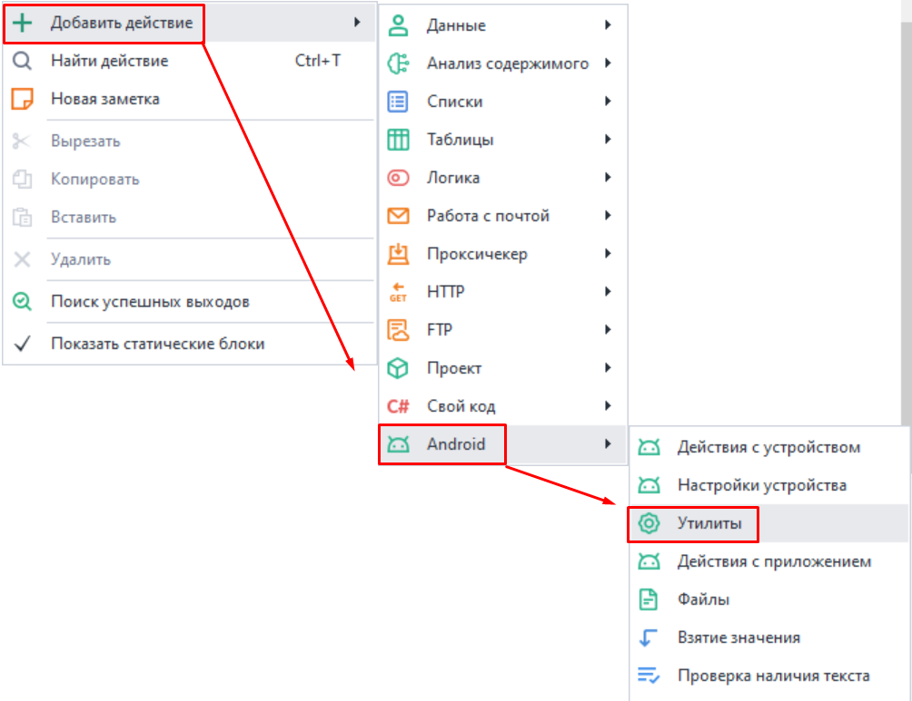
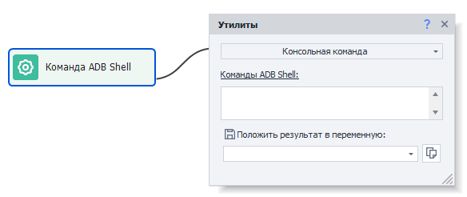

:::info **Пожалуйста, ознакомьтесь с [*Правилами использования материалов на данном ресурсе*](../../Disclaimer).**
:::
_______________________________________________ 
## ADB Shell.  
Так называется интерфейс командной строки для взаимодействия с устройствами Android. С его помощью можно выполнять различные команды для управления смартфоном, тестирования приложений и анализа их работы.           

### Как добавить в проект? 
#### Через контекстное меню:  
**Добавить действие → Android → Утилиты**.    

  

Экшен позволяет выполнять встроенные в Android консольные Linux команды.  


_______________________________________________
## Команды.  
:::warning **Все команды вводятся без `ADB Shell` в начале.**
:::  

Команд существует огромное количество, так что для их описания понадобится отдельная справка. Поэтому в данном разделе мы опишем только самые популярные.  

### Файловая система.  
| Название    | Описание |
| :-------- | :-------: |
| `ls`  | **Отображает список файлов и папок в текущем каталоге**   |
| `cd <путь>` | **Переход в указанный каталог**    |
| `pwd`    | **Показывает текущий путь**    |
| `mkdir <имя_папки>`  | **Создает новую папку**   |
| `rm <файл>` | **Удаляет указанный файл**    |
| `rm -r <папка>`    | **Удаляет папку и её содержимое**    |

### Работа с файлами.  
| Название    | Описание |
| :-------- | :-------: |
| `cat <файл>`  | **Выводит содержимое файла**   |
| `cp <источник> <назначение>` | **Копирует файл**    |
| `mv <источник> <назначение>`    | **Перемещает или переименовывает файл**    |
| `touch <имя_файла>`  | **Создает пустой файл**   |
| `stat <файл>` | **Выводит информацию о файле (размер, права, время модификации)**    |

### Системные команды.
| Название    | Описание |
| :-------- | :-------: |
| `reboot`  | **Перезагружает устройство**   |
| `reboot recovery` | **Перезагружает устройство в режим восстановления**    |
| `top`    | **Отображает список запущенных процессов с их использованием ресурсов**    |
| `free`  | **Показывает использование оперативной памяти**   |
| `df` | **Выводит информацию о свободном месте на дисках**    |  

### Управление приложениями.
| Название    | Описание |
| :-------- | :-------: |
| `pm list packages`  | **Отображает список установленных приложений**   |
| `pm uninstall <имя_приложения>` | **Удаляет приложение**    |
| `pm install <путь>`    | **У станавливает приложение из указанного APK-файла**    |
| `pm clear <имя_приложения>`  | **Очищает данные приложения**   |
| `am force-stop <имя_приложения>` | **Принудительно останавливает приложение**    |

### Как увидеть все доступные команды?  
:::tip  **BusyBox — это набор UNIX-утилит для командной строки.**
:::

 Для отображения списка команд введите в консоли это: `busybox`  

<details>
<summary>***Пример полученного вывода***</summary>  


```
root@x86:/ # busybox
BusyBox v1.22.1 bionic (2018-09-25 14:13 +0800) multi-call binary.
BusyBox is copyrighted by many authors between 1998-2012.
Licensed under GPLv2. See source distribution for detailed
copyright notices. Merged for bionic by tpruvot@github

Usage: busybox [function [arguments]...]
   or: busybox --list[-full]
   or: busybox --install [-s] [DIR]
   or: function [arguments]...

        BusyBox is a multi-call binary that combines many common Unix
        utilities into a single executable.  Most people will create a
        link to busybox for each function they wish to use and BusyBox
        will act like whatever it was invoked as.

Currently defined functions:
        [, [[, adjtimex, arp, ash, awk, base64, basename, bbconfig, blkid,
        blockdev, brctl, bunzip2, bzcat, bzip2, cal, cat, catv, chattr, chcon,
        chgrp, chmod, chown, chroot, chvt, clear, cmp, и так далее...
```
     
</details>    

### Подсказки по командам.
По некоторым из команд можно получить подсказку с описанием их функций. Достаточно ввести `<имя_команды> --help`. Информация доступна только на английском языке. 

| `mkdir --help` | 
| :-------- |
|   |  

:::tip  **Если такой способ кажется вам не информативным.**
То всегда можно найти детальную информацию в интернете. Так как все эти команды базовые для Linux, по ним много инструкций и объяснений.
:::
_______________________________________________ 
## Специальные команды.  
### Activity Manager `am`. 
Так называется системная команда Android, которая используется для управления приложениями, их состояниями и взаимодействия с компонентами системы. Она полезна для разработчиков и тестировщиков, поскольку позволяет автоматизировать различные действия на устройстве.  

В Android приложения состоят из компонентов, среди которых основные — это **Activity** и **Intent**. Эти концепции связаны и играют важную роль в архитектуре приложений.

#### Activity.
Это компонент Android-приложения, представляющий один экран пользовательского интерфейса. Как, например, страница в браузере или окно приложения. Чаще всего окна Activity развёрнуты на весь доступный экран. При этом каждая активность работает независимо, но может взаимодействовать с другими активностями как внутри одного приложения, так и из других приложений.

**Пример Activity в приложении для электронной почты:**  
- Inbox Activity (список входящих писем);  
- Email Activity (чтение конкретного письма);  
- Compose Activity (написание письма);  
- Settings Activity (настройки приложения).  

:::info  **Примеры вызова.**
- **Запуск файлового менеджера:**  
`am start com.cyanogenmod.filemanager/com.cyanogenmod.filemanager.activities.NavigationActivity`  
- **Открытие настроек:** `am start -n com.android.settings/.Settings`  
- **Запуск браузера:** `am start -n com.android.browser/.BrowserActivity`
:::  

#### Intent.  
Это объект, который указывает системе, что нужно «сделать» (например, открыть данный URL, написать письмо на данный адрес, позвонить на данный номер телефона или сделать фотографию). Если в WEB для перехода на другую страницу обращаются по URL (ссылке), то в Android для запуска приложений и прочих Activity используются intent’ы. Приложение может создать такой intent и передать его системе, а система решает, какая activity (или другой компонент) будет его выполнять (handle).  

:::info  **Примеры вызова.**
- **Открыть URL:** `am start -a android.intent.action.VIEW -d https://zennolab.com`  
- **Поиск через браузер (браузер уже должен быть запущен):**  
`am start -a android.intent.action.WEB_SEARCH -n com.android.browser/.BrowserActivity --es query 'Hello, world!'`  
::: 

### Package Manager `pm`.  
Данная команда нужна для управления установленными приложениями и пакетами. С помощью неё можно удалить данные, включить или отключить приложение, получить список установленных приложений и так далее. Команда **`pm`** особенно полезна для автоматизации тестирования приложений и управления устройствами без графического интерфейса.  

:::info  **Примеры вызова.**
- **Удалить приложение:** `pm uninstall com.example.MyApp`    
- **Получить список всех приложений:** `pm list packages`  
Так же этот список можно получить с помощью инструмента [**Установленные приложения**](../../Tools/Installed_App).
:::  
_______________________________________________
## Полезные ссылки.    
- [**Как работает Android**](https://habr.com/ru/companies/solarsecurity/articles/338494/).  
- [**Введение в Intent. Запуск Activity.**](https://metanit.com/java/android/2.2.php).  
