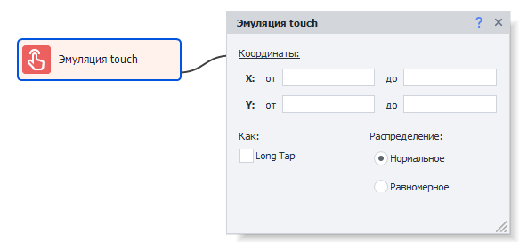
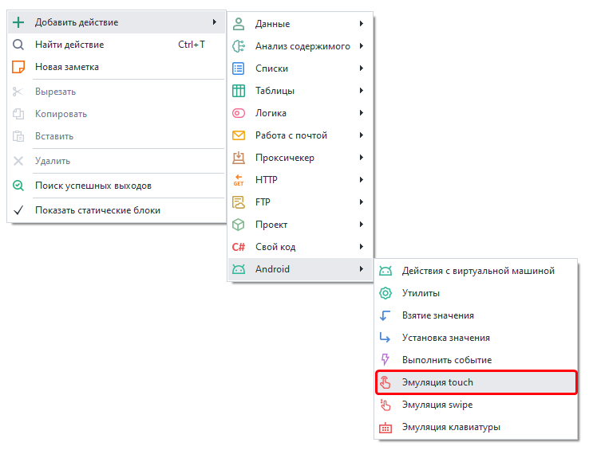

:::info **Пожалуйста, ознакомьтесь с [*Правилами использования материалов на данном ресурсе*](../../Disclaimer).**
:::
_______________________________________________  
## Описание.  
Экшен позволяет эмулировать нажатие на экран (touch-событие) в пределах указанных координат.  

  

:::warning **Разрешение эмулятора должно быть одинаковым.**
Как во время разработки, так и во время выполнения проекта. Так как при изменении разрешения меняются также и координаты элементов. 
:::  

### Для чего использовать?  
Эмуляция нажатия пальцем пригодится в случаях, когда тяжело или невозможно сделать клик с помощью экшена **Выполнить событие**.  

### Как добавить в проект?  
***Нажимаем ПКМ → Добавить действие → Android → Эмуляция touch***  

  
_______________________________________________ 
## Работа с экшеном.  
### Координаты.  
Тут мы указываем координаты интересующего элемента. Узнать их можно в [**Окне эмулятора**](../../pm/Interface/DeviceWindow), в нижней его части отображается текущая позиция курсора (если он в пределах этого окна).  

  

**X (от, до)** — координаты по горизонтали.  
**Y (от, до)** — координаты по вертикали.  

*Нажатие Touch* будет выполнено по указанным координатам.  

### Long Tap.  
Выполняет длительное нажатие, как будто вы удерживаете палец на экране.  

### Распределение.  
Определяет то, насколько точно будет выполнено нажатие по экрану:
- **Нормальное**. В этом варианте более вероятно попадание ближе к центру объекта.  
- **Равномерное**. Распределение будет происходить равномерно в пределаз указанных координат.  
_______________________________________________ 