:::info **Пожалуйста, ознакомьтесь с [*Правилами использования материалов на данном ресурсе*](../../Disclaimer).**
:::
_______________________________________________
export const VideoSample = ({source}) => (
  <video controls playsInline muted preload="auto" className='docsVideo'>
    <source src={source} type="video/mp4" />
</video>
); 
 

## Как добавить действие в проект?  

Для вызова контекстного меню нажимаем правой кнопкой мыши по пустому месту.  
Затем **Добавить действие → Android → Настройки устройства**.  

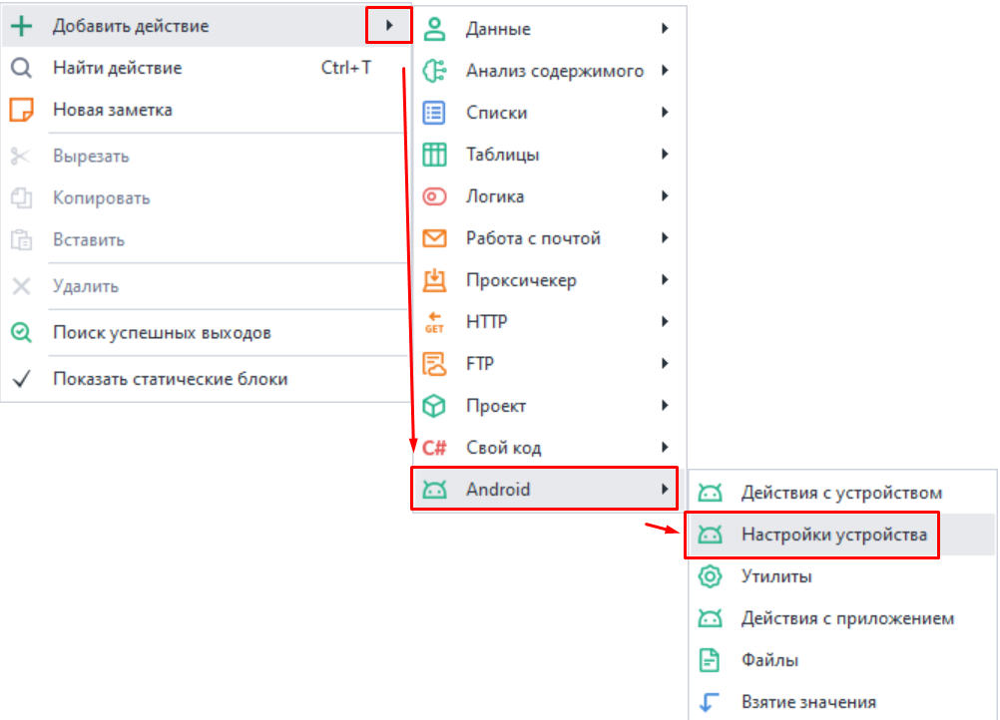  
_______________________________________________ 
## Как настроить идентификаторы устройства.  

С помощью данной функции можно изменить такие параметры как [IMEI](https://ru.wikipedia.org/wiki/IMEI), Android ID (идентификатор устройства), [IMSI](https://ru.wikipedia.org/wiki/IMSI), Sim Serial (серийный номер SIM карты).  

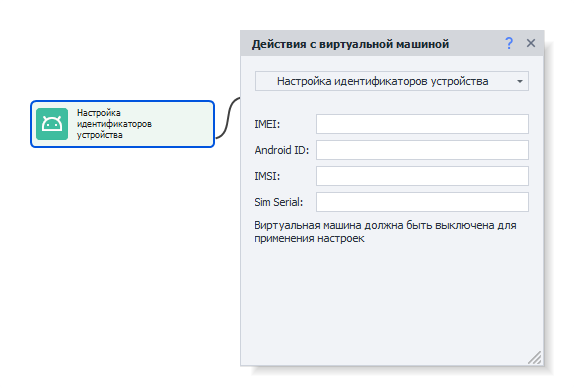  
_______________________________________________ 
## Как добавить сотового оператора?  

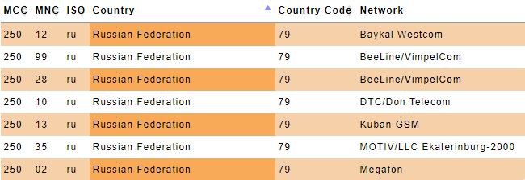  

Все данные для этого действия можно найти [**на этом сайте**](https://www.mcc-mnc.com/)  

### Доступные настройки:  

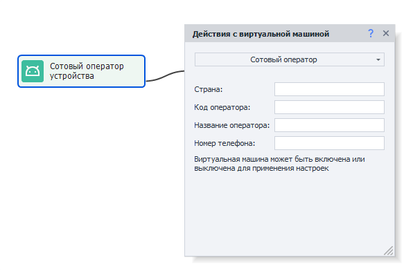 
- ***Страна***. Две буквы из колонки ISO.  
- ***Код оператора***. Совокупность значений из колонок MCC и MNC (например, 25002 для Мегафона).  
- ***Название оператора***. Колонка Network (Baykal Westcom, BeeLine/VimpelCom, MTS).  
- ***Номер телефона***. Без знака "+" в начале, 79*** и так далее.  
_______________________________________________ 
## Как указать модель устройства?  

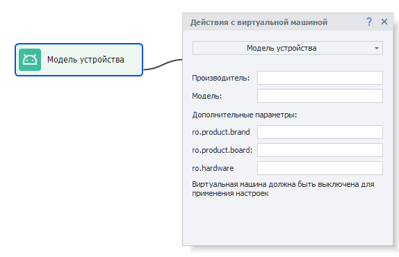 
### Доступные настройки:  
- ***Производитель***. Чье устройство эмулируем (Samsung, Huawei, Xiaomi, Google, Meizu и т.д.).  
- ***Модель***. Какую модель используем. Можно найти в build.prop (подскажем как ниже).  
- ***ro.product.brand***. Если в этом поле значение не указано, то дублируем его из Производитель.  
- ***ro.product.board***. Для современных телефонов неактуально, можно оставить пустым.  
- ***ro.hardware*** и ***ro.build.fingerprint***. Возьмем из build.prop.  

### Как найти данные в build.prop:  
Для этого необходимо сделать запрос в поисковую систему следующего вида:  
***build.prop phone_model*** *(например, build.prop Samsung s10)*.  
Переходим по одному из результатов и в тексте сообщения находим интересующие нас данные:  
`ro.product.brand=samsung`  
`ro.hardware.chipname=exynos9820`  
`ro.product.board = нет`  
`ro.product.model` или `ro.product.system.model`  
:::info **Как узнать параметры своего телефона?**
*Для этого нужно в терминале (например, [Terminal Emulator for Android](https://apkpure.com/terminal-emulator-for-android/jackpal.androidterm#google_vignette)) выполнить команду *getprop*.*
::: 
 
_______________________________________________
## Как настроить MAC адрес Wi-Fi сети:  
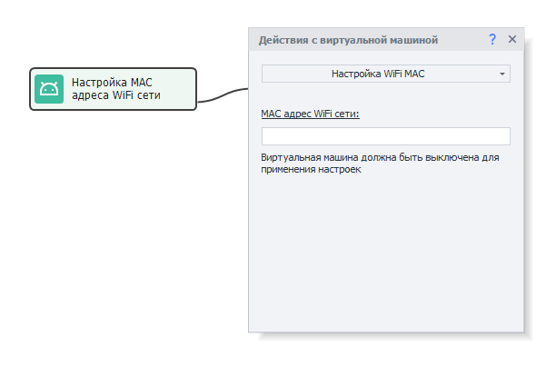  
Формат - через двоеточие: XX:XX:XX:XX:XX:XX, либо без него: XXXXXXXXXXXX (12 знаков)  
_______________________________________________ 
## Управление производительностью:  
Здесь можно настроить объем выделяемых для устройства ресурсов компьютера.  
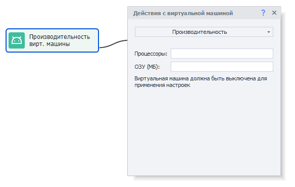    
### Доступные настройки:
:::warning **Перед изменением настроек убедитесь, что устройство выключено.**
:::  

- ***Процессоры***. Число выделяемых ядер процессора на работу эмулятора.  
- ***ОЗУ (МБ)***. Количество оперативной памяти в МБ, которое может использовать эмулятор. *Минимально 512мб, максимум 65 636мб*.  
**Важно!** Больше 4гб можно выделить только на Android x64, на х86 4гб — это максимум.  
:::info **В большинстве случае достаточно связки 1/2 ЦПУ + 1/2ГБ ОЗУ.**
Так как для эмуляции используются ресурсы вашего компьютера, но при высоких значениях он может начать тормозить. Рекомендуем начать с минимальных показателей и увеличивать их по мере необходимости.
:::    
_______________________________________________
## Установить разрешение экрана:  
В этой настройке можно задать **Ширину** и **Высоту** экрана, а также плотность пикселей на дюйм (**DPI**).  
**Плотность (DPI)** — можно указать любые значения в диапазоне от 40 до 640, но лучше придерживаться стандартных показателей Memu.  
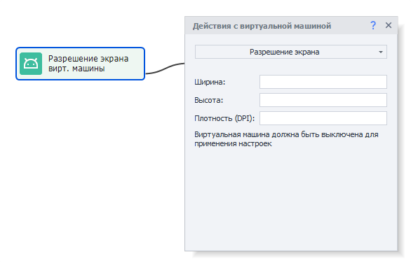  
:::warning **Осторожно.**
Изменение DPI может негативно повлиять на отображение элементов приложений. Они могут стать либо слишком большими, перекрывающими доступ к другим элементам, либо наоборот слишком мелкими.
:::   
#### Например так:  

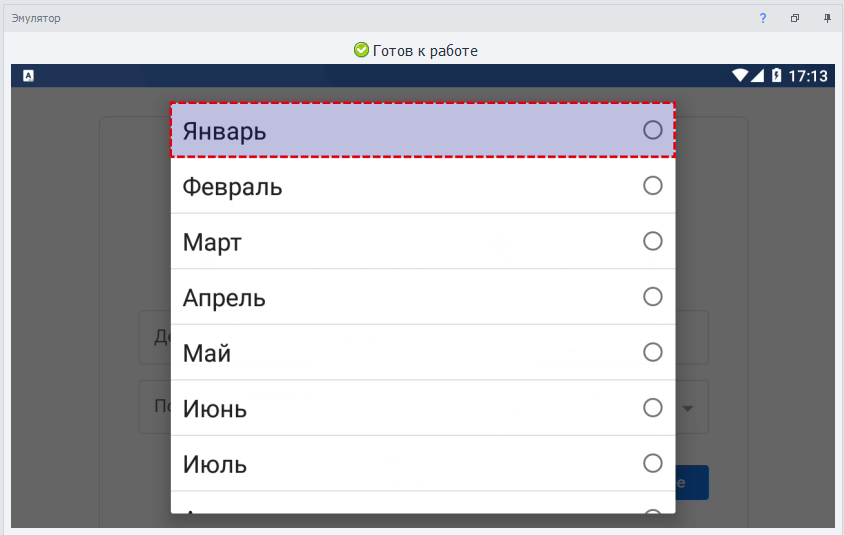   
_______________________________________________
## Выбор режима рендеринга:  
Переключение между OpenGL и DirectX. Данная настройках больше нужна при запуске игр через эмулятор.  Оптимальное значение придётся вычислять экспериментальным путём, либо на основе того, что пишут в интернете. Так как одни игры лучше работают с OpenGL, а другие с DirectX. Также влияет видеокарта и ее драйвера.  
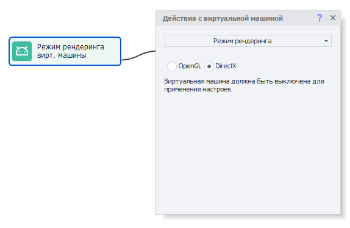
:::warning **Перед изменением настроек убедитесь, что устройство выключено.**
:::  
_______________________________________________ 
## Включение режима суперпользователя:  
Позволяет включать и отключать **root-доступ** к устройству.  
  
:::warning **Перед изменением настроек убедитесь, что устройство выключено.**
::: 
_______________________________________________
## Доступ к общим папкам:  
Здесь можно указать пути к общим папкам в Windows. Они позволяют легко пересылать файлы  
в эмулятор и из него.  
:::info **Для одной виртуальной машины можно настроить не более 4-ех общих папок.**
::: 
 
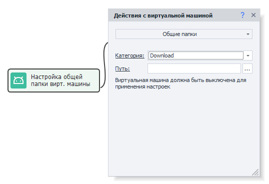  
### Примеры:  
- **В Memu**: */sdcard/Download*, **в Windows**: *C:\Users\USERNAME\Downloads\MeEmu Download*  
- **В Memu**: */sdcard/Movies*, **в Windows**: *C:\Users\USERNAME\Videos\Memu Video*  
- **В Memu**: */sdcard/Music*, **в Windows**: *C:\Users\USERNAME\Music\Memu Music*  
- **В Memu**: */sdcard/Pictures*, **в Windows**: *C:\Users\USERNAME\Pictures\Memu Photo*  
 
 ***USERNAME** — подставьте сюда имя пользователя, с которого запущен сеанс Windows.*
:::warning **Перед изменением настроек убедитесь, что устройство выключено.**
:::   
_______________________________________________
## Выбор языка системы:  
Данная настройка меняет язык эмулятора.   
Доступные значения: ***en, ko, de, ja, fr, ru, es, pt, hr, cn, sr, it, cs, th, in, pl, tr, uk, ar, vi, fil***  
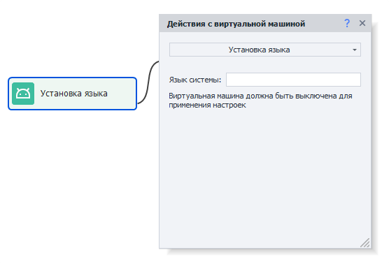  
:::warning **Перед изменением настроек убедитесь, что устройство выключено.**
:::
_______________________________________________
## Установка часового пояса:  
Позволяет выбрать часовой пояс устройства.  
Указывается в формате: ***Europe/Moscow*** или ***America/New_York*** и т.д.  
  
Список всех доступных временных зон можно посмотреть [**Здесь**](https://en.wikipedia.org/wiki/List_of_tz_database_time_zones)  
_______________________________________________ 
## Как задать дату и время:  
Можно произвольно установить: **год, месяц, день, час, минуту и секунду**.  
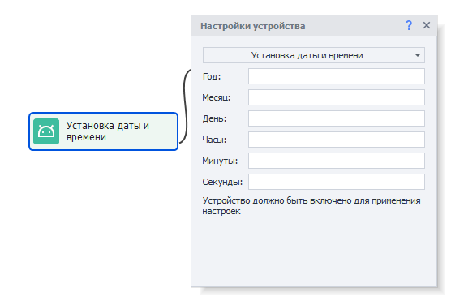    
Если оставить все поля пустыми, то произойдет автоматическая синхронизация с текущим временем.  
_______________________________________________ 
## Смена типа камеры: 
Какие доступны:  
- **Физическая**. Реальная камера, подключенная к компьютеру.  
- **Виртуальная**. Используется автоматически, если нет реальной. Она встроена в эмулятор и позволяет сканировать QR-коды с экрана.  
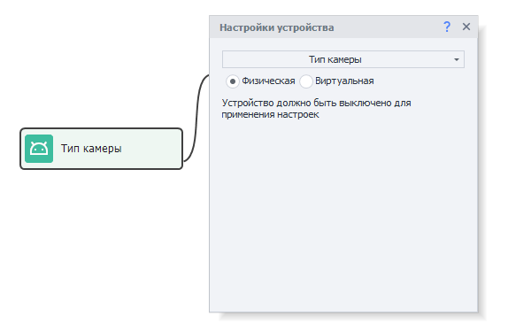  
_______________________________________________ 
## Выбрать способ подключения системного диска:  
Доступные способы:  
- **Общий диск**. Позволяет использовать один системный диск для всех эмуляторов, что значительно снижает занимаемое место. В этом случае диск работает в режиме  
*Только для чтения*, то есть на него не получится записать информацию.  
- **Независимый диск**. Выбрав эту настройку, мы сможем записывать информацию на системный раздел эмулятора (*/system*).  
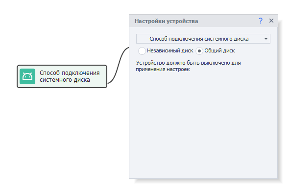  
_______________________________________________ 
## Как поставить прокси:  
Данная настройка позволяет установить прокси на весь эмулятор. 

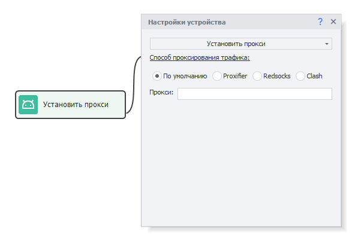  

Формат для прокси:  
- **С авторизацией**: `protocol://login:password@ip:port`.  
- **Без авторизации**: `protocol://ip:port`.  
 Значения для **protocol**: ***http***, ***socks4*** или ***socks5***. Если не указать, то по умолчанию стоит ***http***.  

:::warning **Важно.**
Лучше включать прокси до запуска эмулятора, иначе некоторые приложения успеют отправить данные через ваш реальный IP.
::: 

### [Proxifier](https://proxifier.com/).  
Это мощная и гибкая программа для перенаправления интернет-трафика через прокси-сервер.  

Эмулятор будет проксироваться на основе его PID в Windows. 

### Redsocks.  
Для проксирования трафика используется Redsocks2 — прозрачный редиректор TCP/UDP-соединений в прокси.

По умолчанию DNS-запросы будут направляться через прокси-сервер. Поэтому если ваши запросы будут блокироваться (не подключается к интернету или возникает ошибка **`DNS_PROBE_FINISHED_NO_INTERNET`**), то необходимо отключить перенаправление.  

:::info **С# код для отключения перенаправления DNS-запросов.**  
```
var settings = new DroidProxySettings.Redsocks();
settings.UseDnsTcp = false;
settings.UseDnsUdp = false;
instance.DroidInstance.Proxy.SetProxy("socks5://10.20.30.40:8080", settings); 
```  
**Этот код необходимо выполнить перед установкой прокси.**
:::  

#### Адреса DNS.  
При использовании Redsocks можно настроить адреса DNS-сервера. Если их несколько, то разделять нужно запятой `,`  

Все DNS-запросы будут направляться через прокси-сервер.  

:::info **С# код для указания DNS-сервера у каждого потока в отдельности.**  
```
instance.DroidInstance.Proxy.SetDnsServers("8.8.8.8,8.8.4.4"); 
```  
**Этот код необходимо выполнить перед установкой прокси.**
:::  

### Clash.
Это продвинутый прокси-клиент с возможностью маршрутизации трафика по заданным правилам.  

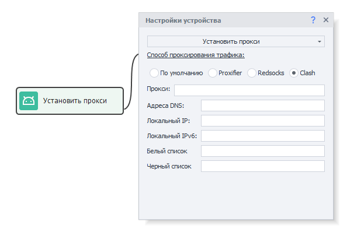 

#### Адреса DNS.  
Здесь можно настроить адреса DNS-сервера. Если их несколько, то разделять нужно запятой `,`  

#### Локальный IP.  
Настройка локального IP-адреса устройства.  

Если указать последнее число адреса равным нулю, например, `192.168.20.0`, то будет сгенерирован случайный адрес из указанной подсети `192.168.20.2-192.168.20.254`.  

#### Локальный IPv6.  
Тут же выполняется настройка локального IPv6-адреса устройства.  

Пример адреса: `fdfe:dcba:9806::1/126` Если указать адрес вида `fdfe:dcba:0::1/126` то вместо **`0`** будет сгенерировано случайное число в шестнадцатеричном формате.  

#### Белый список.  
Список приложений, трафик которых будет идти через прокси (указываем каждое через запятую). Все остальные приложения будут использовать прямое подключение к интернету (без прокси).  

Идентификатор приложения можно узнать с помощью инструмента [Установленные приложения](../../Tools/Installed_App).  

#### Черный список.
Здесь наоборот задаётся список приложений, для которых будет недоступно прокси. Их трафик будет идти через прямое подключение к интернету. А все остальные приложения будут использовать прокси.  

Идентификатор приложения можно узнать с помощью инструмента [Установленные приложения](../../Tools/Installed_App).  

:::warning **Одновременно можно использовать либо белый, либо черный список.**
Если же заполнены оба поля, то будет использоваться только белый список.
::: 
_______________________________________________  
## Полезные ссылки.     
- [**Запуск эмулятора**](../../ProLite/Memu_Start).   
- [**Окно устройства**](../../pm/Interface/DeviceWindow).