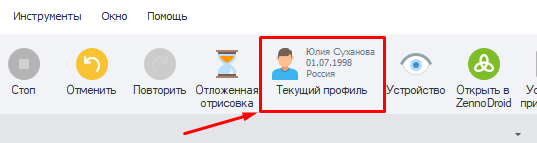
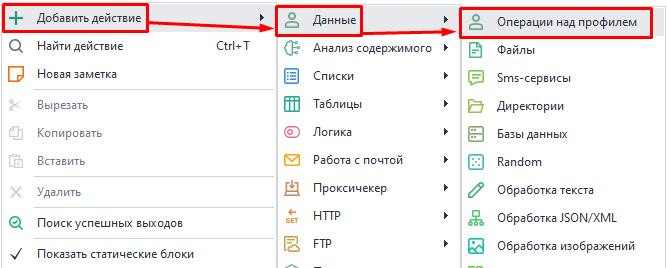
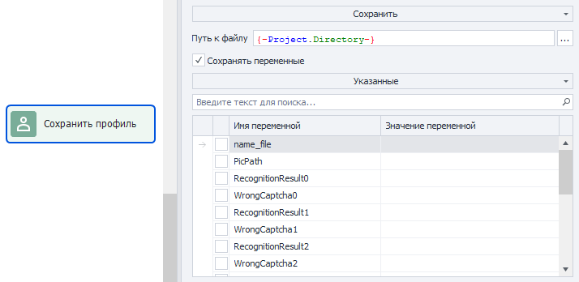
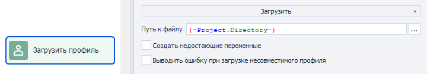
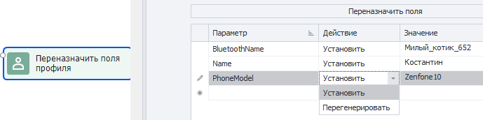
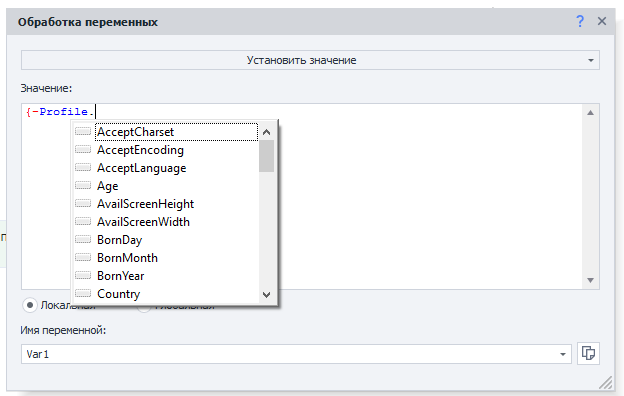
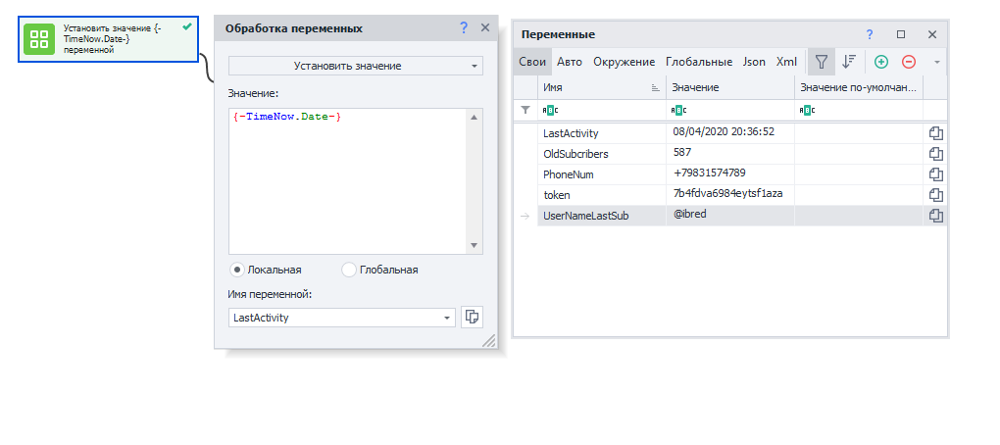
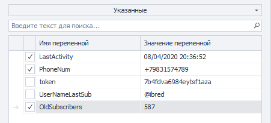
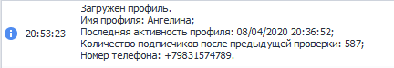
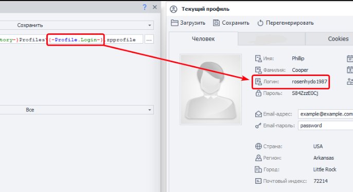

---
sidebar_position: 1
title: Операции над профилем
description: Операции над профилем.
---  

export const VideoSample = ({source}) => (
  <video controls playsInline muted preload="auto" className='docsVideo'>
    <source src={source} type="video/mp4" />
</video>
);  

:::info **Пожалуйста, ознакомьтесь с [*Правилами использования материалов на данном ресурсе*](../Disclaimer).**
:::
_______________________________________________  
## Описание.  
Для работы в интернете ZennoDroid имеет специальную сущность — **Профиль проекта**. Его можно сохранять и загружать в шаблон, а затем использовать отличающиеся личности для работы на различных ресурсах. В профиле хранятся многие часто используемые параметры. Например:  
- **Виртуальная личность**:  
    - *Имя и фамилия*;  
    - *Дата рождения*;  
    - *Местоположение (страна, регион, город и почтовый индекс)*;  
    - *Email и Никнейм*;  
    - *Прочие параметры*.  
- **Виртуальный телефон**:  
    - *IMEI*;  
    - *Количество CPU и объем RAM*;  
    - *Номер телефона и информация об операторе*;  
    - *Производитель и модель*;  
    - *Размер экрана*;  
    - *Wi-Fi и Bluetooth MAC*.  

:::info **Профиль генерируется каждый раз заново при новом запуске/выполнении проекта.**  
<VideoSample source={require("@site/static/video/profile_regen.mp4").default}/>
:::

### Настройки по умолчанию.  
Некоторые из параметров можно задать для использования по умолчанию при каждой новой генерации. Делается это через **Панель статических блоков → Профиль**.  

   

### Текущий профиль.  
Для ознакомления с характеристиками нынешнего профиля нужно нажать на кнопку **Текущий профиль** на верхней панели.  

   
_______________________________________________ 
## Как добавить в проект?  
Через контекстное меню: **Добавить действие → Данные → Операции над профилем**.  

   
_______________________________________________  
## Сохранить профиль.  
   

Вы можете воспользоваться этим действием, если по тем или иным причинам хотите сохранить все данные текущего профиля для использования в других проектах. Например, после регистрации на каком-либо ресурсе. В файле профиля (`*.zpprofile`) при этом сохранятся все параметры личности и телефона.  

:::warning **Сохранять переменные.**  
Если сохранить профиль с этой опцией, то при следующей его загрузке значения выбранных переменных будут перезаписаны. Для корректного выполнения шаблона мы рекомендуем сохранять только необходимые значения.
:::  
_______________________________________________
## Загрузить профиль.  
   

С помощью этого экшена можно загрузить ранее сохраненные профили для использования в текущем проекте.  

### Создать недостающие переменные.  
При включении данной настройки в проекте автоматически создадутся недостающие переменные, которые имеются в загружаемом профиле.  

### Выводить ошибку при загрузке несовместимого профиля.  
Данная функция будет удалена в будущих обновлениях, а в данный момент не оказывает никакого эффекта при включении.  
_______________________________________________
## Переназначить поля.  
С помощью этого действия можно вручную редактировать параметры профиля. Для некоторых значения задаются с нуля, а для других перегенерируются.  

   

### Что можно делать?  
- **Задавать кастомные параметры телефона**;  
- **Устанавливать желаемые имена, фамилии, даты рождения и прочую Личную информацию;**  
- **Придумывать логины, пароли, адреса почтовых ящиков;  
- **Любыми иными способами модернизировать данные профиля под свои нужды.**  
_______________________________________________
## Использование данных.  
В своей работе вы можете использовать данных из профиля в других действиях. Например, в экшене ***Обработка переменных***. Для этого вам пригодятся макросы ***переменных окружения***, такие как `{-Profile.Name}`.  

   

:::tip **Возможные варианты.**  
Вам достаточно написать фрагмент переменной, а ProjectMaker сам предложит возможные варианты в виде всплывающего списка.
:::
_______________________________________________
## Практический пример.  
Представим, что мы пользуемся каким-либо сервисом, где есть подписчики. И после завершения работы хотим сохранять последние дату и время в переменную `LastActivity`. Для этого воспользуемся экшеном [**Обработка переменных**](./WorkWithVariables), в поле которого укажем макрос `{-TimeNow.Date-}`.  

:::info **Подробнее о доступных макросах читайте в статье об [*Окне переменных*](../pm/Interface/Variables).**  
:::  

Продолжим. В переменную `OldSubcribers` положим информацию о количестве подписчиков, которое мы получили при работе шаблона.  

А в `PhoneNum` сохраним номер телефона, привязанный к аккаунту.  

  

Теперь при сохранении профиля указываем переменные, которые хотим оставить:  

   

Так как переменные `token` и `UserNameLastSub` нам не нужны по тем или иным причинам, мы их не сохраняем.  

В дальнейшем мы сможем **Загрузить профиль** и сразу получить нужные переменные. Их можно использовать для собственного логирования действий. Добавим экшен [**Оповещение**](../Project%20Editor/Logic/Notification) и укажем в нем этот текст:  
```
Загружен профиль.
Имя профиля: {-Profile.Name-};
Последняя активность профиля: {-Variable.LastActivity-};
Количество подписчиков после предыдущей проверки: {-Variable.OldSubcribers-};
Номер телефона: {-Variable.PhoneNum-}.  
```  
В результате получим следующий текст в логе:  

   

Также при сохранении и загрузке профиля можно использовать пользовательские переменные и переменные окружения, а также их сочетания.  

Например, если вставить в *Путь к файлу* следующую строку:  
`{-Project.Directory-}ProfilesZenno\{-Profile.Login-}.zpprofile`  
то профиль сохранится в файл с названием `rosenhydo1987.zpprofile`.  

 
_______________________________________________  
## Полезные ссылки.   
- [**Настройки заполнения профиля**](../Settings/Profile_Setting).  
- [**Окно профиля**](../pm/Interface/Work_with_Profile).   
- [**Профиль**](../Project%20Editor/Static%20Block%20Panel/Profile). 