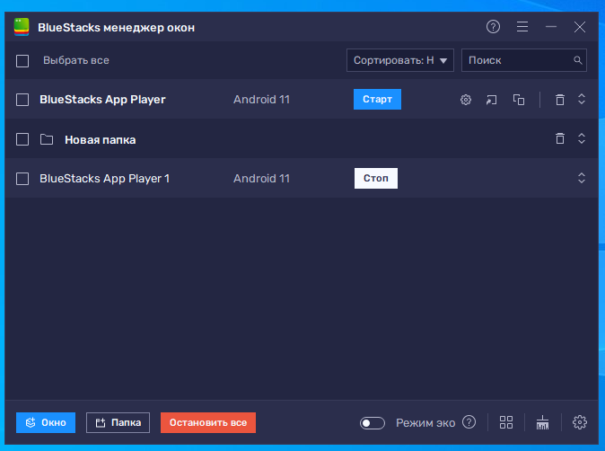

import DisclaimerNotice from '@site/src/components/DisclaimerNotice';

# Работа с BlueStacks
<DisclaimerNotice />

export const VideoSample = ({source}) => (
  <video controls playsInline muted preload="auto" className='docsVideo'>
    <source src={source} type="video/mp4" />
</video>
);

## Что такое BlueStacks?  
Это эмулятор Android, который создает виртуальную среду, аналогичную смартфону или планшету на базе Android. Доступен для использования на Windows и macOS.  

:::warning **Доступен для использования только в версии Enterprise.**  
Официальной поддержки нет, поэтому может работать нестабильно. 
:::
_______________________________________________
## Подключение к ZennoDroid.  
**1.** Скачиваем эмулятор с официального сайта: [**BlueStacks**](https://www.bluestacks.com/features.html).  
**2.** После установки открываем именно ярлык под названием *BlueStacks Multi-Instance*. 

  

**3.** Новые виртуальные машины можно добавить с помощью кнопок: Окно → Новое.  

:::tip **Не используйте в работе первую добавленную ВМ.**  
Так как могут возникать ошибки, чинятся которые только полной переустановкой BlueStacks. Это специфика самого эмулятора.  

Поэтому рекомендуем создать один и более дополнительных и использовать именно их.
:::  

**4.** Скачайте [**данный архив**](./assets/BlueStacks/BlueStacks_5_Root_ver.8.zip) и распакуйте его.  
**5.** Запустите Project Maker для ZDE и откройте проект из архива, который называется *Bluestacks5RootMagisk_v8*.  
**6.** В экшене **BlueStacks App Player** указываем название эмулятора, на котором необходимо получить Root.  
**7.** Запускаем проект на выполнение.  

:::note **Примечание.**  
Если эмулятор уже запускался, то процесс получения Root начнётся сразу. Если это новый экземпляр, то сначала он будет один раз запущен для наполнения раздела с данными, а затем начнётся процесс получения Root.
:::

:::info **Если проект падает на каком-либо кубике, то запустите его ещё раз.**  
В том случае, когда после нескольких перезапусков шаблон так и не срабатывает, напишите нам [**в поддержку**](https://helpdesk.zennolab.com/ru/conversation/new).
:::  

### Видеоинструкция.  
> Получение Root-прав в BlueStacks 5 и MSI App Player 5 при помощи шаблона *Bluestacks5RootMagisk_v8* и Magisk 30.7.  

<VideoSample source={require("./assets/BlueStacks/BlueStacks_Root_Magisk.mp4").default}/>  

_______________________________________________
## Работа с эмулятором.  
Полное описание всех методов управления эмулятором — запуск, остановка и подключение, создание и удаление инстансов, разблокировка системного диска, установка Magisk, Zygisk и модулей — приведено в справке по API: [**BlueStacks5 API**](../API/BlueStacks5).  

_______________________________________________
## Полезные ссылки.  
- [**Установка Root-прав**](./Root).  
- [**Настройка LSPosed**](./LSPosed).  
- [**C# код**](../project-editor/custom-code/С).