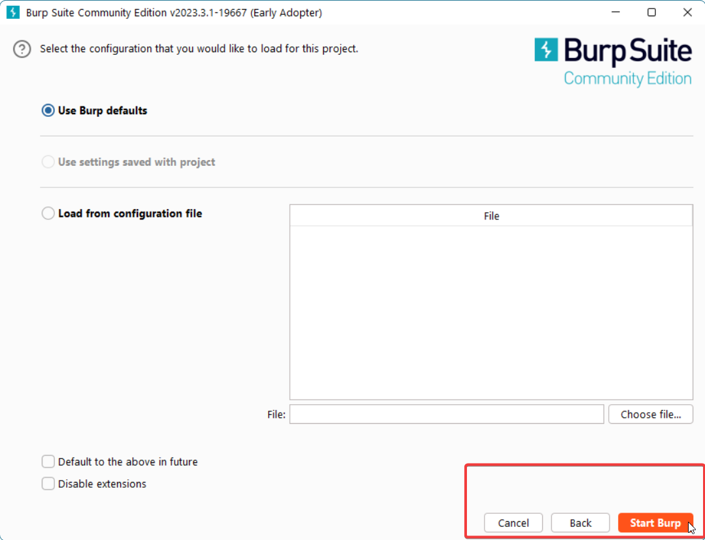
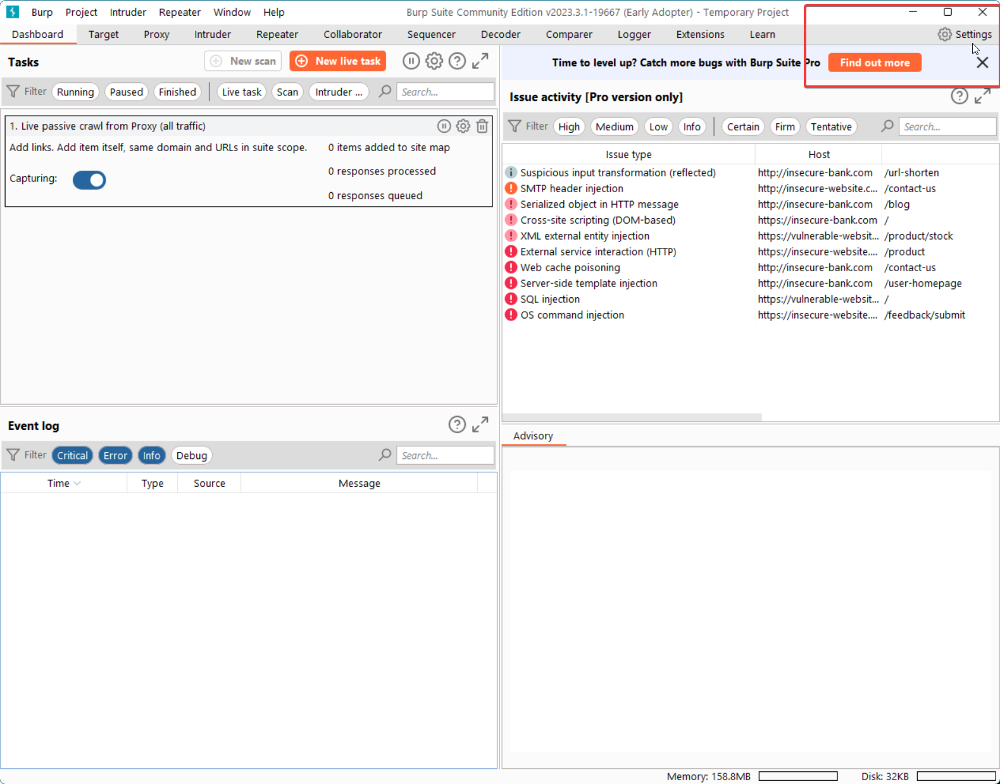
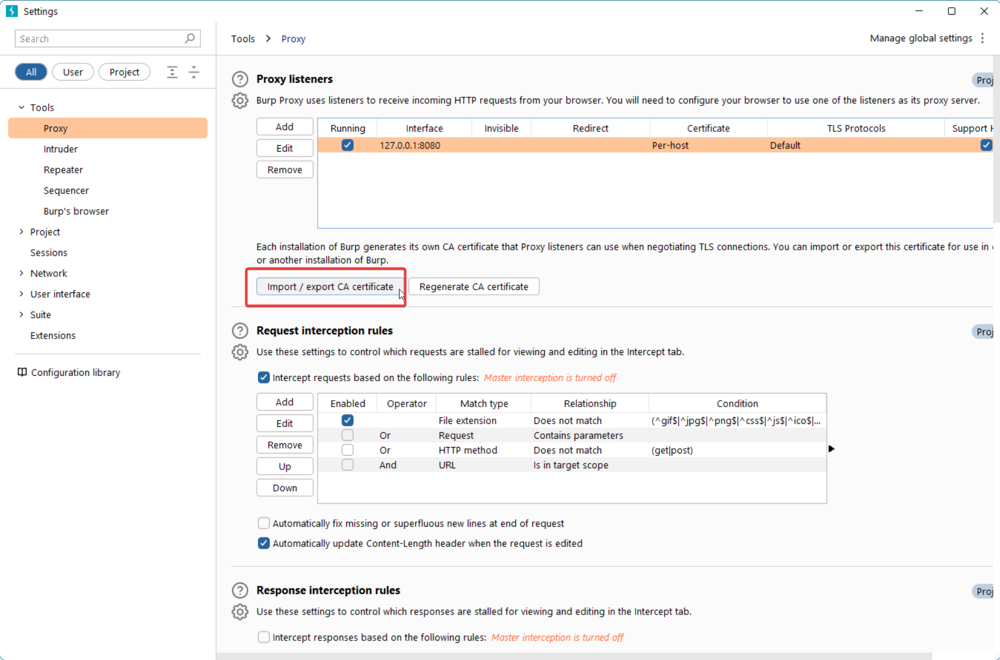
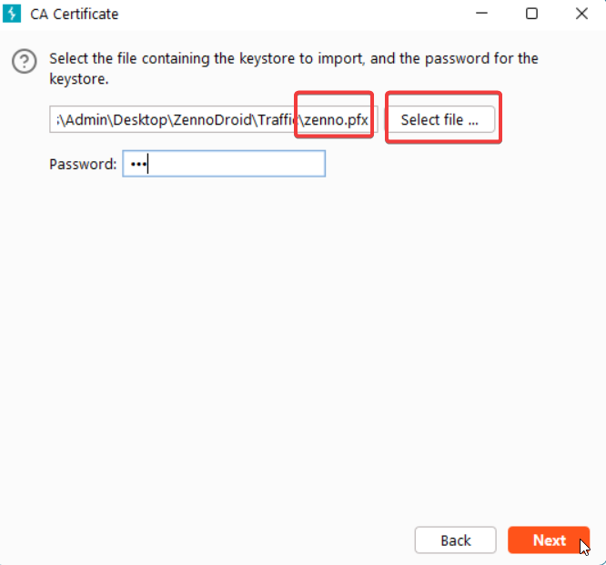

# Перехват трафика с помощью BurpSuite
:::info **Пожалуйста, ознакомьтесь с [*Правилами использования материалов на данном ресурсе*](../Disclaimer).**
:::

export const VideoSample = ({source}) => (
  <video controls playsInline muted preload="auto" className='docsVideo'>
    <source src={source} type="video/mp4" />
</video>
);  

Для анализа трафика можно воспользоваться решением [**BurpSuite Community Edition**](https://portswigger.net/burp/communitydownload) от PortSwigger

## Настройка Burp Suite  
:::info **Все необходимые файлы можно скачать по ссылке:**
[Frida\_Burp\_HttpToolkit.zip](https://www.dropbox.com/scl/fi/1vp7g23me9ekr34aacsfh/Frida_Burp_HttpToolkit.zip?rlkey=8ykdpi0jve6aplqpfpoh0rcoq&st=lac44ugj&dl=0) (пароль на zenno.pfx - 123)
:::  
_________________
 ### 1. Скачать и установить  
 

1. Выбрать **Burp Suite Community Edition** и нажать **«Download»**
  

  

 

2. Создаем временный **(Temporary)** проект.
  

  

   

 

3. Используем **настройки по умолчанию (Use Burp defaults)** для проекта.
  

  

 

 ### 2. Настроить Burp Suite на обработку трафика с локальной сети компьютера  

1. Заходим в **настройки (Settings)**
  

 

  

2. Выбираем **Tools → Proxy** и нажимаем **«Import / Export CA certificate»**. 
  

 

  

3. Затем выбираем ***Certificate and private key from PKCS#12 keystore*** → выбрать файл **zenno.pfx** (*пароль **123***).
  

  
_________________  
 

## Перехват трафика с использованием Frida  
_________________
### Настройка BurpSuite и отключение проверки сертификата с помощью скриптов для Frida
:::info **Все необходимые файлы можно скачать по ссылке:**
[Frida\_Burp\_HttpToolkit.zip](https://www.dropbox.com/scl/fi/1vp7g23me9ekr34aacsfh/Frida_Burp_HttpToolkit.zip?rlkey=8ykdpi0jve6aplqpfpoh0rcoq&st=lac44ugj&dl=0) (пароль на zenno.pfx - 123)
:::  

<VideoSample source={require("./assets/BurpSuite/Frida_SSL_Pinning_Demo.mp4").default}/>
_________________
### Установка пользовательского сертификата для перехвата трафика в Chrome  
:::info **Все необходимые файлы можно скачать по ссылке:**
[Frida\_Burp\_HttpToolkit.zip](https://www.dropbox.com/scl/fi/1vp7g23me9ekr34aacsfh/Frida_Burp_HttpToolkit.zip?rlkey=8ykdpi0jve6aplqpfpoh0rcoq&st=lac44ugj&dl=0) (пароль на zenno.pfx - 123)
:::  
> *Предварительная настройка Burp Suite показана в предыдущем видео* 

<VideoSample source={require("./assets/BurpSuite/FridaChrome.mp4").default}/>
_________________
## Перехват трафика без использования Frida  
### Настройка BurpSuite и отключение проверки сертификата с помощью модуля ZennoDroid
:::warning **Метод поддерживается только в ZennoDroid Enterprise**
:::
:::info **Все необходимые файлы можно скачать по ссылке:**
[TrafficCapture.zip](https://www.dropbox.com/scl/fi/gs7la6k2cs1xpkt7jo6sf/TrafficCapture.zip?rlkey=jwu7u81gy040v1hk6vz0g0gc9&st=be8hpjyq&dl=0) (пароль на zenno.pfx - 123)  
:::  

<VideoSample source={require("./assets/BurpSuite/Frida_SSL_Pinning_Demo.mp4").default}/>
_________________
### Настройка BurpSuite и патч приложения для перехвата запросов flutter
:::info **Все необходимые файлы можно скачать по ссылке:**
[Flutter_Patch_Restore.zip](https://www.dropbox.com/scl/fi/1yx6s8yg2x1nuk0c7a4l6/FlutterPatchRestore.zip?rlkey=9ui6an51gcqppta9uq7o7op5t&st=065bqtiv&dl=0)  
:::  

<VideoSample source={require("./assets/BurpSuite/Flutter_Patch_Restore.mp4").default}/>

_________________
## Полезные ссылки  
- [**Установка и настройка Frida**](../Tools/Frida).
- [**Frida\_Burp\_HttpToolkit.zip**](https://www.dropbox.com/scl/fi/1vp7g23me9ekr34aacsfh/Frida_Burp_HttpToolkit.zip?rlkey=8ykdpi0jve6aplqpfpoh0rcoq&st=lac44ugj&dl=0) (пароль на zenno.pfx - 123).  
- [**TrafficCapture.zip**](https://www.dropbox.com/scl/fi/gs7la6k2cs1xpkt7jo6sf/TrafficCapture.zip?rlkey=jwu7u81gy040v1hk6vz0g0gc9&st=be8hpjyq&dl=0) (пароль на zenno.pfx - 123).  
- [**Flutter_Patch_Restore.zip**](https://www.dropbox.com/scl/fi/1yx6s8yg2x1nuk0c7a4l6/FlutterPatchRestore.zip?rlkey=9ui6an51gcqppta9uq7o7op5t&st=065bqtiv&dl=0)  
- [**android-ssl-pinning-demo.apk**](https://github.com/httptoolkit/android-ssl-pinning-demo/releases/latest)
- [**Подключение реального устройства к ZennoDroid**](../Enterprise/Connection).
- [**Управление LSPosed**](../Enterprise/LSPosed_Control).
 