import DisclaimerNotice from '@site/src/components/DisclaimerNotice';

# Настройка LSPosed
<DisclaimerNotice />

export const VideoSample = ({source}) => (
  <video controls playsInline muted preload="auto" className='docsVideo'>
    <source src={source} type="video/mp4" />
</video>
);

## Описание. 
Модуль ZennoDroid необходим для подмены основных параметров устройства: IMEI, Android ID, сотового оператора, модели, WiFi, Bluetooth и других.  
:::info **Для функционирования модуля необходимы Root-права**
Поддерживаются телефоны с Android 8.1-16 
:::  
_________________  
## Установка LSPosed Framework    
  

Начиная с версии ZennoDroid 2.5.0.0, для установки модуля необходим телефон с [**Magisk**](https://github.com/topjohnwu/Magisk) и активным [**LSPosed Framework v2**](https://www.dropbox.com/scl/fo/bve4et0ilt6bocnbi7ba9/AI0JuEpsjOHkKKlYMgx9aM0?rlkey=je4fi8u0np6267i0e5iblsyu3&st=rlrsg76a&dl=0).
  

 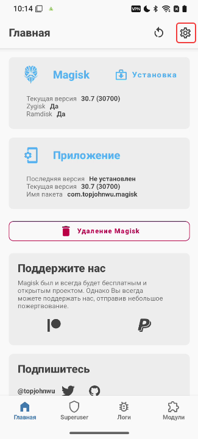 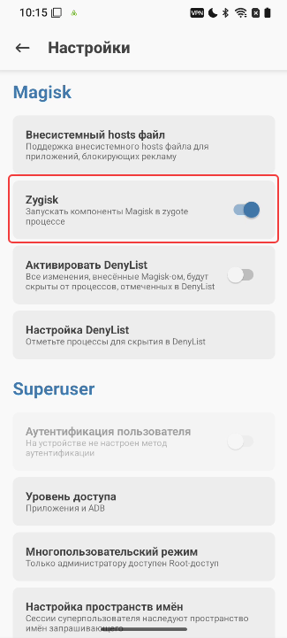 

   

Актуальная официальная версия LSPosed распространяется через официальный [**Telegram канал**](https://t.me/LSPosed). Также последню версию LSPosed можно скачать по [**ссылке**](https://www.dropbox.com/scl/fo/bve4et0ilt6bocnbi7ba9/AI0JuEpsjOHkKKlYMgx9aM0?rlkey=je4fi8u0np6267i0e5iblsyu3&st=rlrsg76a&dl=0)

 Этот билд нужно скачать на телефон в папку **sdcard/Download/** и установить с помощью стандартного меню.
  

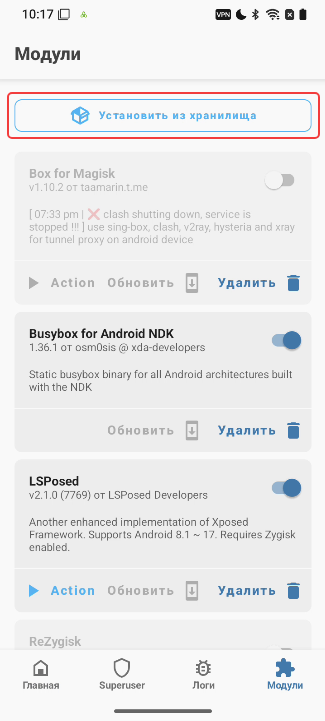 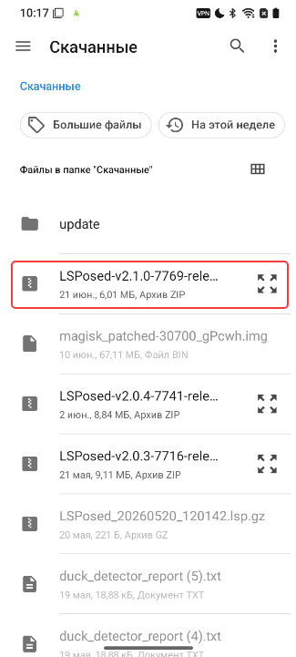 

:::warning **По умолчанию модуль LSPosed Framework не имеет иконки**
**Открыть его можно, нажав на уведомление в шторке:**

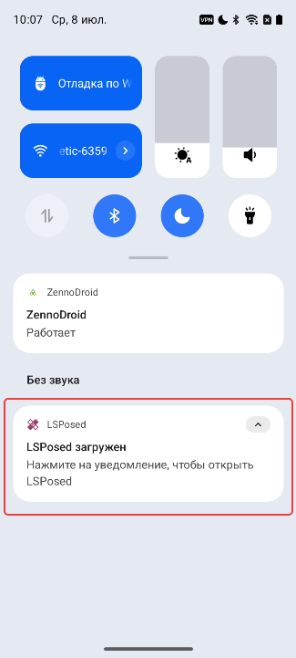
:::  
  
_________________
## Установка модуля «ZennoDroid»  
Модуль ZennoDroid устанавливается автоматически при первой попытке изменить параметры устройства или при выполнении любого экшена из группы [Управление LSPosed](./LSPosed_Control).  

При запуске на экране устройства возникнет запрос прав суперпользователя. Необходимо нажать на кнопку **«Разрешить»** (при использовании magisk, разрешение предоставляется автоматически).  

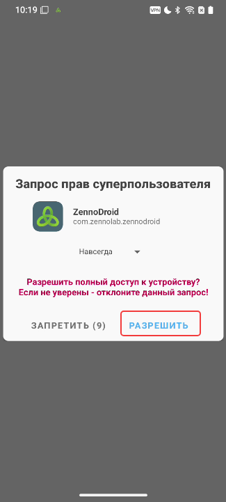  

Если вы не успели этого сделать или случайно нажали на кнопку **«Запретить»**, тогда нужно открыть **Magisk**. Там переходим на вкладку **Superuser (Суперпользователь)** и включаем *автоматическую выдачу прав суперпользователя для ZennoDroid*.  

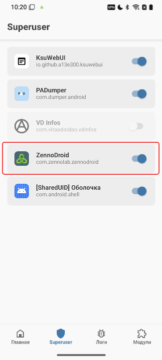  

После запуска модуля на экране устройства появится уведомление о том, что он выключен.  

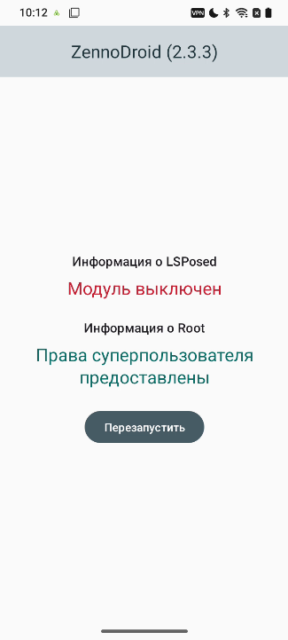  
 
Нам нужно запустить LSPosed через меню в шторке, переключиться на вкладку **Модули** и включить *модуль ZennoDroid*.    

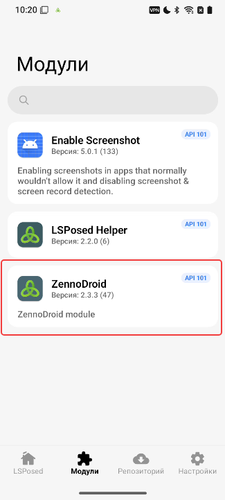 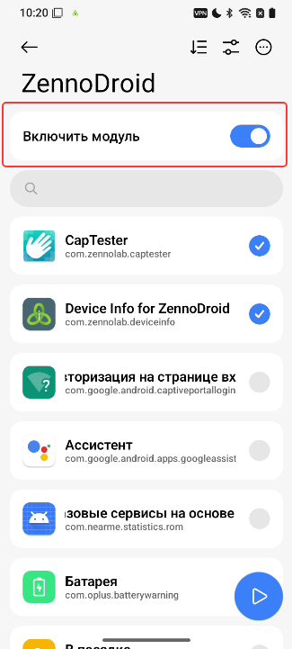 

После этого можно будет выбрать программы, к которым будет применяться подмена параметров устройства.  
_________________
### Важная информация  
- Рекомендуем добавлять в список подмены только те приложения, для которых действительно требуется изменять данные. **Не нужно добавлять в список системный фреймворк (system framework)**.  
- Если после активации вы удалили приложение, а затем установили его повторно, необходимо обязательно заново активировать приложение в списке подмены **(снять и установить галочку)**.  
  
:::tip **В LSPosed есть визуальный баг**
При удалении приложения оно также автоматически удаляется из списка подменяемых. Однако после повторной установки приложение автоматически не попадает в список подменяемых (галочка при этом стоит, но подмены не работают).
:::     
  
- По умолчанию в списке программ отображаются не все приложения. Если вы не видите нужного, например, Google Chrome, то нужно зайти в меню **Настройки** и выбрать нужную группу.  

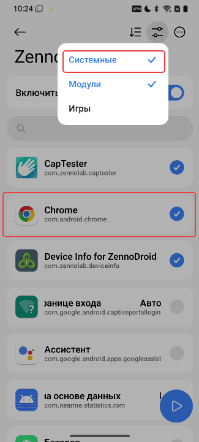

- После выбора приложений для подмены нужно вернуться в модуль ZennoDroid и нажать на кнопку **«Перезапустить»**. Далее при перезапуске на экран устройства будет выведено уведомление о том, что модуль готов к работе. Можно менять параметры устройства с помощью экшенов.  

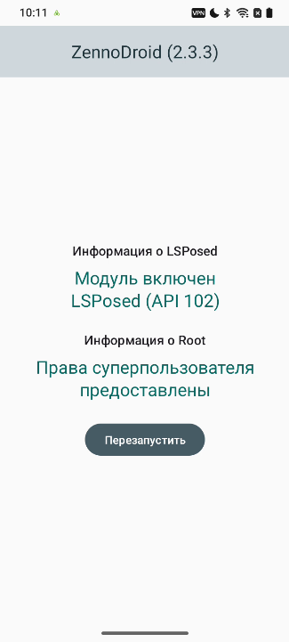  

- Завершите работу нужных приложений после подмены параметров устройства. Предпочтительно делать это экшеном **«Закрыть приложение»**.   

:::tip **Можно закрывать приложения и до подмены.**
Но тогда некоторые системные приложения тут же перезапускаются, поэтому могут считать старые параметры.
:::  
_________________
## API для управления LSPosed
В версии **ZennoDroid 2.4.0** мы добавили API для управления LSPosed.

Основные функции:
- включить и выключить нужный модуль;  
- выбрать приложения в списке подмены нужного модуля, а также добавить или удалить их из списка;  
- создать и восстановить бэкап настроек (поддерживается сохранение как на телефон, так и на компьютер);  
- получить информацию о LSPosed.

### Видеоинструкция  
> Настройка модуля ZennoDroid и модуля [DisableFlagSecure](https://github.com/LSPosed/DisableFlagSecure/releases/latest) (`io.github.lsposed.disableflagsecure`), позволяющего просматривать защищенные страницы.  

<VideoSample source={require("@site/static/video/LSPosedAPI.mp4").default}/>  

Также примеры работы с API приведены в архиве [LSPosedAPI.zip](https://www.dropbox.com/scl/fi/xsw5q8ej1wtmhpg5695we/LSPosedAPI.zip?rlkey=menqd2q7a0g6qnmc1l3omq4fr&st=0byf2hwb&dl=0&roistat_visit=1429674).  

_________________
## **Управление LSPosed с помощью экшенов**
В версии 2.4.6 была добавлена возможность удобного [**управления LSPosed**](./LSPosed_Control) с помощью группы экшенов.

_________________
## Полезные ссылки.  
- Шаблон для подмены параметров устройства с помощью экшенов и API: [**fakeDeviceBrief.droid**](https://www.dropbox.com/scl/fi/xkyhg4e72l9su4xvqsdn9/fakeDeviceBrief.droid?rlkey=583ltzuficlyh0kxrma83qodb&dl=0)  
- [**Последняя версия LSPosed Framework v2**](https://www.dropbox.com/scl/fo/bve4et0ilt6bocnbi7ba9/AI0JuEpsjOHkKKlYMgx9aM0?rlkey=je4fi8u0np6267i0e5iblsyu3&st=rlrsg76a&dl=0)  
- [**Подключение реального устройства к ZennoDroid**](./Connection).  
- [**Настройки устройства**](../Settings/Settings_for_Enterprise).

 