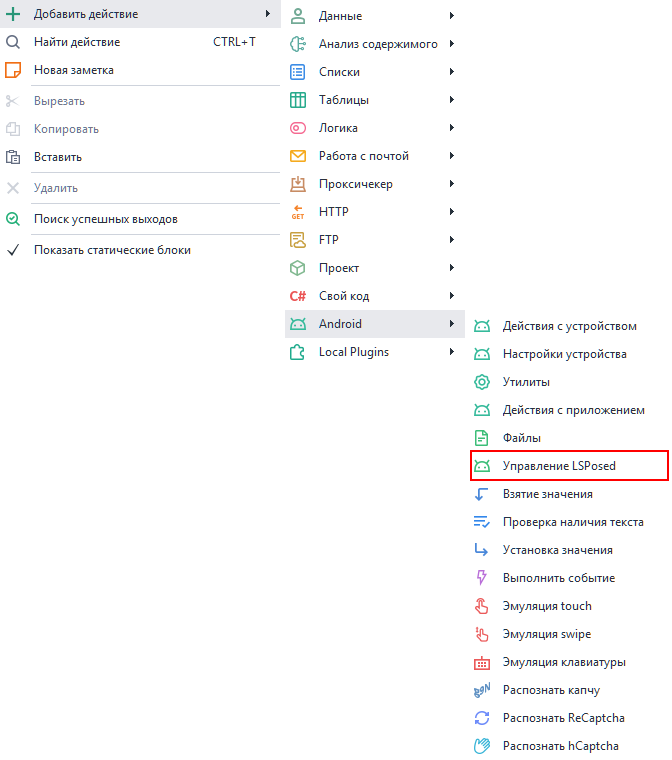
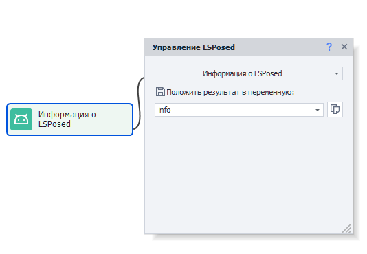
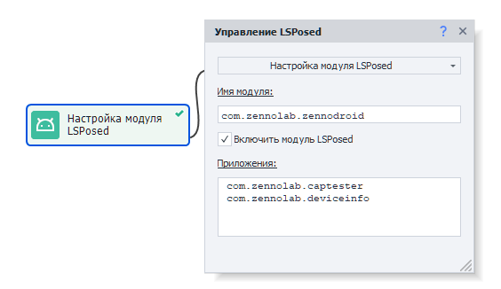
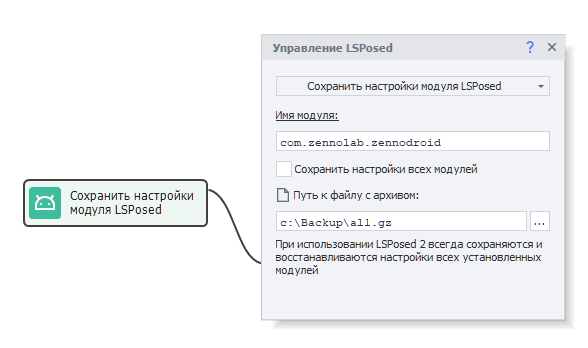
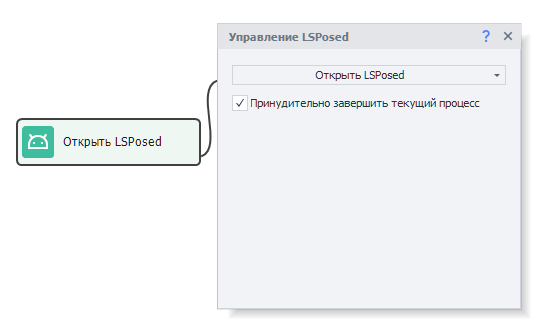

import DisclaimerNotice from '@site/src/components/DisclaimerNotice';

# Управление LSPosed
<DisclaimerNotice />

## Описание 
Данный экшен нужен для управления различными модулями LSPosed, с помощью которых происходит подмена параметров на устройствах.  

:::warning Начиная с версии ZennoDroid 2.5.0.0 необходимо использовать [**LSPosed Framework v2**](https://www.dropbox.com/scl/fo/bve4et0ilt6bocnbi7ba9/AI0JuEpsjOHkKKlYMgx9aM0?rlkey=je4fi8u0np6267i0e5iblsyu3&st=rlrsg76a&dl=0).  
На устройстве не должно быть установлено других модификаций LSPosed
:::

### Как добавить в проект? 
Через контекстное меню: **Добавить действие → Android → Управление LSPosed**  

  
_________________ 
## Принцип работы
### Информация о LSPosed
С помощью этого действия можно получить различную служебную информацию об установленной версии LSPosed, а также проверить её работоспособность.  

  

Данные возвращаются в формате JSON и могут быть обработаны с помощью экшена [Обработка JSON и XML](../Data/JSON_XML).  

Пример ответа:  
```json
{
  "API version": 102,
  "Injection Interface": "LSPosed",
  "Framework version": "2.1.0 (7769)",
  "System version": "15 (API 35)",
  "Device": "Realme RMX3834",
  "System ABI": "arm64-v8a"
}
```  

### Настройка модуля LSPosed
Здесь можно указать список приложений, для которых требуется осуществлять подмену параметров.  

 

По умолчанию указан штатный модуль ZennoModule (`com.zennolab.zennodroid`), но можно указать любой другой. Например, если вместо содержимого отображается черный экран, то можно установить модуль [DisableFlagSecure](https://github.com/LSPosed/DisableFlagSecure/releases/latest) (`io.github.lsposed.disableflagsecure`), позволяющий просматривать защищенные страницы.  

#### Доступные параметры  
- **Имя модуля**.  
Так как модуль для LSPosed является приложением, то здесь нужно указать его идентификатор. Узнать его можно с помощью инструмента [Установленные приложения](../Tools/Installed_App).  
- **Включить модуль**.  
Определяет статус модуля. В выключенном состоянии подмены не осуществляются.  
- **Приложения**.  
Список приложений, для которых осуществляется подмена. Должно быть указано как минимум одно приложение. Если их несколько, то разделяются запятой или переносом строки. Идентификаторы, опять же, можно узнать через [Установленные приложения](../Tools/Installed_App).  

### Сохранить настройки модуля  
Так сохраняются настройки модуля (или всех модулей), чтобы впоследствии восстановить их.   

 

#### Доступные параметры  
- **Имя модуля**.  
Так как модуль для LSPosed является приложением, то здесь нужно указать его идентификатор. Узнать его можно с помощью инструмента [Установленные приложения](../Tools/Installed_App).  
- **Сохранить настройки всех модулей**.  
Будут сохранены настройки всех установленных модулей, а не одного конкретного.  
:::warning При использовании LSPosed v2 всегда сохраняются настройки всех модулей, независимо от выбранной настройки
:::
- **Путь к файлу с архивом**.  
Тут указываем путь, по которому сохранятся данные приложения в архиве формата `.gz`. Можно указать путь на компьютере или смартфоне (например: `/sdcard/com.zennolab.zennodroid.gz`).  


### Восстановить настройки модуля  
Это же действие восстанавливает прошлые настройки из выбранного файла.  

  

#### Доступные параметры  
- **Имя модуля**.  
Так как модуль для LSPosed является приложением, то здесь нужно указать его идентификатор. Узнать его можно с помощью инструмента [Установленные приложения](../Tools/Installed_App).  
- **Восстановить настройки всех модулей**.  
Будут восстановлены настройки всех установленных модулей, а не одного конкретного.  
:::warning При использовании LSPosed v2 всегда восстанавливаются настройки всех модулей, независимо от выбранной настройки
:::
- **Путь к файлу с архивом**.  
Тут указываем путь к архиву в формате `.gz`, из которого будут восстановлены данные приложения. Можно указать путь на компьютере или смартфоне (например: `/sdcard/com.zennolab.zennodroid.gz`).  

### Открыть LSPosed
Открывает LSPosed для ручной настройки или визуальной проверки установленных параметров.  

 

#### Доступный параметр  
- **Принудительно завершать текущий процесс**.  
Рекомендуем включить эту опцию, если ранее выполнялось включение или выключение какого-либо модуля. Иначе может возникнуть визуальный баг: галочка не будет отражать актуальный статус модуля. 
_________________
## Полезные ссылки.  
- Шаблон для подмены параметров устройства с помощью экшенов и API: [**fakeDeviceBrief.droid**](https://www.dropbox.com/scl/fi/xkyhg4e72l9su4xvqsdn9/fakeDeviceBrief.droid?rlkey=583ltzuficlyh0kxrma83qodb&dl=0)  
- [**Последняя версия LSPosed Framework v2**](https://www.dropbox.com/scl/fo/bve4et0ilt6bocnbi7ba9/AI0JuEpsjOHkKKlYMgx9aM0?rlkey=je4fi8u0np6267i0e5iblsyu3&st=rlrsg76a&dl=0)  
- [**Подключение реального устройства к ZennoDroid**](./Connection).  
- [**Настройки устройства**](../Settings/Settings_for_Enterprise).

 