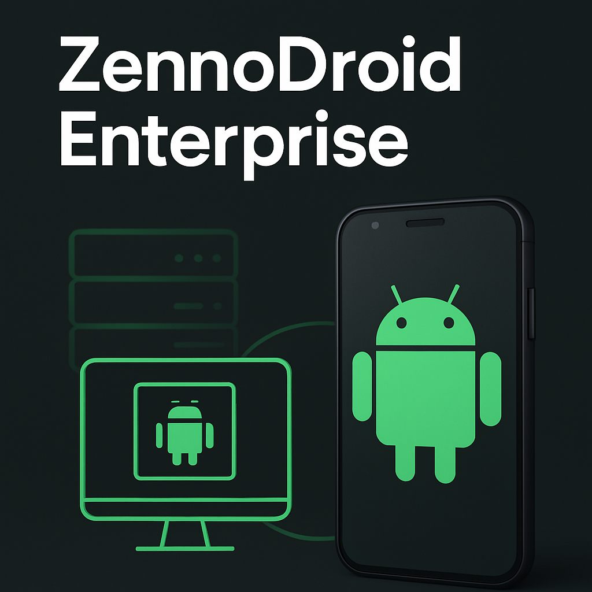

:::info **Пожалуйста, ознакомьтесь с [*Правилами использования материалов на данном ресурсе*](../Disclaimer).**
:::
_______________________________________________  
ZennoDroid Enterprise — это максимально мощное решение для корпоративных задач. Главное отличие этой версии от других заключается в том, что она работает **с реальными физическими Android-устройствами**, что обеспечивает максимальную скорость выполнения задач и стопроцентную совместимость с приложениями.   

:::tip **Дополнительно поддерживается работа с эмулятором BlueStacks для задач, требующих виртуализации.**
:::  

Enterprise версия также поддерживает неограниченное количество потоков. А лицензия позволяет привязку до трех компьютеров с возможностью одновременного использования только на одной машине, что обеспечивает необходимую гибкость в корпоративной среде.  

| Поддерживаемые устройства | Выполнение проектов | Количество привязанных ПК |Сложность задач |Наличие Демо-версии |Уровень нашей поддержки |
| :----------------: | :------: | :----: |:----: |:----: |:----: |
| Физические Android + BlueStacks|   Многопоточное без ограничений   | 3 ПК |Любые |[✅](https://zennolab.com/ru/products/zennodroid/download/)   |[Всегда ответим и поможем](https://helpdesk.zennolab.com/ru/conversation/new) |

Это выбор для организаций, которым критически важна производительность и надежность автоматизации.  

