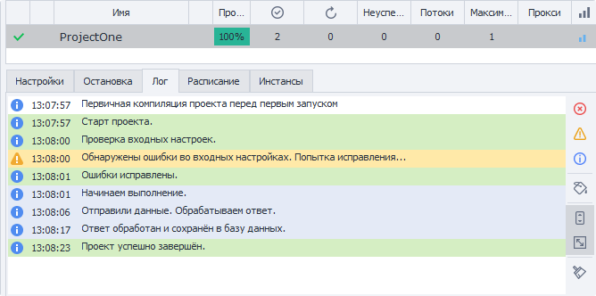

---
sidebar_position: 3
sidebar_label: Вкладка «Лог»
title: Вкладка «Лог» | Документация ZennoDroid | ZennoLab
description: Вкладка «Лог» - раздел официальной документации ZennoDroid от ZennoLab. Подробные инструкции, примеры использования и руководство по настройке
---  
# Вкладка «Лог»
:::info **Пожалуйста, ознакомьтесь с [*Правилами использования материалов на данном ресурсе*](../Disclaimer).**
:::

В этой вкладке записываются все уведомления о ходе выполнения проекта:  
- *ошибки*;  
- *отметки об успешных действиях*;  
- *оповещения о неуспешном завершении проекта*.  

  

С помощью кнопок на правой панели можно:  
- **очистить лог**;  
- **включить автоматическую прокрутку**;  
- **фильтровать сообщения по типу или цвету**.  

:::tip **Окно Лога.**
Принцип работы полностью повторяет описанный ранее в [статье про Окно лога](../pm/Interface/Log_window).
:::