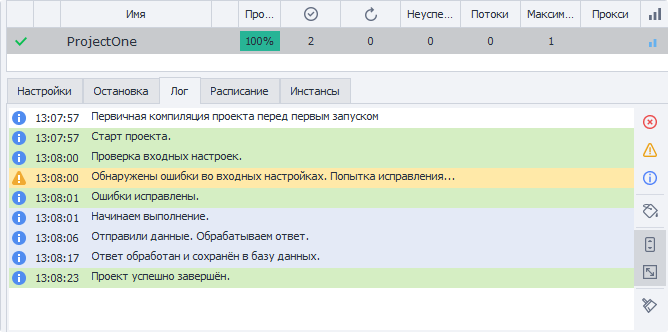

---
sidebar_position: 3
title: Вкладка «Лог»
description: Уведомления о ходе выполнения проекта
---  
:::info **Пожалуйста, ознакомьтесь с [*Правилами использования материалов на данном ресурсе*](../Disclaimer).**
:::
_______________________________________________  
В этой вкладке записываются все уведомления о ходе выполнения проекта:  
- *ошибки*;  
- *отметки об успешных действиях*;  
- *оповещения о неуспешном завершении проекта*.  

  

С помощью кнопок на правой панели можно:  
- **очистить лог**;  
- **включить автоматическую прокрутку**;  
- **фильтровать сообщения по типу или цвету**.  

:::tip **Окно Лога.**
Принцип работы полностью повторяет описанный ранее в [статье про Окно лога](../pm/Interface/Log_window).
:::