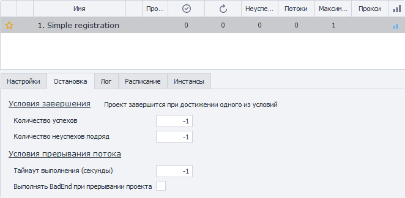
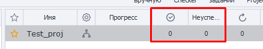
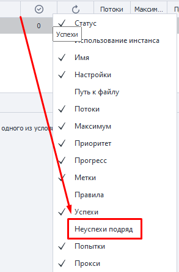

---
sidebar_position: 2
title: Вкладка «Остановка»
description: Условия для прекращения выполнения
---  
:::info **Пожалуйста, ознакомьтесь с [*Правилами использования материалов на данном ресурсе*](../Disclaimer).**
:::
_______________________________________________  
## Описание.
Данная вкладка содержит настройки условий, при наступлении которых проект прекратит выполнение.  

Она находится на главной странице ZennoDroid, достаточно нажать на интересующее нас задание, а затем на раздел **Остановка**.   

  
_______________________________________________
## Доступные параметры.   
### Количество успехов.  
В этой настройке мы задаём количество выполнений для проекта, по достижению которого он остановится.  

По умолчанию указано **`-1`**, то есть бесконечно. Успехи не будут считаться, проект будет выполняться, пока вы не остановите его вручную.  

:::tip **В Таблице проектов можно увидеть общее число успехов и ошибок для конкретного задания.**

:::
### Количество неуспехов подряд.  
Проект может завершиться с ошибкой только указанное здесь количество раз подряд, после этого он будет остановлен.  

Счётчик неуспешных выполнений сбрасывается после того, как задание хотя бы раз завершится успешно.  

По умолчанию стоит значение **`-1`**, то есть бесконечно. Ошибки не будут учитываться, а проект будет выполняться до остановки вручную. 

:::tip **В *Таблице проектов* по умолчанию не отображается колонка с Неуспехами подряд.**  
Но её можно включить, **нажав ПКМ по любому из заголовков таблицы**.  

:::  

### Таймаут выполнения (секунды).  
Задаём максимальное время, выделенное для одного выполнения проекта.  

Если по истечении этого времени задание не успело завершиться, то оно будет прервано, независимо от того, на каком этапе оно находится.  

:::tip **Представим, что выполнение нашего проекта занимает примерно 6-8 минут.**  
Тогда **Таймаут выполнения** выставляем на 600 секунд, то есть 10 минут (с небольшим запасом).

По какой-либо причине наш шаблон неожиданно завис прямо посреди работы. Ровно через 600 секунд от начала он будет прерван, чтобы напрасно не тратить ресурсы и время.
:::  

### Выполнить BadEnd при прерывании проекта.  
Если включить данную настройку, то при прерывании проекта через кнопку **Прервать** или при истечении **Таймаута выполнения** он выйдет по красной линии (BadEnd).  

