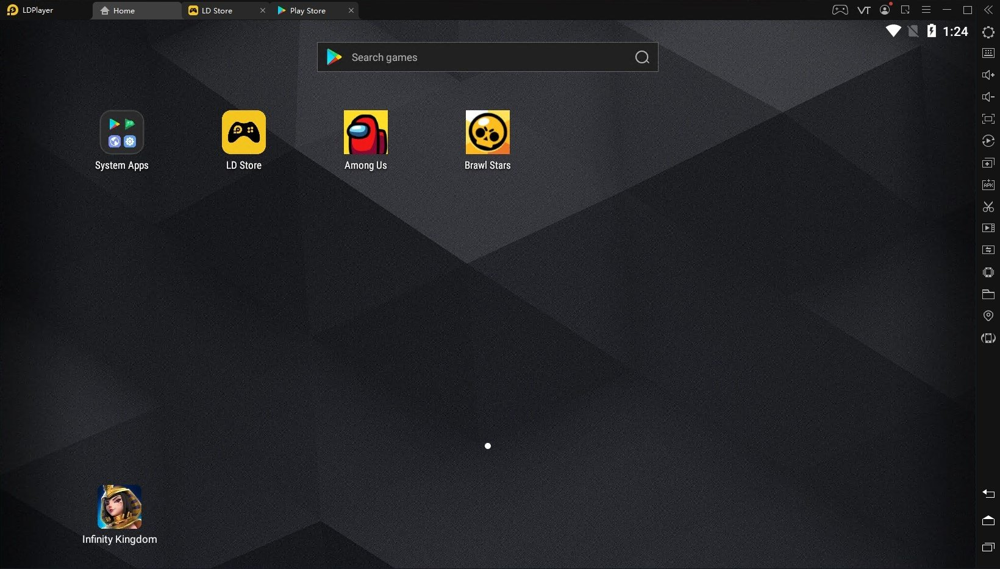
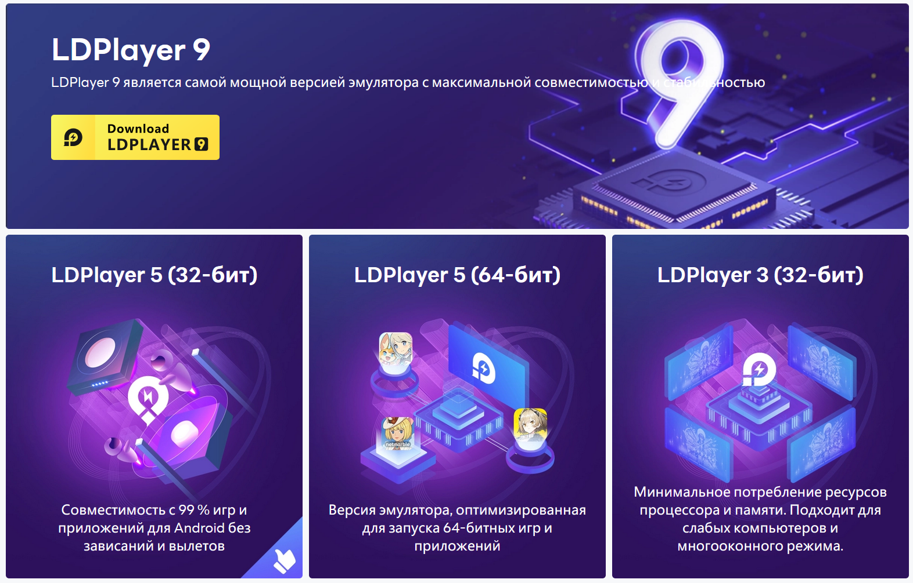
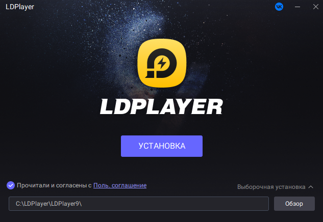
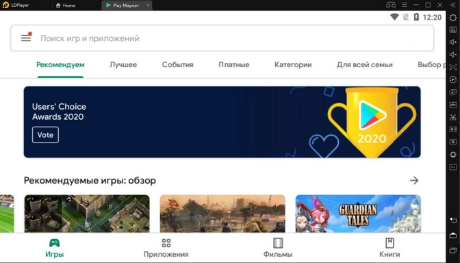
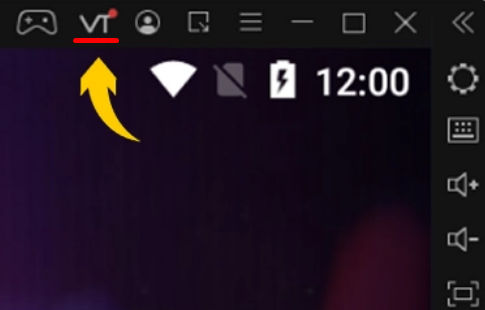
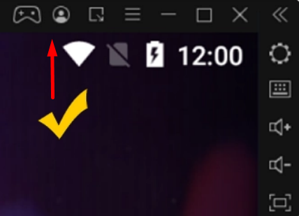

:::info **Пожалуйста, ознакомьтесь с [*Правилами использования материалов на данном ресурсе*](../Disclaimer).**
:::
_______________________________________________
## Что такое LDPlayer?  
Это бесплатный эмулятор Android, который позволяет запускать мобильные приложения прямо на компьютере. Его хвалят за высокую производительность, гибкие настройки и удобное управление с клавиатуры и мыши.   

LDPlayer поддерживает несколько версий Android (5.1, 7.1 и 9.0), что обеспечивает хорошую совместимость с широким спектром приложений. Установку можно адаптировать под возможности вашего компьютера — например, вручную выделить количество ядер процессора, оперативную память, задать разрешение экрана, FPS, выбрать графический движок (OpenGL или DirectX), что особенно важно для стабильной и быстрой работы. 

Он умеет запускать несколько эмуляторов одновременно (мульти-инстанс), синхронизировать действия между ними, записывать макросы и симулировать GPS. LDPlayer также поддерживает ADB-подключение, работу с root-доступом (опционально), обмен файлами между Windows и Android-средой, установку APK-файлов вручную или напрямую из встроенного Play Market. При этом он остаётся относительно лёгким, не перегружая систему, если настроен правильно.  
_______________________________________________  
## Системные требования.  
### Минимальные:  
- **Процессор**: Любой чип от Intel или AMD x86 или x64.  
- **Операционная система**: Windows XP SP3, 7, 8, 8.1, 10 (и обычно поддерживается Windows 11). 
- **Драйвера**: последние версии DirectX 11 или OpenGL 2.0.  
- **Включенная аппаратная виртуализация (VT)**.  
- **ОЗУ (RAM)**: 2 гб для x86 и 4 гб для x64.  
- **Свободное место**: минимум 36 ГБ. 

### Рекомендуемые (для плавной работы, игр и мульти-инстансинга):  
- **Операционная система**: Windows 10 (или Windows 11) с включенной виртуализацией.  
- **Процессор**: Intel Core i5‑10500 (или аналогичный AMD) или выше.  
- **Видеокарта**: NVIDIA GeForce GTX 1660 Ti или лучше.  
- **Драйвера**: последние версии DirectX 11 или OpenGL 4.5.  
- **ОЗУ (RAM)**: не менее 16 гб.  
- **Свободное место**: минимум 100 ГБ.    
- **Интернет**: соединение с низкой задержкой. 

#### Примечание: 
- Чем выше версия эмулированного Android, тем больше нужно ОЗУ и места на диске.  
- Не рекомендуем запускать LDPlayer на еще одной виртуальной машине.  
- Советуем обновить графический драйвер или сменить видеокарту, если есть проблемы с совместимостью.  
_______________________________________________   
## Как установить LDPlayer?  
### 1. Выбираем подходящую версию программы [**на официальном сайте**](https://ru.ldplayer.net/versions).
 

### 2. Завершаем установку LDPlayer из скачанного .exe файла (лучше установить на SSD диск). 

### 3. Включаем LDPlayer и ищем необходимое приложение в Google Play.  
 
_______________________________________________
## Включение виртуализации.  
Технически LDPlayer создаёт виртуальное Android-устройство с помощью технологии виртуализации (работает через Hyper-V, VT-x/AMD-V), поэтому для корректной работы необходимо включить виртуализацию в BIOS.  

|     |  |
| -------- | ------- |
| Значок «VT» предупреждает, что на вашем компьютере **отключена виртуализация**.   | Теперь виртуализация включена, всё супер!    |
_______________________________________________
## Полезные ссылки.   
- [**Включение виртуализации**](./Virtualization).       
- [**Выключение Hyper-V**](./Hyper-V).  