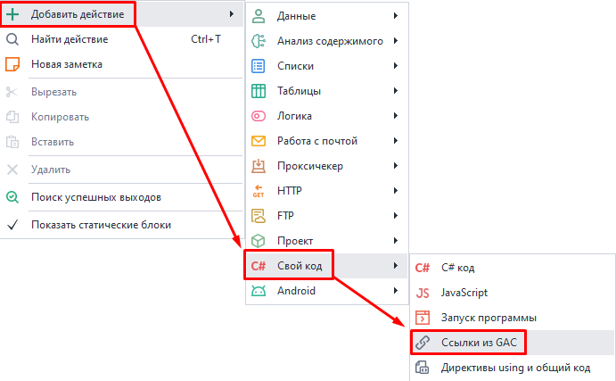
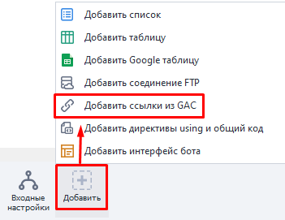
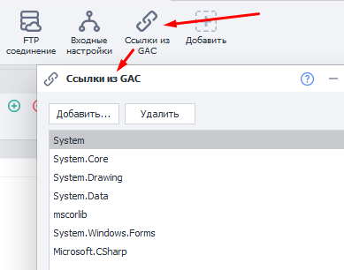
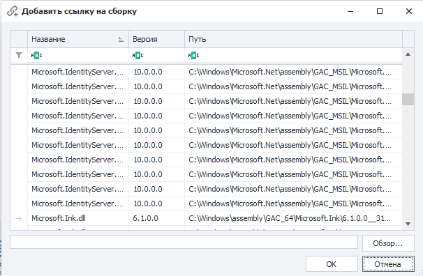
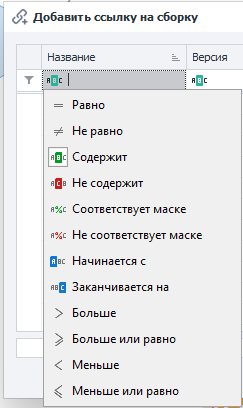

---
sidebar_position: 4
title: Ссылки из GAC
description: Сторонняя библиотека классов.
---  
:::info **Пожалуйста, ознакомьтесь с [*Правилами использования материалов на данном ресурсе*](../../Disclaimer).**
:::  
_______________________________________________  
## Описание.  
При использовании C# сниппетов вам доступны все возможности этого языка. Например, он включает в себя обширную библиотеку классов и методов, которая покрывает большинство возникающих задач.  

Описание различным классов, а также их возможности доступны на странице [**Библиотека классов платформы .NET Framework**](https://learn.microsoft.com/ru-ru/previous-versions/gg145045(v=vs.110)?redirectedfrom=MSDN).  

Однако, если вы не нашли класс, решающий вашу задачу, вы можете воспользоваться сторонней библиотекой. Для этого в проект нужно добавить экшен **Ссылки из GAC**, в котором можно подключить отдельную библиотеку классов.  
_______________________________________________ 
## Как добавить в проект?  
Через контекстное меню: **Добавить действие → Свой код → Ссылки из GAC**.  

  

Или через **[*Панель статических блоков*](../Static%20Block%20Panel/CommonPrinciples) → Добавить → Добавить ссылки из GAC**:  

  

_______________________________________________
## Как работать с экшеном?  
 

При открытии экшена или соответствующего элемента из [*Панели статических блоков*](../Static%20Block%20Panel/CommonPrinciples) появится окно, в котором перечислены все подключенные в данный момент библиотеки.  

С помощью кнопки **Добавить** можно добавить свою библиотеку, выбрав ее из списка или загрузив из файла.  

  

Можно также воспользоваться фильтрацией для поиска:  

  

После добавления нужной библиотеки для нее необходимо прописать новое пространство имен. Это делается через экшен [*Директивы using и общий код*](./Directives_Using), который мы рассматриваем в соседней статье.  
_______________________________________________
## Полезные ссылки.  
- [**Фрагменты кода C#**](https://learn.microsoft.com/ru-ru/visualstudio/ide/visual-csharp-code-snippets?view=vs-2022).

