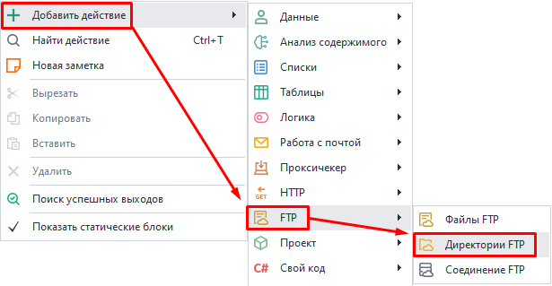
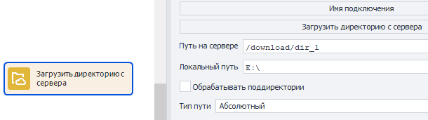
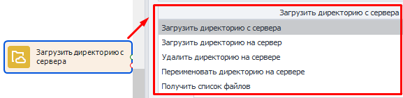
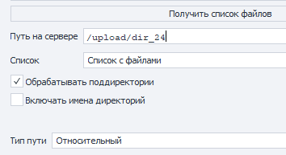
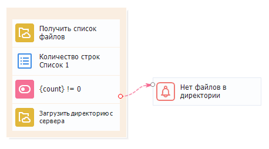

---
sidebar_position: 5
title: Директории FTP
description: Работа с директориями на FTP сервере.
---  
:::info **Пожалуйста, ознакомьтесь с [*Правилами использования материалов на данном ресурсе*](../../Disclaimer).**
:::  
_______________________________________________   
Данный экшен позволяет вам работать с директориями, а именно:  
- ***Скачать** директорию с файлами данных проекта, которая находится на FTP-сервере;*  
- ***Загрузить** директорию с данными проекта на FTP-сервер;*  
- ***Удалить** директорию с файлами из сервера;*  
- ***Получить** список рабочих файлов, которые находятся в определенной директории;*  
- ***Переименовать** директорию на сервере.*  
_______________________________________________ 
### Как добавить в проект?  
Через контекстное меню: **Добавить действие → FTP → файлы FTP**.  

_______________________________________________   
## Как работать с экшеном?  
  
_______________________________________________   
### Доступные варианты действий:  
 
#### Загрузить директорию с сервера.  
Позволяет скачать директорию с сервера на свой компьютер.  

#### Загрузить директорию на сервер.  
Загружает директорию с вашего компьютера на сервер.    

#### Удалить директорию на сервере.  
Удаляет директорию с сервера. Необходимо указать к ней путь.  

#### Переименовать директорию на сервере.  
Нужен для изменения имени директории на сервере. Указываем путь к директории и ее новое имя.  

#### Получить список файлов.  
Используется для получения списка файлов, содержащихся в определённой директории на сервере.  
Необходимо указать список, в который будут сохраняться имена файлов.  
_______________________________________________
### Доступные настройки:  
  

- **Путь на сервере**.  
Путь к нужной директории на сервере.  
- **Локальный путь**.  
Путь на личном компьютере, куда сохранится скачанная директория.  
- **Обрабатывать поддиректории**.  
При работе будут учитываться поддиректории, если они есть в основной директории.  
- ***Включать имена директорий***.   
 *(Дополнительная настройка для* **Получить список файлов**).  
 Включает в итоговый список файлов имена директорий.   
- **Тип пути**.  
Относительный (относительно текущей папки) или абсолютный (от корня системы) путь на сервере.  
_______________________________________________  
## Пример использования.  
  
### Скачиваем папку с файлами.  
**1.** Проверяем есть ли файлы в директории на FTP сервере.   
**2.** Если директория не пустая, то скачиваем ее для дальнейшей работы.  
**3.** Получаем список файлов.  
**4.** Если строк в списке больше 0, то скачиваем все файлы с FTP-сервера и работаем с ними.  
**5.** Когда строки заканчиваются, выводим уведомление об этом и завершаем работу.  
_______________________________________________
## Полезные ссылки.    
- [**Список**](../Lists%20and%20Google%20Sheets/Lists).  
- [**Оператор IF**](../Logic/IF).  
- [**Оповещение**](../Logic/Notification).