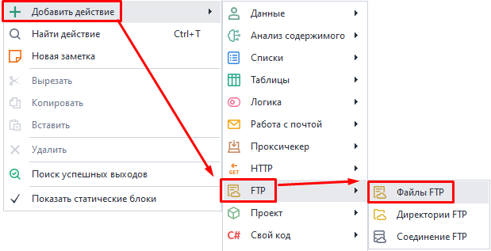
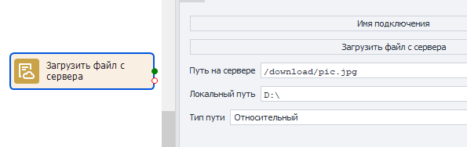
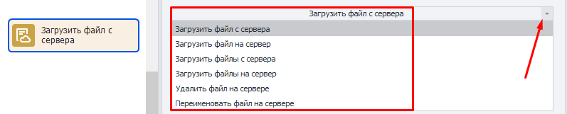
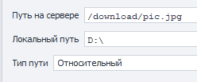
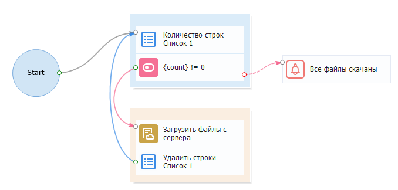

---
sidebar_position: 4
title: Файлы FTP
description: Работа с файлами на FTP сервере.
---  
:::info **Пожалуйста, ознакомьтесь с [*Правилами использования материалов на данном ресурсе*](../../Disclaimer).**
:::  
_______________________________________________  
В ZennoDroid есть встроенные возможности для работы с FTP-ресурсами. Вы можете автоматически загружать файлы на FTP-сервер, создавать и удалять директории, а так же производить другие операции. Это удобно, когда файлы ваших проектов хранятся на FTP-сервере.  

Данный экшен позволяет вам работать с файлами, а именно:  
- ***Загрузить один** файл С или НА сервер;*  
- ***Загрузить несколько** файлов С или на сервер;*  
- ***Удалить** один или несколько файлов с сервера;*  
- ***Переименовать** файл на сервере.*  
_______________________________________________ 
### Как добавить в проект?  
Через контекстное меню: **Добавить действие → FTP → файлы FTP**.  

_______________________________________________   
## Как работать с экшеном?  
  
_______________________________________________
### Доступные варианты действий:  
 
#### Загрузить файл с сервера.  
Позволяет скачать файл с сервера на свой компьютер.  

#### Загрузить файл на сервер.  
Загружает файл с вашего компьютера на сервер.  

#### Загрузить файлы с сервера.  
Нужен для скачивания нескольких файлов с сервера на компьютер.  
Пути к файлам указываются в ***Списке***. За один проход экшена берется только одна строка с путем из списка.  

#### Загрузить файлы на сервер.  
Используется для загрузки нескольких файлов с компьютера на сервер.  
Пути к файлам указываются в ***Списке***. За один проход экшена берется только одна строка с путем из списка.  

#### Удалить файл на сервере.  
Удаляет файл с сервера. Необходимо указать к нему путь.  

#### Переименовать файл на сервере.  
Нужен для изменения имени файла на сервере. Указываем путь к файлу и его новое имя.  
_______________________________________________
### Доступные настройки:  
  

- **Путь на сервере**.  
Путь к нужному файлу на сервере.  
- **Локальный путь**.  
Путь на личном компьютере, куда сохранится скачанный файл.  
- **Тип пути**.  
Относительный (относительно текущей папки) или абсолютный (от корня системы) путь на сервере.  
_______________________________________________
## Пример использования.  
  
### Скачиваем файлы с FTP-сервера по списку.  
Пути к файлам, которые нам нужно скачать, хранятся в списке.  
**1.** Получаем количество строк из списка.   
**2.** Если список не пустой, то скачиваем файл с FTP-сервера.  
**3.** Затем удаляем строку, которая содержит путь к уже скачанному файлу.  
**4.** Возвращаемся в начало цикла (к 1 шагу).  
**5.** Как только строк в списке не останется, выводим оповещение о том, что все файлы скачаны.
_______________________________________________
## Полезные ссылки.    
- [**Как подключиться к серверу по FTP**](https://help.reg.ru/support/hosting/dostupy-i-podklyucheniye-panel-upravleniya-ftp-ssh/kak-podklyuchitsya-k-serveru-po-ftp-i-nachat-rabotu#0)  
- [**Оператор IF**](../Logic/IF)  
- [**Оповещение**](../Logic/Notification).