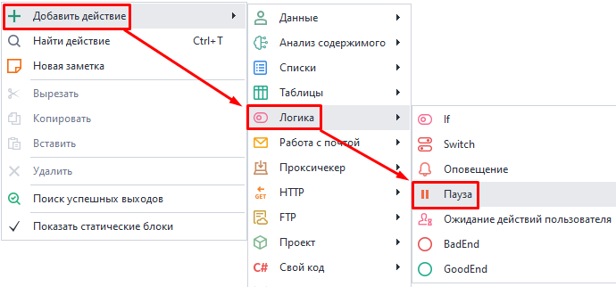
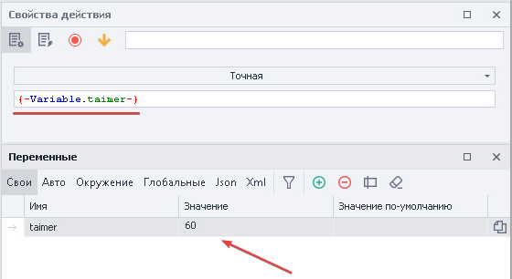
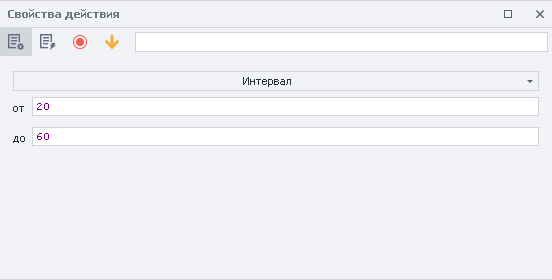

---
sidebar_position: 4
title: Пауза 
description: Действие остановки проекта.
---  
:::info **Пожалуйста, ознакомьтесь с [*Правилами использования материалов на данном ресурсе*](../../Disclaimer).**
:::   
_______________________________________________
Данное действие позволяет останавливать выполнение проекта на заданный в секундах промежуток времени.  

Используется для:  
- Ожидания полной загрузки приложения;  
- Создания человеческого поведения с помощью случайных пауз;  
- Задания промежутка времени между выполнениями действий;  
_______________________________________________
### Как добавить в проект?  
Через контекстное меню: **Добавить действие → Логика → Пауза**.  

    
_______________________________________________
## Как работать с экшеном?  
:::info **Значение устанавливается в секундах.**  
Если используются переменные, то значение должно быть цифровым.
:::   

### Точная.  
Проект остановит выполнение на указанное количество секунд. Значение можно задать вручную или через переменную.  

  

### Интервал.  
Указывается пауза в заданном цифровом промежутке, можно использовать переменные.  

  

- **ОТ**. Минимальное время в секундах.  
- **ДО**. Максимальная пауза в секундах (**НЕ ВКЛЮЧИТЕЛЬНО**).  

Например, после настроек со скриншота проект уйдет в ожидание на время, выбранное случайным образом из диапазона от 20 до 59 секунд.  
_______________________________________________
### Пример.  
Допустим, что нам нужно сделать несколько однотипных действий в приложении. Чтобы они не выглядели роботизировано из-за молниеносного выполнения, мы рекомендуем делать случайные паузы между действиями.  

Это может выглядеть вот так:  
1. Открываем приложение.  
2. Выполняем необходимые действия.  
3. Задаем паузу в интервале.  
4. Снова выполняем действия.  

Таким образом, выдерживая паузы между действиями, мы даем понять сайту, что работает *живой* пользователь, а не бот.
_______________________________________________
## Полезные ссылки.  
- [**Диапазоны значений**](../../pm/Creating/Value_Ranges).
- [**Обработка переменных**](../../Data/WorkWithVariables). 

