:::info **Пожалуйста, ознакомьтесь с [*Правилами использования материалов на данном ресурсе*](../Disclaimer).**
:::  
_______________________________________________  
## Описание.   
Позволяет найти нужное письмо и информацию в нём. Подходит для массовой обработки входящей корреспонденции.  

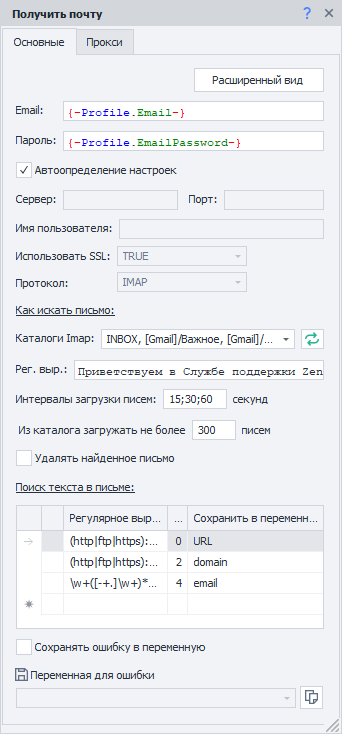 

Подходит для:  
- Быстрого доступа к письмам;  
- Получения данных из письма;  
- Активации учетных записей;  
- Удаление ненужных писем;  
- Удаление загруженных писем.
_______________________________________________ 
## Как добавить в проект?  
Через контекстное меню: **Добавить действие → Работа с почтой → Принять почту**.  

   
_______________________________________________ 
## Как работать с экшеном?  
:::info **Перед работой убедитесь, что в вашей учетной записи активирована опция доступа через IMAP.**
:::   
_______________________________________________
### Вкладка «Основные».   
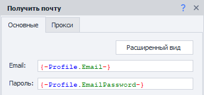  

#### Кнопка «Расширенный вид».  
При клике по данной кнопке откроется окно ***Обработки почты***.  

#### Email и Пароль.  
Указываем эти данные от электронного ящика  
_______________________________________________
### Настройки подключения.   
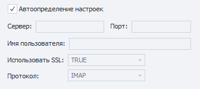   

#### Автоопределение настроек.  
При включении данной настройки ZennoDroid автоматически подберёт параметры для соединения с почтовым сервером.  

:::warning **Работает не со всеми почтовыми провайдерами.**
:::  

#### Сервер, Порт, Имя пользователя, Использовать SSL, Протокол.   
Все эти параметры нужно взять из документации выбранного почтового провайдера.  
_______________________________________________
### Как искать письмо.   
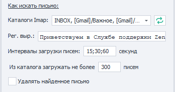   

#### Каталоги Imap.  
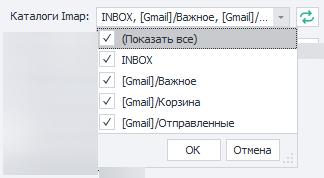   

Здесь можно выбрать папки почтового ящика, в которых будет производиться поиск письма.  

  А эта кнопка обновляет список доступных папок.  

#### Рег. выр. (Регулярное выражение).    
В данное поле вносится регулярное выражение, согласно которому будет происходить поиск письма в ящике.  

#### Интервалы загрузки писем.  
Письма от сервисов могут приходить с задержкой. Поэтому можно указать промежуток времени в секундах и количество попыток скачивания списка писем.  

 Разделитель `;` указывает на количество попыток. Например, на скриншоте это: *первая через 15 сек, вторая - 30 сек, третья - 60 сек*.  

#### Из каталога загружать не более писем.   
Указываем количество писем, которые будут загружены.  

#### Удалять найденное письмо.  
При включении данной настройки найденное письмо будет удалено из ящика после обработки.
_______________________________________________
### Поиск текста в письме.   
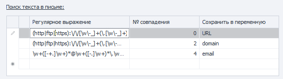   

Можно сохранять результат работы сразу нескольких регулярных выражений!  

Например, в письме есть: 
- код активации,  
- адрес сайта,  
- номер телефона,  
- имя и фамилия.   
Все это можно достать за одно действие! Достаточно под каждый элемент составить регулярное выражение и добавить переменные, в которые будет сохранён результат работы.  

#### Регулярное выражение.     
Тут указываем регулярное выражение для поиска нужного текста.  

#### № совпадения.  
Часто для одного регулярного выражения может быть сразу несколько совпадений. Тут отобразится порядковый номер найденного элемента. ***Нумерация с нуля***.  

:::warning **Не рекомендуем привязываться к номеру совпадения.**  
Так как структура проекта может измениться, а вместе с ней и порядковый номер ссылки.  
Старайтесь подбирать регулярное выражение таким образом, чтобы в результате его работы оставалось только одно совпадение.
:::  

#### Сохранить в переменную.  
В этой колонке нужно выбрать существующую или создать новую переменную, куда будет сохранён результат работы регулярного выражения.  
_______________________________________________
### Сохранить ошибку в переменную.  
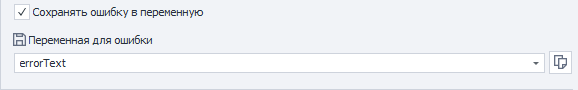  

Если во время работы экшена возникнет ошибка, то эта настройка сохранит её текст в переменную (новую или уже созданную).  
_______________________________________________
### Вкладка «Прокси».  
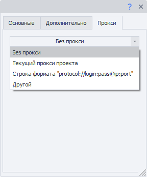  

#### Без прокси.  
Работа экшена будет происходить через реальный ip компьютера/сервера.  

#### Строка формата.  
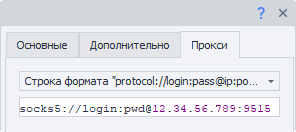   

Указываем прокси в формате:  
- ***С авторизацией***. `socks5://логин:пароль@ip:port` или `http://логин:пароль@ip:port`  
- ***Без авторизации***. `socks5://ip:port` или `http://ip:port`  
- ***Без указания протокола*** *(по умолчанию http://)*. `логин:пароль@ip:port` или `ip:port`  

:::tip **Можно указывать переменные.**  
::: 

#### Другой.  
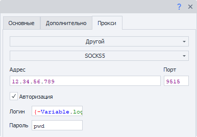   

Эта опция выбирается, если необходимо указать детальные настройки прокси. Такие как: тип прокси, данные авторизации, адрес и порт. Эту информацию можно узнать у поставщика услуг.  

:::tip **Можно использовать переменные в любом из полей.**  
:::  

:::info **Если не указать протокол прокси, то по умолчанию будет выбран http://**  
:::  
_______________________________________________
## Пример использования.  
Допустим, что после регистрации в приложении нам нужно подтвердить свою учетную запись, перейдя по ссылке из письма.  

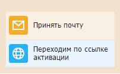  

1. Регистрируемся в приложении.  
2. Добавляем в проект экшен **Принять почту** и настраиваем его.  
3. Получаем письмо для активации аккаунта.  
4. Переходим по ссылке.  
5. Аккаунт успешно подтвержден.  

Это особенно удобно при массовых действиях в приложениях, так как работа без отдельного почтового клиента экономит время и ресурсы. 
_______________________________________________  
## Полезные ссылки.   
- [**Настройки Почты**](../Settings/Mailbox).  
- [**Тестер регулярных выражений**](../Tools/RegEx_Tester).   
- [**Переменные окружения**](../pm/Creating/Variables)

