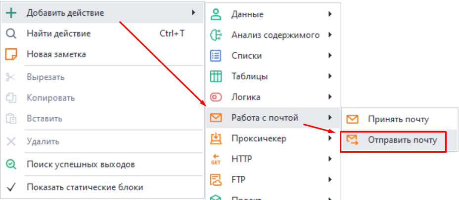
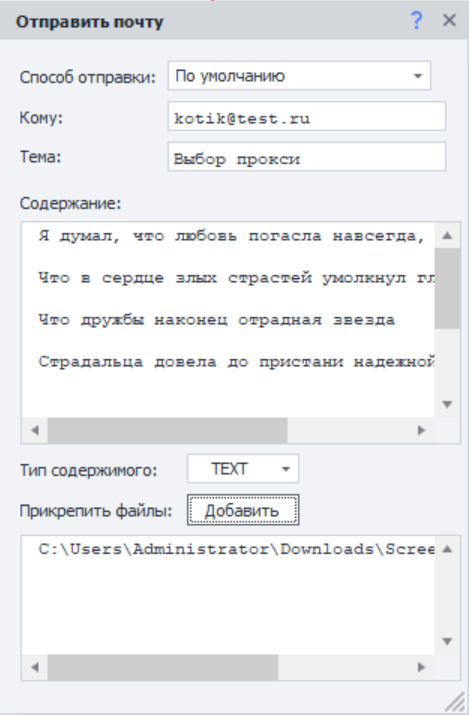

:::info **Пожалуйста, ознакомьтесь с [*Правилами использования материалов на данном ресурсе*](../Disclaimer).**
:::  
_______________________________________________  
## Описание.   
С этим экшеном вы можете отправить письмо на любой адрес электронной почты, используя SMTP сервер.  

Подходит для:  
- Отправки уведомления о событиях в проекте (успешное выполнение, возникла ошибка и так далее);  
- Передачи сообщений на указанные адреса со своего ящика;  

### Как добавить в проект?  
Через контекстное меню: **Добавить действие → Работа с почтой → Отправить почту**.  

_______________________________________________ 
## Как работать с экшеном?  
:::info **Перед началом работы добавьте данные вашего ящика.**
Сделать это можно в настройках программы в разделе [**Почта**](../Settings/Mailbox). Там указываются аккаунты, с которых будут отправляться письма.  
:::  

  

### Способ отправки.  
Здесь отобразятся все почтовые ящики, которые вы добавили в [**Настройках программы**](../Settings/Mailbox). Выбираем из них один, с которого произведётся отправка.  

Доступно использование [**Переменных проекта**](../Data/WorkWithVariables).  

### Кому.  
Указываем Email-адрес получателя.

### Тема. 
Задаём тему для нашего письма.

### Содержание.  
Сюда помещаем основной текст сообщения. Поддерживается HTML-разметка.

### Тип содержимого.  
#### TEXT.  
Оставляем этот вариант, если хотим отправить обычый текст.  
#### HTML.  
Этот же пункт выбираем, когда содержимое включает HTML-разметку.

### Прикрепить файлы.
Вместе с письмом можно отправить любое количество файлов. В данном поле указывается путь к нужным файлам, каждый с новой строки.  

Путь к файлам можно прописать вручную или выбрать через кнопку **Добавить**. Поддерживаются также [**Переменные проекта**](../Data/WorkWithVariables).  
_______________________________________________  
## Полезные ссылки.    
- [**Принять почту**](./RecieveEmails).  
- [**Настройки Почты**](../Settings/Mailbox).  
- [**Окно переменных**](../pm/Interface/Variables)