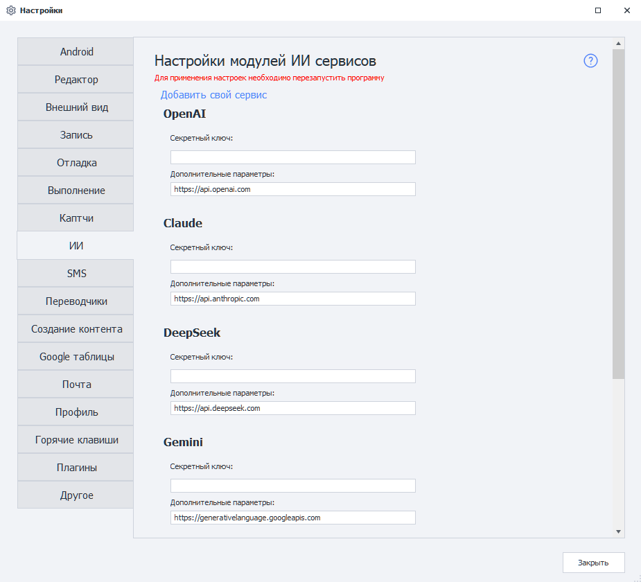
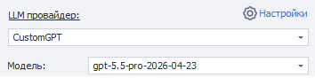

---
sidebar_position: 8
sidebar_label: ИИ
title: ИИ | Документация ZennoDroid | ZennoLab
description: ИИ - раздел официальной документации ZennoDroid от ZennoLab. Подробные инструкции, примеры использования и руководство по настройке
---  
# ИИ
:::info **Пожалуйста, ознакомьтесь с [*Правилами использования материалов на данном ресурсе*](../Disclaimer).**
:::

## Описание.  
**ИИ-сервисы** — это сервисы, предоставляющие доступ к языковым моделям и другим AI-инструментам через API. Они позволяют автоматически генерировать тексты, комментарии, описания, анализировать данные, переводить текст, писать код, обрабатывать изображения и выполнять многие другие задачи.  

  
_______________________________________________
## Для чего нужны эти настройки?  
Современные ИИ-модели способны понимать текстовые запросы (*промпты*) и генерировать ответы, максимально приближенные к человеческому общению. Благодаря API-интеграции ZennoDroid может отправлять запросы в ИИ-сервисы и использовать полученные ответы в автоматизации.  

**Это может использоваться для:**  
- *генерации комментариев, постов и описаний*;  
- *рерайта и перевода текста*;  
- *анализа контента*;  
- *создания SEO-текстов*;  
- *генерации кода*;  
- *классификации и обработки данных*;  
- *работы с изображениями и OCR*;  
- *автоматизации общения и поддержки пользователей*.  

Кроме того, указанный здесь ключ используется [**ИИ-помощником**](../get-started/ai-assistant) в ProjectMaker — без подключённой модели он работать не будет.  

После подключения API-ключа вы сможете выбирать модель, настраивать параметры генерации и использовать ИИ прямо внутри проекта ZennoDroid.  
_______________________________________________
## Как открыть это окно?  
- Через верхнее меню ProjectMaker **Редактирование → Настройки → ИИ**.  

  

- Через [**Стартовую страницу**](../pm/Welcome_PM) — кнопка **Настройки** в блоке *Начало работы*.  

  
_______________________________________________
## Как подключиться?  
### Секретный ключ.  
Для работы с ИИ-сервисом необходим **API-ключ** (*Token*). Это *уникальная строка символов*, которая используется для авторизации запросов и идентификации вашего аккаунта в сервисе. Например, он может выглядеть вот так: `sk-proj-8fKx2aBcD93kdPqLmN4...`.  

Для получения API-ключа перейдите на сайт выбранного ИИ-сервиса, зарегистрируйтесь и создайте ключ в личном кабинете или разделе для разработчиков.  

**API-ключ необходим для:**  
- *отправки запросов к ИИ-моделям*;  
- *учёта использованных токенов*;  
- *доступа к доступным моделям*;  
- *тарификации и лимитов API*.  

:::warning **Храните API-ключ в секрете.**  
- Не публикуйте его в открытом доступе.  
- При компрометации ключ рекомендуется немедленно отозвать и создать новый.  
:::

После добавления ключа ZennoDroid сможет выполнять запросы к выбранному ИИ-сервису от вашего имени.  

### Дополнительные параметры.  
Тут пишется **URL-адрес** для приёма API-запросов. Он установлен в программе по умолчанию. Если вдруг адрес не прописан заранее, то его необходимо уточнить в документации выбранного сервиса.  

:::warning **Не меняйте без необходимости значение данного поля!**
:::

:::info **Для применения настроек необходимо перезапустить программу.**  
Об этом предупреждает красная надпись в верхней части окна настроек.
:::
_______________________________________________
## Доступные сервисы.  
- [api.openai.com](https://openai.com) — ChatGPT;  
- [api.anthropic.com](https://anthropic.com) — Claude;  
- [api.deepseek.com](https://deepseek.com) — DeepSeek;  
- [generativelanguage.googleapis.com](https://ai.google.dev) — Gemini;  
- [openrouter.ai/api](https://openrouter.ai) — OpenRouter;  
- [api.perplexity.ai](https://perplexity.ai) — Perplexity Sonar.  
_______________________________________________
## Свой сервис.  
### Добавить свой сервис (модуль).  
Также можно добавить в программу пользовательский ИИ-сервис на основе API популярных сервисов.  

Для этого необходимо перейти на страницу **Настроек** и выбрать пункт **Добавить свой сервис**.  

  

Перед вами появится окно для ввода данных нового сервиса:  

  

### Необходимые параметры.  
:::tip **Если вы не уверены, какие данные нужно вводить.**
То проконсультируйтесь с поставщиком услуг.
:::
#### Название модуля.  
Указываем имя нового сервиса.  

#### API.  
Выбираем API, на основе которого будет создан наш модуль.  

  

#### Token.  
Ключ от сервиса. Тот же самый, который указываем в поле **Секретный ключ** при подключении встроенного сервиса *(описано выше)*.  

#### Server.  
URL-адрес, куда будут отправляться запросы.  

### Работа с добавленным сервисом.  
После добавления сервиса и перезапуска программы он появится в общем списке наравне со встроенными. Его можно выбрать в экшене [**ИИ Агент**](../project-editor/AI_Agent) и работать с ним точно так же, как и со встроенными LLM-провайдерами.  

  

### Удаление модуля.  
Чтобы убрать созданный модуль из программы, **необходимо удалить два файла**:  
- `c:\Users\USERNAME\AppData\Roaming\ZennoLab\Configs\ИмяМодуля.config.json`  
- `c:\Users\USERNAME\AppData\Roaming\ZennoLab\CustomModules\Ai\ИмяМодуля.dll`  

`USERNAME` — тут необходимо вставить имя вашего пользователя в операционной системе.  

:::warning **Рекомендуем закрыть ZennoDroid и ProjectMaker перед удалением этих файлов.**
:::
_______________________________________________
## Полезные ссылки.  
- [**Экшен ИИ Агент**](../project-editor/AI_Agent).  
- [**ИИ-помощник в ZennoDroid**](../get-started/ai-assistant).  
- [**Настройка MCP для AI-ассистентов**](../get-started/MCP_Setup).  
