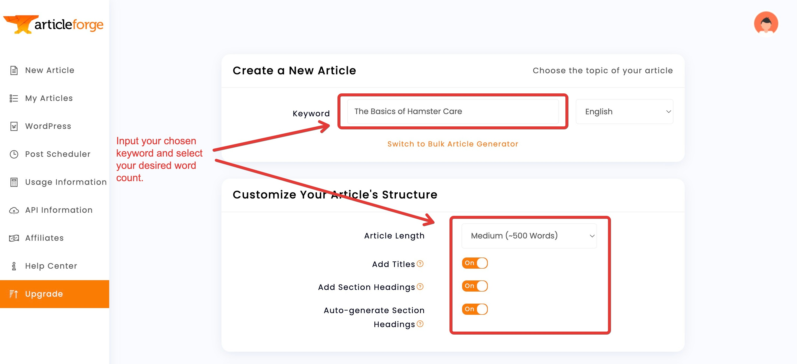
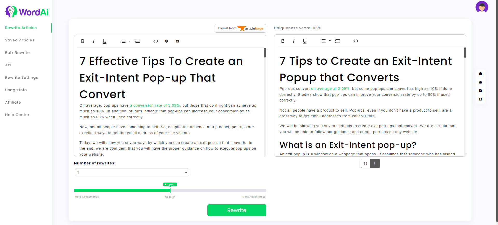

---
sidebar_position: 10
title: Создание контента
description: Настройка модулей создания контента. 
---  
:::info **Пожалуйста, ознакомьтесь с [*Правилами использования материалов на данном ресурсе*](../Disclaimer).**
:::
_______________________________________________    
## Описание.  
Данные модули позволяют создавать контент на основе заданного текста через сторонние сервисы. Технологии на основе ИИ пишут текст, по качеству сравнимый с человеческим.  

Подходят для **рерайтинга текста** и **создания уникального контента**.

:::warning **Работают только с английским языком.**
:::  

### Внешний вид.  
  
_______________________________________________
### Настройка ArticleForge.  
  

#### 1. Создаём аккаунт, если его ещё нет.  
#### 2. Получаем свой ключ в разделе API Information.  
_______________________________________________
### Настройка WordAi.  
  

#### 1. Создаём аккаунт, если его ещё нет.  
#### 2. Вводим в настройки ZennoDroid свой логин и ключ из раздела API.  
_______________________________________________  
## Полезные ссылки.    
- [**Модули создания контента**](../Data/ContentCreator).   
