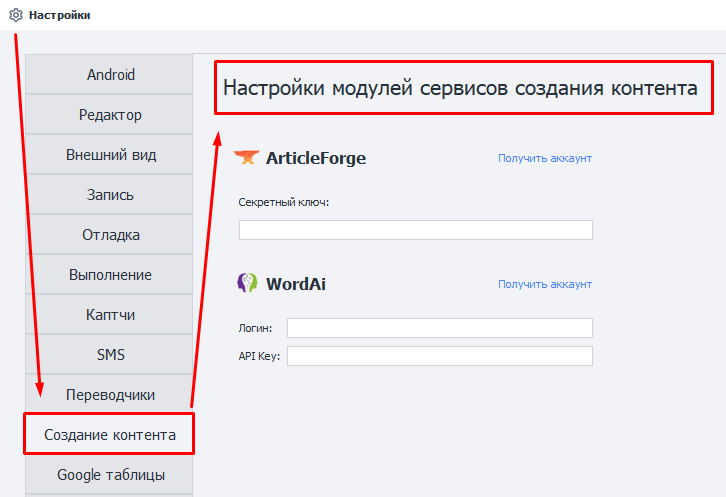
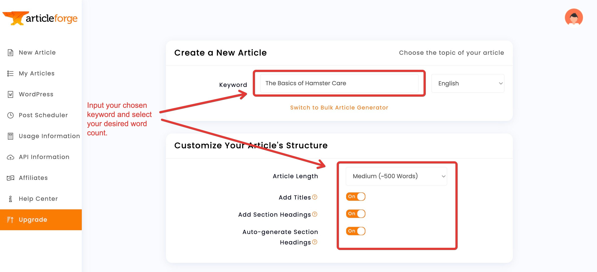
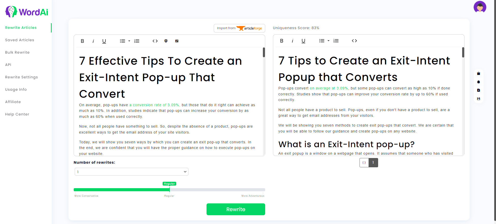

---
sidebar_position: 10
sidebar_label: Создание контента
title: Создание контента | Документация ZennoDroid | ZennoLab
description: Создание контента - раздел официальной документации ZennoDroid от ZennoLab. Подробные инструкции, примеры использования и руководство по настройке
---  
# Создание контента
:::info **Пожалуйста, ознакомьтесь с [*Правилами использования материалов на данном ресурсе*](../Disclaimer).**
:::

## Описание.  
Данные модули позволяют создавать контент на основе заданного текста через сторонние сервисы. Технологии на основе ИИ пишут текст, по качеству сравнимый с человеческим.  

Подходят для **рерайтинга текста** и **создания уникального контента**.

:::warning **Работают только с английским языком.**
:::  

### Внешний вид.  
  
_______________________________________________
### Настройка ArticleForge.  
  

#### 1. Создаём аккаунт, если его ещё нет.  
#### 2. Получаем свой ключ в разделе API Information.  
_______________________________________________
### Настройка WordAi.  
  

#### 1. Создаём аккаунт, если его ещё нет.  
#### 2. Вводим в настройки ZennoDroid свой логин и ключ из раздела API.  
_______________________________________________  
## Полезные ссылки.    
- [**Модули создания контента**](../Data/ContentCreator).   
