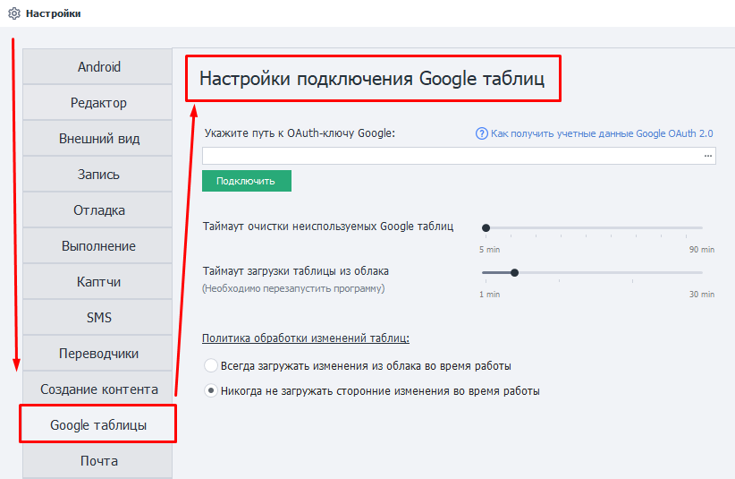

---
sidebar_position: 16
title: Google таблицы
description: Настройка Google таблиц. 
---  
:::info **Пожалуйста, ознакомьтесь с [*Правилами использования материалов на данном ресурсе*](../Disclaimer).**
:::

## Настраиваем Google таблицы.  
В данной статье мы рассказываем **только** о *настройке Google Таблиц* в программе. [Процесс подключения описан здесь](../Project%20Editor/Lists%20and%20Google%20Sheets/Connecting_GoogleSheets).  

### Внешний вид.  
 

### Путь к OAuth-ключу Google.  
Здесь необходимо выбрать путь к файлу с [настройками подключения к Google API](../Project%20Editor/Lists%20and%20Google%20Sheets/Connecting_GoogleSheets).  

:::warning **Файл обязательно должен иметь расширение `.json`.**
:::  

### Таймаут очистки неиспользуемых Google таблиц.  
Эта настройка определяет время хранения таблицы в памяти.  

Если ни один проект в ZennoDroid не использует Google таблицу в течение указанного в этой настройке количества минут, то эта таблица будет выгружена из памяти для экономии ресурсов компьютера.  

**Большой таймаут** может быть полезен, когда между запуском определенного проекта есть пауза (например по расписанию, каждый час). Тогда не надо будет каждый раз скачивать таблицу из облака.  

**Малый таймаут** пригодится, если во время каждого выполнения проекта формируется отчёт о работе, который сохраняется в новую таблицу. При этом нет необходимости хранить эти таблицы в памяти после выгрузки данных.  

### Таймаут загрузки таблицы из облака.  
Тут указываем время, отведённое на загрузку таблицы из облака.

Если таблица большая, то синхронизация иногда занимает длительное время. Это может привести к ошибке загрузки, так как запрос выполняется слишком долго.  

### Политика обработки изменений таблиц.  
В этой настройке можно выбрать, должен ли ZennoDroid загружать сторонние изменения таблицы во время работы с ней.  

При выборе режима **Никогда не загружать сторонние изменения во время работы** программа будет *только отсылать* локальные данные, не сопоставляя их с теми, что находятся в облаке. То есть программа не будет тратить ваше время и ресурсы компьютера на это. Полезно, если таблица большая.  

Отключение синхронизации также пригодится при парсинге данных, когда не нужны актуальные данные из облака.
_______________________________________________  
## Полезные ссылки.   
- [**Подключение Google-таблиц**](../Project%20Editor/Lists%20and%20Google%20Sheets/Connecting_GoogleSheets).   
