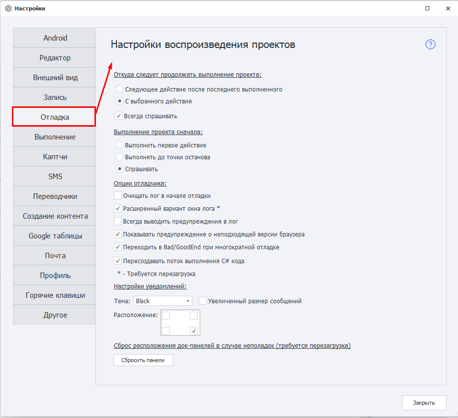
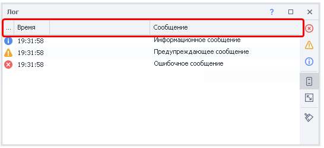
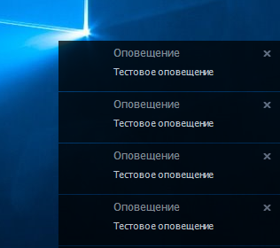
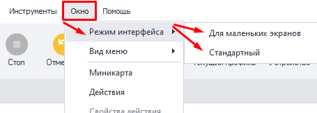

---
sidebar_position: 5
title: Отладка
description: Настройки воспроизведения проектов. 
---  
:::info **Пожалуйста, ознакомьтесь с [*Правилами использования материалов на данном ресурсе*](../Disclaimer).**
:::
_______________________________________________  
  

## Откуда следует продолжать выполнение проекта.  
Данные настройки влияют на то, как будет вести себя проект при клике по кнопкам **Далее** или **До конца**.  

### Следующее действие после последнего выполненного.  
Если включить, то проект продолжит выполняться со следующего действия, которое следует за последним выполненным.  

### С выбранного действия.  
А в этом случае выполнение продолжится с действия, которое пользователь в данный момент выделил в схеме проекта.  

### Всегда спрашивать.  
Данный чекбокс отвечает за то, будет ли запрашиваться выбор из двух верхних вариантов у пользователя каждый раз перед продолжением.  
_______________________________________________
## Выполнение проекта сначала.
Эта настройка определяет поведение проекта при клике ***С начала***.  

### Выполнить первое действие.  
При выборе данной опции фокус проекта будет смещаться на первый экшен после нажатия кнопки **С начала**.  

### Выполнять до точки останова.  
Действия будут выполняться до первой ***Точки останова***, а если её нет, то сразу до конца проекта.  

### Спрашивать.  
В этом случае порядок выполнения будет каждый раз запрашиваться у пользователя.  
_______________________________________________
## Опции отладчика.  
### Очищать лог в начале отладки.  
При каждом запуске проекта **С начала** лог будет автоматически очищен.  

### Расширенный вариант окна лога.  
Лог будет отображаться в окне с дополнительными опциями и возможностью копирования текста.  

:::tip **Настройка включается одновременно для ZennoDroid и ProjectMaker.**
:::  

Из отличий, например, появление заголовков:  

  

:::info **Для применения опции требуется перезапуск.**
:::

### Всегда выводить предупреждения в лог.  
В логе появятся дополнительные предупреждения. Например:  
- `Выполнение логического оператора If Результат: false`, если экшен [**IF**](../Project%20Editor/Logic/IF) вышел по красной ветке.    

### Показывать предупреждение о неподходящей версии браузера.  
:::warning **Неактуально для ZennoDroid. Ни на что не влияет.**
:::  

### Переходить в Bad/GoodEnd при многократной отладке.  
Если данная опция включена, то выполнение экшена сможет перебрасываться то в [**BadEnd**](../Project%20Editor/Logic/BadEnd), то в [**GoodEnd**](../Project%20Editor/Logic/GoodEnd), в зависимости от того возникают ли ошбики, или работа продвигается успешно.  

Но когда опция выключена, то попадание в *Bad/GoodEnd* возможно лишь раз за выполнение, а затем придётся перезапускать проект **С начала**.  

### Пересоздавать поток выполнения C# кода.  
Данная настройка помогает в некоторых случаях **избежать утечек памяти** в *ProjectMaker* на процессорах AMD при выполнении C# кода. Сам баг при этом находится в *.NET Framework*.  

:::warning **Исключает использование ThreadStatic.**  
Если вы используете в своих проектах С# вместе с [**ThreadStatic**](https://www.c-sharpcorner.com/article/overview-of-threadstatic-attribute-in-c-sharp/), то эту настройку нужно выключить.
:::  
_______________________________________________
## Настройки уведомлений.  
Эта настройка регулирует [**Оповещения**](../Project%20Editor/Logic/Notification), выводящиеся на рабочем столе.  

  

### Тема.  
Выбор цвета фона для оповещений:  
- **Black**, чёрный;  
- **White**, белый;  
- **Blue**, синий;  
- **Green**, зелёный;  
- **Orange**, оранжевый;  
- **WhiteRed**, красно-белый; 

### Увеличенный размер сообщений.  
Уведомления будут отображаться в увеличенном виде.  

### Расположение.  
Выбор области отображения оповещения на рабочем пространстве:  
- *правый нижний угол (по умолчанию)*;  
- *левый нижний угол*;  
- *левый верхний угол*;  
- *правый верхний угол*.  
_______________________________________________
## Сброс расположения док-панелей в случае неполадок.  
Кнопка **Сбросить панели** восстанавливает изначальное отображение окон программы, если вдруг вы открепляли, перемещали или закрывали их.  

:::tip **Окна также сбрасываются при изменении *Режима интерфейса*.**  

:::
_______________________________________________  
## Полезные ссылки.   
- [**Окно лога**](../pm/Interface/Log_window).  
- [**Отладка проектов**](../pm/Debugging).   
