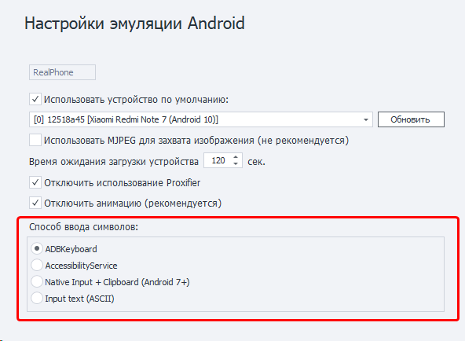

---
sidebar_position: 15
title: Способы ввода (Enterprise)
description: Доступные способы ввода. 
---  
:::info **Пожалуйста, ознакомьтесь с [*Правилами использования материалов на данном ресурсе*](../Disclaimer).**
:::

## Способы ввода.  
В программе есть **4 способа** ввода символов с клавиатуры.  
  
Ввод символов по-разному работает на устройствах, поэтому наличие нескольких способов дает возможность самостоятельно подобрать оптимальный. Первые три варианта позволяют вводить любые символы, включая эмодзи, последний же работает только с ASCII.  
_______________________________________________
### Подробное описание.  
#### ADBKeyboard.  
Применяется сторонняя клавиатура. Автоматически устанавливается при подключении к устройству. Позволяет вводить символы, как если бы их набирали на виртуальной клавиатуре.  
#### AccessibilityService.  
Используется [***UiAutomator2***](https://github.com/appium/appium-uiautomator2-driver). Позволяет задать любое значение полю, которое находится в фокусе.  
По своей сути не является вводом символов, а просто меняет у поля свойство **Text** на нужное значение.  
:::tip **Имейте в виду.**
*Не будет работать в приложениях, в которых нет стандартного дерева элементов. Например, в играх.*
::: 
  
#### Native input + Clipboard.
Ввод символов осуществляется через интерфейс **IInputManager** и **IClipboard**. Работает достаточно быстро.
:::info **Внимательно.**
*Ввод кириллицы/эмодзи возможен только на Android 7 и выше, ASCII - на любых устройствах.* 
:::  
  
#### Input text.  
Аналог команды ***input text***, но с добавлением всех необходимых преобразований текста для корректного ввода спецсимволов  `< > | ) (` и прочих. Позволяет вводить **только ASCII символы**.  
:::info **Рекомендуем.**
*Посимвольный ввод работает медленно, поэтому лучше выбирать тип ввода с **отключенной задержкой**.*
::: 
_______________________________________________  
### Не установилась клавиатура ADBKeyboard. Что делать?  
1. Нужно установить на телефон приложение ***com.android.adbkeyboard.apk*** (*файл лежит в корневой папке с программой*). Например, с помощью экшена [**Установить приложение**](../Android/ProLite/App#установка-приложения).  
2. Зайти на телефоне в настройки языка ввода и поставить галку на ***AdbKeyboard***.  
3. Выполнить экшен [**Запустить ВМ**](../Android/ProLite/action#как-запустить-или-перезапустить-устройство). Это активирует клавиатуру. Она появится в любом поле, где нужно ввести текст - снизу вы увидите маленькое уведомление `Adb keyboard ON`.   
 