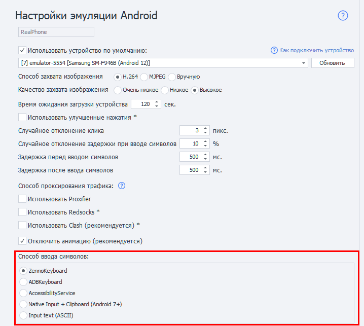

---
sidebar_position: 15
sidebar_label: Способы ввода (Enterprise)
title: Способы ввода (Enterprise) | Документация ZennoDroid | ZennoLab
description: Способы ввода (Enterprise) - раздел официальной документации ZennoDroid от ZennoLab. Подробные инструкции, примеры использования и руководство по настройке
---  
# Способы ввода (Enterprise)
:::info **Пожалуйста, ознакомьтесь с [*Правилами использования материалов на данном ресурсе*](../Disclaimer).**
:::

## Способы ввода.  
В программе есть **5 способов** ввода символов с клавиатуры.  
  
Ввод символов по-разному работает на устройствах, поэтому наличие нескольких способов дает возможность самостоятельно подобрать оптимальный. Первые четыре варианта позволяют вводить любые символы, включая эмодзи, последний же работает только с ASCII.  
:::warning **Способ ввода выбирается на устройстве в момент его запуска.**
*Если переключить настройку у уже запущенного устройства, экшены ввода могут завершаться ошибкой **Используемый способ ввода не соответствует настройкам**. Чтобы применить новый способ, перезапустите устройство.*
::: 
_______________________________________________
### Подробное описание.  
#### ZennoKeyboard.  
Собственная клавиатура ZennoLab, способ ввода **по умолчанию**. Как и ADBKeyboard, автоматически устанавливается при подключении к устройству и вводит символы так, как если бы их набирали на виртуальной клавиатуре.  
Обменивается данными с программой напрямую, поэтому спецсимволы не нужно экранировать, а результат ввода **подтверждается устройством**: если поле не приняло текст или приложение закрылось, экшен сразу завершится ошибкой, а не продолжит работу так, будто текст введён.  
Пока клавиатура активна, внизу экрана вместо клавиш видна строка `ZennoKeyboard {ON}`.  
:::tip **Имейте в виду.**
*Ввод работает только тогда, когда поле ввода находится в фокусе* - Android подключает клавиатуру к приложению именно в этот момент. Если поля в фокусе нет, в логе появится сообщение ***ZennoKeyboard не отвечает. Убедитесь, что поле ввода в фокусе***.
::: 
:::info **Внимательно.**
*Требуется Android 8.1 и выше. На более старых устройствах используйте **ADBKeyboard**.*
::: 
  
#### ADBKeyboard.  
Применяется сторонняя клавиатура. Автоматически устанавливается при подключении к устройству. Позволяет вводить символы, как если бы их набирали на виртуальной клавиатуре.  
#### AccessibilityService.  
Используется [***UiAutomator2***](https://github.com/appium/appium-uiautomator2-driver). Позволяет задать любое значение полю, которое находится в фокусе.  
По своей сути не является вводом символов, а просто меняет у поля свойство **Text** на нужное значение.  
:::tip **Имейте в виду.**
*Не будет работать в приложениях, в которых нет стандартного дерева элементов. Например, в играх.*
::: 
  
#### Native input + Clipboard.
Ввод символов осуществляется через интерфейс **IInputManager** и **IClipboard**. Работает достаточно быстро.
:::info **Внимательно.**
*Ввод кириллицы/эмодзи возможен только на Android 7 и выше, ASCII - на любых устройствах.* 
:::  
  
#### Input text.  
Аналог команды ***input text***, но с добавлением всех необходимых преобразований текста для корректного ввода спецсимволов  `< > | ) (` и прочих. Позволяет вводить **только ASCII символы**.  
:::info **Рекомендуем.**
*Посимвольный ввод работает медленно, поэтому лучше выбирать тип ввода с **отключенной задержкой**.*
::: 
_______________________________________________  
### Не установилась клавиатура ZennoKeyboard. Что делать?  
1. Нужно установить на телефон приложение ***com.zennolab.zennokeyboard.apk*** (*файл лежит в папке Android корневой папки с программой*). Например, с помощью экшена [**Установить приложение**](../Android/pro-lite/App#установка-приложения).  
2. Зайти на телефоне в настройки экранной клавиатуры, включить ***ZennoKeyboard*** и выбрать её способом ввода по умолчанию.  
3. Выполнить экшен [**Запустить ВМ**](../Android/pro-lite/action#как-запустить-или-перезапустить-устройство). Клавиатура появится в любом поле, где нужно ввести текст - снизу вы увидите строку `ZennoKeyboard {ON}`.  
:::info **Внимательно.**
*Если в логе появляется сообщение **Не удалось включить ZennoKeyboard**, значит системе не хватает прав на смену способа ввода. На устройстве с Root ZennoDroid выдаёт их автоматически, без Root клавиатуру нужно включить вручную - как в пункте 2.*
::: 
_______________________________________________  
### Не установилась клавиатура ADBKeyboard. Что делать?  
1. Нужно установить на телефон приложение ***com.android.adbkeyboard.apk*** (*файл лежит в папке Android корневой папки с программой*). Например, с помощью экшена [**Установить приложение**](../Android/pro-lite/App#установка-приложения).  
2. Зайти на телефоне в настройки языка ввода и поставить галку на ***AdbKeyboard***.  
3. Выполнить экшен [**Запустить ВМ**](../Android/pro-lite/action#как-запустить-или-перезапустить-устройство). Это активирует клавиатуру. Она появится в любом поле, где нужно ввести текст - снизу вы увидите маленькое уведомление `Adb keyboard ON`.   
 