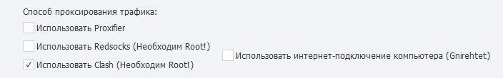

---
sidebar_position: 1
sidebar_label: Проксирование трафика (Enterprise) (до версии 2.4.2)
title: Проксирование трафика (Enterprise) (до версии 2.4.2) | Документация ZennoDroid | ZennoLab
description: Проксирование трафика (Enterprise) - раздел официальной документации ZennoDroid от ZennoLab. Подробные инструкции, примеры использования и руководство по настройке
---  
import DisclaimerNotice from '@site/src/components/DisclaimerNotice';


## Описание.  
:::warning **Устаревшая информация**
Актуальная для версий ZennoDroid до 2.4.2
:::
ZennoDroid позволяет выбрать способ проксирования трафика для выполнения экшена [**Установка прокси**](../Android/Enterprise/setting#как-поставить-прокси).  

Параметры задаются на вкладке [**Настройки Android**](../Android/Enterprise/setting#как-поставить-прокси). По умолчанию используется **Proxifier**.  

    
_______________________________________________ 
## [Proxifier](https://proxifier.com/).  
Это мощная и гибкая программа для перенаправления интернет-трафика через прокси-сервер. Она позволяет приложениям, которые не поддерживают работу через прокси, использовать его.   

Используется интернет-подключение компьютера. Весь трафик с телефона заворачивается в VPN с помощью Gnirehtet и передаётся на ПК, где уже проксируется через приложение Proxifier.  

:::tip **Gnirehtet — это инструмент, который позволяет раздавать интернет с компьютера на Android-устройство.**
Работает, как привычная всем "точка доступа", но с обратным смыслом. Это полезно в ситуациях, когда у вашего телефона нет мобильного интернета или доступа к Wi-Fi, но ваш компьютер подключен к сети.  

Программа работает через USB-кабель или по беспроводной сети и не требует root-прав на устройстве. 
:::
__________________________________________ 
## Redsocks.  
Данная утилита нужна для перенаправления сетевого трафика через прокси-сервер, минуя необходимость ручной настройки прокси в каждом отдельном приложении. Выполняется прозрачный редиректор TCP/UDP-соединений в прокси.  

Все необходимые файлы копируются на устройство автоматически при первой установке прокси.

:::warning **Работает только на устройствах с Root.**
:::  

### По умолчанию DNS-запросы будут направляться через прокси-сервер.  
Если прокси-сервер блокирует DNS-запросы — отсутствует интернет или возникает ошибка `DNS_PROBE_FINISHED_NO_INTERNET`, то необходимо отключить перенаправление.  

> Отключаем перенаправление с помощью кода C#:  
> ```
> instance.DroidInstance.Proxy.UseDnsTcp = false;  
> instance.DroidInstance.Proxy.UseDnsUdp = false;  
> ```  
> **Этот код выполняется *перед* установкой прокси.**
_______________________________________________ 
## Clash.  
Это продвинутый прокси-клиент с возможностью маршрутизации трафика по заданным правилам. Он отличается мощным rule-based подходом и сам решает через какой сервер направить трафик в зависимости от настроенных правил. 

Простое и полное проксирование всего UDP-трафика — в отличие от redsocks, не требуется настраивать отдельное проксирование для каждого IP. Благодаря этому, при использовании прокси с поддержкой UDP, даже IP-адрес через WebRTC отображается как адрес прокси.  

:::warning **Работает только на устройствах с Root.**
Необходим BusyBox версии не ниже 1.36.1.
:::  
__________________________________________
## Использовать интернет-подключение компьютера (Gnirehtet).  
Если эта настройка **выключена**, то весь интернет-трафик будет напрямую передаваться через Wi‑Fi-подключение телефона. Однако при её **включении** весь трафик с телефона начинает идти в обход с помощью Gnirehtet и передаваться на компьютер.  

При использовании этого метода нужно выключить передачу данных на телефоне, чтобы исключить случайную утечку трафика в сеть. Сделать это можно вручную или с помощью экшена.  

Консольные команды для отключения:  
```
svc wifi disable
svc data disable
```  

Такой подход гарантирует, что весь трафик будет проходить строго через интернет-подключение компьютера.  

### Локальный IP.  
Настройка локального IP-адреса устройства.  

Если указать последнее число адреса равным **нулю**, например, `192.168.20.0`, то будет сгенерирован случайный адрес из указанной подсети (`192.168.20.2`-`192.168.20.254`).  

Локальный IP можно задать при использовании:  
- Proxifier, 
- Redsocks + интернет-подключение компьютера.  

> Код C# для указания локального IP у каждого потока в отдельности:  
> ```
> instance.DroidInstance.Proxy.SetLocalAddress("192.168.50.0");
> ```  
> **Код необходимо выполнить *перед* установкой прокси.**  

### Адреса DNS  
Настройка адреса DNS-сервера. Можно указать несколько через запятую: `8.8.8.8,1.1.1.1`.  

> Код C# для указания адреса DNS-сервера у каждого потока в отдельности:  
> ```
> instance.DroidInstance.Proxy.SetDnsServers("8.8.8.8,8.8.4.4");
> ```  
> **Код необходимо выполнить *перед* установкой прокси.**  
_______________________________________________
- [**Установка Clash (Box for Root).**](../Android/Enterprise/Clash).